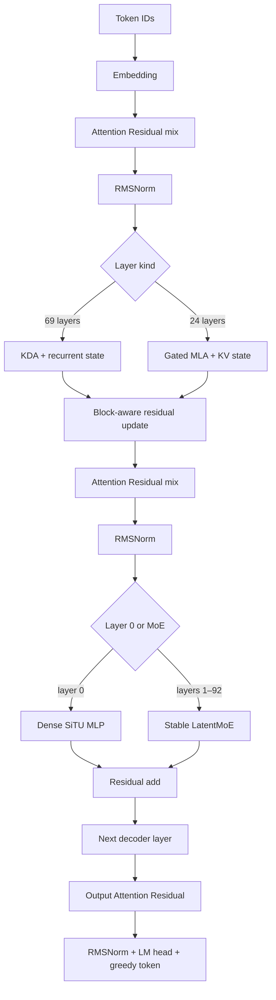
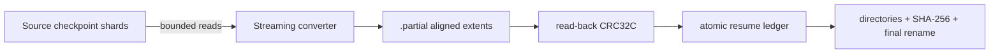

# K3X Architecture

## Scope and evidence

This document separates four kinds of statements.

- **Released graph** describes the text decoder exposed by Moonshot AI's Kimi K3 configuration and official implementations.
- **Milestone 0** describes code that exists and is covered by tests in this repository.
- **Accepted design** describes an approved implementation boundary that has not yet passed its implementation gates.
- **Planned runtime** describes later work and is not presented as implemented performance.

K3X does not download or inspect the full Kimi K3 checkpoint in Milestone 0. MoonViT-V2 is outside the executable milestone; the runtime currently begins at text token embeddings.

## Released Kimi K3 text graph

The released configuration describes a 93-layer, 7,168-wide decoder. Layer 0 is dense. The remaining 92 layers use Stable LatentMoE with 896 routed experts, natural Top-16 selection, and two shared experts. Attention alternates in a 3:1 pattern through layer 91, followed by a final MLA layer: 69 KDA layers and 24 Gated MLA layers in total.

| Component | Released value used by K3X |
|---|---:|
| Decoder layers | 93 |
| Hidden width | 7,168 |
| KDA layers / MLA layers | 69 / 24 |
| Attention heads / head width | 96 / 128 |
| Routed experts / selected experts | 896 / 16 |
| Shared experts | 2 |
| LatentMoE latent width | 3,584 |
| Routed expert intermediate width | 3,072 |
| Dense intermediate width | 33,792 |
| MLA query LoRA rank / KV LoRA rank | 1,536 / 512 |
| MLA main key width / shared extra key width / value width | 128 / 64 / 128 |
| Attention Residual block size | 12 |
| KDA short-convolution width | 4 |
| RMSNorm epsilon | 1e-5 |

The official configuration sets `mla_use_nope=true`. K3X therefore treats both the per-head main key and the shared 64-dimensional extra key as NoPE paths. The extra path is retained because it changes the attention score; its historical `qk_rope_head_dim` name is not taken as evidence that rotary position encoding is active.

### Decoder execution order

For hidden state `x_l`, each decoder layer performs the following ordered operations.

1. Attention Residual selects and mixes the current block's raw depth sources to form the attention input.
2. RMSNorm is applied.
3. The layer executes KDA or Gated MLA and updates its persistent state.
4. The attention output replaces the prefix at a new residual block boundary or is added to the existing prefix otherwise.
5. A second Attention Residual mix forms the feed-forward input.
6. RMSNorm is applied.
7. The dense MLP or Stable LatentMoE executes.
8. The feed-forward output is added to the prefix.

After the last layer, an output Attention Residual mix, final RMSNorm, and LM head produce FP32 logits. Greedy generation selects `argmax(logits)`.

### Kimi Delta Attention

KDA uses causal depthwise short convolutions for Q, K, and V, then maintains a per-head matrix recurrent state. The decay is derived from learned `A_log`, `dt_bias`, and the current query-dependent gate; `beta` controls the delta write. K3X's reference path applies the write before reading the updated state, matching the checked implementation. The persistent state consists of convolution histories and the recurrent matrix and does not grow with context length.

### Gated Multi-Latent Attention

Gated MLA applies query LoRA, normalizes the compressed KV latent, expands per-head main keys and values, and expands one shared extra NoPE key. Scores combine the main and shared subspaces. A learned output gate modulates the attention result before output projection. Incremental decoding persists main keys, values, and shared keys, so this state grows linearly with context.

### Attention Residual

At each block boundary, the raw prefix is added to the block source bank. Learned normalized keys score that bank, while the weighted values are the unnormalized raw sources. K3X preserves this distinction in its executable oracle and C++ runtime.

### Stable LatentMoE and routing

The router computes sigmoid scores for all 896 routed experts. Correction bias participates only in Top-K selection. The selected experts are weighted with normalized, unbiased sigmoid scores. Routed computation projects the hidden state into the 3,584-dimensional latent space, executes native MXFP4 experts, accumulates their scaled outputs, and projects back to hidden width. The shared expert branch remains in hidden space and is added separately.

Native expert matrices use MXFP4 E2M1 values with one E8M0 scale per group of 32 values. K3X preserves the released packed codes and scales instead of dequantizing and requantizing during conversion.

## Milestone 0 executable model

The deterministic synthetic model reduces widths but retains the graph contracts that can silently change tokens.

- Four layers in `KDA, KDA, KDA, MLA` order.
- One dense layer followed by three Stable LatentMoE layers.
- Attention Residual block size two, chosen to exercise multiple depth sources in four layers.
- Full and incremental execution with KDA, convolution, and MLA state.
- Native MXFP4 packed-code and scale paths.
- PyTorch reference and independent dependency-free C++20 runtime.

The seeded fixture generates `[43, 32, 28, 49, 9, 28]` for prompt `[1, 7, 3, 9]` in both runtimes and in full-prefix and incremental modes. Floating-point layer outputs use an explicit `1e-6` relative and absolute tolerance; token IDs and preserved MXFP4 bytes match exactly.

## Milestone 1 accepted design

Milestone 1 preserves the portable CPU graph as the exact reference and introduces a narrow projection/MXFP4 compute-backend boundary plus structured profiling. The optional CUDA backend targets the verified WSL2 Ubuntu 24.04 environment with CUDA Toolkit 13.3.1, nvcc 13.3.73, and native `sm_120` support for the RTX 5080. GPU passthrough, the CUDA resource shell, cuBLASLt dense matvec, the exact native-byte K3 MXFP4 CUDA baseline, explicit runtime selection, synthetic graph integration, and JSON/CSV profiler export are implemented and tested.

The accepted comparison has three explicit execution identities.

| Backend | Dense projection | MXFP4 expert path | Status |
|---|---|---|---|
| `cpu` | Portable FP32 C++ | Portable E2M1/E8M0 decode and FP32 accumulation | Implemented and tested |
| `cuda-dense` | cuBLASLt FP32 and BF16-rounded input/weight with FP32 accumulation/output | Portable CPU E2M1/E8M0 oracle | Implemented, graph-integrated, tested, and measured |
| `cuda-custom` | Same cuBLASLt dense path | Native-byte E2M1/E8M0 CUDA decode and FP32 accumulation | Implemented, graph-integrated, tested, and measured |

KDA, MLA, routing, Attention Residual, recurrent state, and greedy selection stay on the existing CPU graph during this baseline. Per-operation host/device transfers remain visible so a later residency layer has a measured cost to remove. CUDA is optional at build time and cannot break the CPU-only Linux build.

Direct cuBLASLt FP4 is not a K3 MXFP4 backend. NVIDIA's FP4 contract uses UE4M3 scales per 16 values, while the released K3 experts use E8M0 scales per 32 values. K3X rejects implicit repacking for the exact path and uses a custom CUDA implementation against the CPU byte-level oracle.

The detailed numerical, profiling, error, and platform gates are in [`docs/superpowers/specs/2026-08-08-k3x-exact-runtime-profiler-cuda-design.md`](docs/superpowers/specs/2026-08-08-k3x-exact-runtime-profiler-cuda-design.md).

The deterministic profiling primitive and runtime export are implemented and tested. `Profiler` owns explicit `ProfileEvent` records and performs a single linear summary pass. It has no clock, thread, serialization, or CUDA dependency. Successful events contribute wall time, device time, logical bytes, and directional transfer bytes; failed events contribute only to `failed_operations`. `k3x_run` serializes the selected backend, device, dense precision, CUDA-event kernel time, H2D/D2H bytes, peak backend-owned device bytes, logical read counters, layer timings, and optional numerical diagnostics. The benchmark driver preserves these fields in JSON/CSV and compares CUDA diagnostics and token IDs against an FP32 CPU run.

The exact CPU compute boundary is implemented and tested. `ComputeBackend` now owns row-major dense matvec and native packed MXFP4 matvec operations, while KDA, MLA, routing, Attention Residual, recurrent state, activations, and greedy selection remain in the unchanged CPU graph. `CpuBackend` preserves the previous double-accumulation dense arithmetic and delegates native MXFP4 to the existing byte-level oracle. Generation accepts an explicit backend, and the legacy overload constructs `CpuBackend` for compatibility.

The optional CUDA resource shell, dense baseline, and custom MXFP4 baseline are implemented and tested. `K3X_ENABLE_CUDA=OFF` compiles a dependency-free stub that rejects explicit CUDA requests with `backend_unavailable`. The ON build requires CUDA Toolkit 13.3 or newer, links CUDA runtime and cuBLASLt, and emits native `sm_120` cubins. The factory validates compute capability 12.0 or newer before creating one nonblocking stream and one cuBLASLt handle with local RAII ownership. Dense matvec accepts row-major FP32 host tensors, stages either FP32 or BF16-rounded operands, selects a zero-workspace cuBLASLt algorithm, accumulates and returns FP32, records CUDA-event device time and exact directional transfer bytes, and releases per-call device buffers before returning. CUDA 13.3 requires regular BF16 matmul operands A and B to share the BF16 type, so BF16-rounded mode stages both input and weight while preserving the FP32 host API.

The `cuda-custom` MXFP4 operation consumes K3X low-nibble-first E2M1 codes and one E8M0 byte per 32 flattened values without repacking or requantization. One CUDA block owns one output row, 256 threads stride the input columns, decode and scale native bytes, reduce FP32 partial sums in shared memory, and return FP32 output. The custom path rejects non-32 groups, invalid extents, and reserved `0xFF` scales. `cuda-dense` deliberately retains the portable CPU MXFP4 oracle with zero H2D and device time, so the dense-library versus custom-expert comparison changes only the expert operation and never mislabels cuBLASLt FP4 as K3 MXFP4. The custom path records packed, scale, input, output, and kernel timing events explicitly and releases all per-call device buffers before returning.

The CLI accepts only explicit `cpu`, `cuda-dense`, or `cuda-custom` identities and `fp32` or `bf16` dense precision. A CUDA-disabled build returns `BACKEND_UNAVAILABLE` for a requested CUDA backend and never silently substitutes CPU. FP32 and BF16 CUDA paths preserve the seeded six-token sequence. Milestone 1 measurements show that this per-operation correctness baseline is not a performance default: on the tiny graph, CPU reaches 19.49 decode tok/s while `cuda-dense` and `cuda-custom` reach 11.67 and 10.11 tok/s. CUDA-event kernel time is only 11.56--14.52 ms per complete run while per-call allocation, staging, synchronization, and the remaining CPU graph dominate. The next architecture step is persistent device buffers and a layer/block execution boundary that can amortize transfers and launches; asynchronous storage is not yet implemented.

## Milestone 2 implemented CUDA residency layer

Milestone 2 implements three orthogonal CUDA switches while retaining the exact Milestone 1 path as `per-operation + transient + scalar`.

| Axis | Reference | Optimization | Status |
|---|---|---|---|
| Device allocation | Per-operation buffers | Backend-owned grow-only scratch slots | Implemented, tested, and measured |
| Immutable weights | Transient H2D on every use | Tensor-ID-keyed bounded static VRAM residency | Implemented, tested, and measured |
| Projection scheduling | Scalar calls and synchronization | Ordered same-input dense/MXFP4 groups | Implemented, tested, and measured; not a default |

Resident entries preserve FP32, BF16, or native MXFP4 bytes exactly and are keyed by tensor ID plus representation and shape metadata. The configured resident-byte bound is hard. An entry that does not fit uses exact transient staging and records an admission bypass; Milestone 2 has no eviction policy and therefore does not introduce LRU, LFU, or Least-Stale prematurely.

Initial grouping is restricted to dependency-free projections already present in the synthetic graph: KDA Q/K/V, dense/shared gate-up pairs, and routed-expert MXFP4 gate-up pairs. Attention, routing, recurrent state, activation, residual, and greedy selection remain on CPU. Allocation reuse, weight residency, and grouping are independently switchable and ablated before any default changes.

Grouped calls upload one shared activation, use disjoint output arenas, enqueue member kernels and output copies in order on one stream, and synchronize once per group. Dense groups use cuBLASLt; `cuda-custom` expert gate/up groups consume exact native MXFP4 payloads. Expert down projections remain scalar because they depend on the CPU SiTU-GLU result. Successful H2D profiler events are classified as immutable-weight or activation traffic, and their sum remains the total H2D count.

B-0003 measured reusable allocation and static residency as beneficial on the deterministic synthetic graph. Grouping reduced activation traffic and synchronization count but was slightly slower than scalar residency for both CUDA identities, so it remains optional. CPU remains the CLI default because the synthetic GPU results still do not exceed the Milestone 1 CPU result and do not represent full Kimi K3. Static residency has no eviction and is an L0 primitive, not the chartered three-tier expert cache.

The normative design and acceptance matrix are in [`docs/superpowers/specs/2026-08-08-k3x-cuda-residency-batching-design.md`](docs/superpowers/specs/2026-08-08-k3x-cuda-residency-batching-design.md).

## Milestone 3 experimental CUDA FFN block executor

Milestone 3 adds an explicit `operation|ffn-block` execution boundary. `operation` remains the default reference. `ffn-block` is implemented only for `cuda-custom`; unsupported backend combinations fail before model execution and never hide CPU work inside the requested CUDA boundary.

Dense and shared blocks upload one input, execute cuBLASLt gate and up projections, strict FP32 SiTU-GLU, and the down projection on one CUDA stream, then download only the final output and synchronize once. FP32 keeps the activation in FP32. The opt-in BF16 mode rounds dense inputs, dense weights, and the SiTU output to BF16 with RNE while accumulating and returning FP32.

Routed blocks receive the natural Top-K expert triplets in router order. The runtime validates every native MXFP4 gate/up/down view before work, resolves all six or more payloads through the existing exact resident table, uploads the shared latent once, and executes each expert's gate, up, strict SiTU, and down chain in request order. Output mixing remains on CPU with the unchanged router scores. A capacity miss uses exact transient staging; routing and expert bytes are never pruned or approximated.

CUDA routed-block preflight requires native E8M0/32 group size on every gate, up, and down view before allocation, residency lookup, transfer, kernel launch, or profiler mutation. Other group sizes fail with `INVALID_MXFP4`; the fixed-group kernel never interprets arbitrary group metadata.

KDA, MLA, Attention Residual, RMSNorm, routing, score normalization, routed mixing, recurrent state, residual addition, and greedy selection remain on CPU. Diagnostic mode serializes the exact prefill routed-expert trace, and parity tests require it to match the operation reference together with tokens, layer outputs, logits, and state.

B-0004 measures the experimental FP32 block-scalar path at 17.0713 decode tok/s versus 16.3576 for its operation-scalar match. D2H falls by 24.77% and synchronizations by 32.86%, but decode improves only 4.36% and CUDA-event kernel time increases. The block path is therefore an experimental synthetic recommendation, not the CLI default and not a full-model throughput claim. The remaining measured bottleneck is the CPU-driven graph and frequent non-FFN boundaries.

The normative design is in [`docs/superpowers/specs/2026-08-09-k3x-ffn-block-executor-design.md`](docs/superpowers/specs/2026-08-09-k3x-ffn-block-executor-design.md).

## Milestone 4 experimental exact L1-to-L0 prefetch

Milestone 4 adds `synchronous|prefetch` transfer modes while retaining `synchronous` as the default. The first prefetch boundary is intentionally narrow: `cuda-custom + ffn-block + reused + transient` only. Unsupported combinations fail before graph execution. Static residency, eviction, persistent L1 caching, NVMe reads, and prediction are not part of this milestone.

After natural routing has selected experts, the runtime synchronously reads their exact native MXFP4 extents into ordinary host memory. In prefetch mode it validates every gate/up/down extent, copies the six router-ordered payload ranges into one fixed page-locked slab, and enqueues slab-to-device copies on a separate nonblocking CUDA transfer stream. The CPU graph then computes the routed-down projection while the transfer can progress. A readiness event and compute-stream wait establish device lifetime ordering before a single-use prepared token executes the expert FFN block. The token carries a process-global ID and exact use sequence; foreign, stale, repeated, wrong-sequence, wrong-layer, or wrong-phase consumption is rejected before scratch allocation, activation upload, or event submission.

`AsyncMxfp4Pipeline` is single-flight and owns one bounded pinned slab, one matching device slab, a transfer stream, and reusable timing/readiness events. It performs no per-request host registration or pinned allocation. Payload order and bytes remain native E2M1 plus E8M0/32; routing, scores, expert order, CPU mixing, recurrent state, and greedy selection are unchanged. The synchronous path does not allocate pinned memory or report async counters.

Runtime and benchmark records expose configured/current/peak pinned bytes, prefetch calls and bytes, ready/late-at-use classification, transfer-stream waits, pinned staging time, device transfer time, exposed stall time, CUDA async-engine count, and device-overlap capability. H2D totals continue to equal immutable-weight plus activation H2D. These counters describe L1-to-L0 transfer only; logical file reads are not NVMe measurements.

B-0005 preserved exact tokens and routing in all FP32/BF16 scalar/grouped rows. Prefetch did not change total H2D bytes or host synchronization count, and all 27 prepared blocks were ready before use. On the tiny WSL2 fixture, matched decode deltas ranged from -1.03% to +0.90%, while prefetch added a 1 MiB pinned/device slab and 0.198--0.312 ms of measured exposed stall per run. The mechanism therefore remains opt-in. The next data-plane boundary is a bounded persistent L1 expert cache plus asynchronous L2 reads, not a claim that the chartered three-tier cache is complete.

The normative design is in [`docs/superpowers/specs/2026-08-09-k3x-async-l0-l1-transfer-design.md`](docs/superpowers/specs/2026-08-09-k3x-async-l0-l1-transfer-design.md).

## Milestone 5 experimental persistent L1 expert cache

Milestone 5 implements a bounded immutable whole-expert store between `Model` and `Reader`, before both synchronous execution and the Milestone 4 prepared-transfer boundary. A `RuntimeSession` owns the store so admitted experts persist across consecutive generation calls; source-compatible one-shot overloads create one session per call. Entries are keyed by layer and expert and own exact native MXFP4 gate/up/down packed and E8M0/32 scale bytes through stable shared handles. The operation, synchronous FFN-block, and asynchronous prepared-transfer paths consume the same representation.

The runtime exposes `--l1-expert-cache disabled|static` and `--l1-expert-cache-bytes`. Disabled remains the default. Experimental static admission charges the six payload extents, validates complete native group-32 packed/scale sizes, reserved E8M0 values, and triplet shapes, admits only a complete expert when it fits the remaining hard capacity, never evicts, and otherwise returns an exact transient handle. Invalid or failed loads cannot alter successful cache counters or residency.

B-0006 admitted 18 synthetic experts into 29,376 bytes, recorded 36 hits and zero bypasses, and reduced logical Reader calls from 428 to 212 and completed bytes from 665,616 to 606,864. All FP32/BF16 synchronous/prefetch rows preserved exact tokens, routing, H2D, D2H, FFN counts, and synchronization. These logical read counters are not physical NVMe traffic, and the synthetic throughput gain is not a full-model projection.

LRU, LFU, Least-Stale, task/session priors, eviction, prediction, asynchronous L2 reads, and cold rescue remain unimplemented. The accepted design and B-0006 matrix are in [`docs/superpowers/specs/2026-08-09-k3x-persistent-l1-expert-cache-design.md`](docs/superpowers/specs/2026-08-09-k3x-persistent-l1-expert-cache-design.md).

## Milestone 6 experimental independent L2 reader

Milestone 6 implements independent Linux I/O-engine (`pread|io_uring`) and page-cache (`buffered|direct`) axes. Metadata and full-file integrity verification remain on the portable buffered path. The Reader-owned hot data plane keeps one descriptor, preserves exact single-extent wrappers, and exposes an ordered batch operation. A native MXFP4 expert now requests its gate/up/down packed values and scales as one six-extent batch.

`pread + buffered` remains the default. `io_uring` is an optional liburing build capability with bounded queue depth, explicit offsets, stable completion identity, partial-submission handling, and exact success-path completion draining. Submit or completion failure closes the ring while batch buffers remain alive, relying on ring-shutdown cancellation, and permanently fails that Reader's io_uring path closed. Direct mode requires `STATX_DIOALIGN`, opens `O_DIRECT`, uses owned aligned bounce buffers, and fails with `STORAGE_UNAVAILABLE` instead of silently falling back. The current API waits for each ordered batch to complete; cross-layer deadline scheduling and compute/I/O overlap are not implemented.

Runtime and benchmark records distinguish logical requested/completed bytes, aligned storage submitted/completed bytes, Reader storage elapsed time, and Linux process `rchar/read_bytes` deltas. B-0007 preserved exact tokens and the 24-entry routing trace across all four modes on WSL2 ext4. That measurement is a capability smoke, not native P44 Pro evidence and not physical NVMe traffic. The normative design is in [`docs/superpowers/specs/2026-08-09-k3x-l2-reader-design.md`](docs/superpowers/specs/2026-08-09-k3x-l2-reader-design.md).

## TITAN component registry

Status meanings are strict. `Implemented` requires code and passing tests. `Experimental` requires code behind a non-default switch. `Proposed` is architecture-only. `Reserved` has no accepted responsibility.

| Component | Responsibility | Status |
|---|---|---|
| TITAN | Umbrella name for Project K3X and its dedicated Kimi K3 runtime, storage, profiling, and manufacturing system | Implemented foundation; production runtime incomplete |
| ATLAS | Responsibility has not been supplied or accepted | Reserved, proposed/undefined |
| CHRONOS | Responsibility has not been supplied or accepted | Reserved, proposed/undefined |
| BLACKSTAR | Responsibility has not been supplied or accepted | Reserved, proposed/undefined |
| PROMETHEUS-X | DSpark-compatible speculative decoding extended with MoE-aware expert-cost scheduling | Proposed |
| AURORA | Self-speculative K3 fast-path drafter using reduced Top-K, reduced precision, and resident experts while retaining target verification | Proposed |
| ORBIT | Multi-layer lookahead expert residency and prefetch prediction | Proposed |
| MERCURY | Dynamic CPU/GPU expert placement using predicted transfer-plus-compute latency | Proposed |
| HELIOS | Automatic hardware/workload tuning for cache, Top-K, speculation, I/O, and placement parameters | Proposed |
| SHADOW | Periodic divergence monitoring between fast execution and a higher-quality reference | Proposed |
| APOLLO | Adaptive test-time reasoning and multi-branch deliberation | Proposed |
| TITAN COUNCIL | Adaptive Architect, Skeptic, Debugger, and Judge reasoning with shared expert-major batching | Proposed |
| PHOENIX | Automatic escalation toward higher quality after uncertainty, divergence, tool failure, or repeated agent failure | Proposed |
| VAULT | Persistent KDA, MLA, prefix, and agent state for resumption without unnecessary re-prefill | Proposed |
| VEILBREAK | Optional behavior-profile adapters for reducing false refusals in legitimate adult roleplay and legitimate security/technical explanation while preserving separate serving-layer controls for disallowed use | Proposed |
| AUTO | Top-level operating mode that combines Balanced and Quality according to confidence, SHADOW divergence, failures, and task importance | Proposed |
| SKYFORGE | Cloud-side bounded, resumable K3X model manufacturing with Conductor, Foundry Workers, and IMMORTAL Ledger | Proposed; no cloud resources provisioned |

APOLLO and TITAN COUNCIL operate above token inference and would consume speculative and expert-major runtime interfaces rather than silently changing K3 routing. AURORA and PROMETHEUS-X occupy separate draft/verification experiments. ORBIT predicts future use; MERCURY decides placement; HELIOS tunes exposed policies. SHADOW observes divergence, PHOENIX escalates quality, and AUTO coordinates those signals. These relationships are proposals and do not imply implementation.

VEILBREAK remains isolated from model correctness modes and from serving-layer policy enforcement. It cannot be described as a safety bypass, and no implementation or quality claim exists.

## K3X data flow

The file format is deliberately execution ordered. The converter reads bounded source chunks, copies or transforms one extent, verifies it after `fsync`, records completion in an atomic ledger, and releases temporary memory. Only after every extent is verified are directories and the superblock finalized and the `.partial` artifact atomically renamed.

The runtime opens only the superblock and bounded directories first. Tensor and expert records map logical execution requests to aligned extents. A strict reader rejects unsupported required features, overflow, overlap, bad alignment, truncation, and checksum failure before execution.

## Three-tier runtime target

The production target is an asynchronous three-tier weight system.

| Tier | Role | Current and planned behavior |
|---|---|---|
| L0: RTX 5080 VRAM | Active trunk tiles and immediately needed experts | Native CUDA compute and pinned asynchronous copies |
| L1: 96 GB system RAM | Quantized trunk working set and warm expert bank | Experimental exact static expert admission implemented; session/task-aware policies and eviction planned |
| L2: P44 Pro NVMe | Complete cold storage | Large aligned reads and per-expert random access |

The scheduler will assign every requested extent an estimated use deadline and fetch latency. While layer `N` computes, L1-to-L0 transfer for `N+1` and L2-to-L1 transfer for `N+2` can proceed concurrently. `io_uring`, `O_DIRECT`, CUDA Graphs, and persistent kernels are experiments, not assumptions; default paths will be selected by measured end-to-end results.

Full 896-way routing remains available in exact modes. Residency changes where an expert is fetched from, not which expert the model selects. A high-scoring cold expert is rescued through NVMe to RAM to GPU, and repeated use may promote it. Prefetch prediction is permitted to miss without changing model output.

## Correctness boundaries

Every later optimization must retain a runtime switch that reaches a known reference behavior.

- Natural Top-16, exact MXFP4 expert routing, and strict speculative verification define the `QUALITY` baseline.
- Adaptive Top-K, verifier budgets, proxy experts, and pruning are never silently equivalent to that baseline.
- Prefetch and cache policies may change latency and traffic but must not change selected experts in exact-prefetch mode.
- Quantization must be evaluated against layer outputs, logits, greedy tokens, and task-quality measurements.
- A performance result must identify hardware, build mode, model scope, quality mode, warm/cold state, and enabled optimizations.

## Source ledger

The primary references and inspected revisions are listed in [`docs/references.md`](docs/references.md). The exact binary storage contract is in [`K3X_FORMAT.md`](K3X_FORMAT.md).
