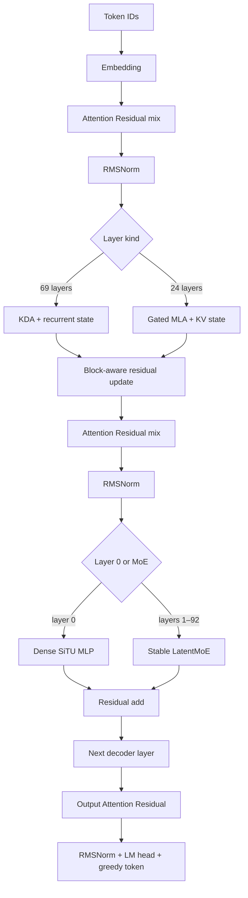
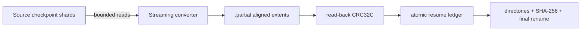

# K3X Architecture

## Scope and evidence

This document separates four kinds of statements.

- **Released graph** describes the text decoder exposed by Moonshot AI's Kimi K3 configuration and official implementations.
- **Milestone 0** describes code that exists and is covered by tests in this repository.
- **Accepted design** describes an approved implementation boundary that has not yet passed its implementation gates.
- **Planned runtime** describes later work and is not presented as implemented performance.

K3X does not download or inspect the full Kimi K3 checkpoint in Milestone 0. MoonViT-V2 is outside the executable milestone; the runtime currently begins at text token embeddings.

## Released Kimi K3 text graph

The released configuration describes a 93-layer, 7,168-wide decoder. Layer 0 is dense. The remaining 92 layers use Stable LatentMoE with 896 routed experts, natural Top-16 selection, and two shared experts. Attention alternates in a 3:1 pattern through layer 91, followed by a final MLA layer: 69 KDA layers and 24 Gated MLA layers in total.

| Component | Released value used by K3X |
|---|---:|
| Decoder layers | 93 |
| Hidden width | 7,168 |
| KDA layers / MLA layers | 69 / 24 |
| Attention heads / head width | 96 / 128 |
| Routed experts / selected experts | 896 / 16 |
| Shared experts | 2 |
| LatentMoE latent width | 3,584 |
| Routed expert intermediate width | 3,072 |
| Dense intermediate width | 33,792 |
| MLA query LoRA rank / KV LoRA rank | 1,536 / 512 |
| MLA main key width / shared extra key width / value width | 128 / 64 / 128 |
| Attention Residual block size | 12 |
| KDA short-convolution width | 4 |
| RMSNorm epsilon | 1e-5 |

The official configuration sets `mla_use_nope=true`. K3X therefore treats both the per-head main key and the shared 64-dimensional extra key as NoPE paths. The extra path is retained because it changes the attention score; its historical `qk_rope_head_dim` name is not taken as evidence that rotary position encoding is active.

### Decoder execution order

For hidden state `x_l`, each decoder layer performs the following ordered operations.

1. Attention Residual selects and mixes the current block's raw depth sources to form the attention input.
2. RMSNorm is applied.
3. The layer executes KDA or Gated MLA and updates its persistent state.
4. The attention output replaces the prefix at a new residual block boundary or is added to the existing prefix otherwise.
5. A second Attention Residual mix forms the feed-forward input.
6. RMSNorm is applied.
7. The dense MLP or Stable LatentMoE executes.
8. The feed-forward output is added to the prefix.

After the last layer, an output Attention Residual mix, final RMSNorm, and LM head produce FP32 logits. Greedy generation selects `argmax(logits)`.

### Kimi Delta Attention

KDA uses causal depthwise short convolutions for Q, K, and V, then maintains a per-head matrix recurrent state. The decay is derived from learned `A_log`, `dt_bias`, and the current query-dependent gate; `beta` controls the delta write. K3X's reference path applies the write before reading the updated state, matching the checked implementation. The persistent state consists of convolution histories and the recurrent matrix and does not grow with context length.

### Gated Multi-Latent Attention

Gated MLA applies query LoRA, normalizes the compressed KV latent, expands per-head main keys and values, and expands one shared extra NoPE key. Scores combine the main and shared subspaces. A learned output gate modulates the attention result before output projection. Incremental decoding persists main keys, values, and shared keys, so this state grows linearly with context.

### Attention Residual

At each block boundary, the raw prefix is added to the block source bank. Learned normalized keys score that bank, while the weighted values are the unnormalized raw sources. K3X preserves this distinction in its executable oracle and C++ runtime.

### Stable LatentMoE and routing

The router computes sigmoid scores for all 896 routed experts. Correction bias participates only in Top-K selection. The selected experts are weighted with normalized, unbiased sigmoid scores. Routed computation projects the hidden state into the 3,584-dimensional latent space, executes native MXFP4 experts, accumulates their scaled outputs, and projects back to hidden width. The shared expert branch remains in hidden space and is added separately.

Native expert matrices use MXFP4 E2M1 values with one E8M0 scale per group of 32 values. K3X preserves the released packed codes and scales instead of dequantizing and requantizing during conversion.

## Milestone 0 executable model

The deterministic synthetic model reduces widths but retains the graph contracts that can silently change tokens.

- Four layers in `KDA, KDA, KDA, MLA` order.
- One dense layer followed by three Stable LatentMoE layers.
- Attention Residual block size two, chosen to exercise multiple depth sources in four layers.
- Full and incremental execution with KDA, convolution, and MLA state.
- Native MXFP4 packed-code and scale paths.
- PyTorch reference and independent dependency-free C++20 runtime.

The seeded fixture generates `[43, 32, 28, 49, 9, 28]` for prompt `[1, 7, 3, 9]` in both runtimes and in full-prefix and incremental modes. Floating-point layer outputs use an explicit `1e-6` relative and absolute tolerance; token IDs and preserved MXFP4 bytes match exactly.

## Milestone 1 accepted design

Milestone 1 preserves the portable CPU graph as the exact reference and introduces a narrow projection/MXFP4 compute-backend boundary plus structured profiling. The optional CUDA backend targets the locally verified CUDA 13.3 and `sm_120` environment.

The accepted comparison has three explicit execution identities.

| Backend | Dense projection | MXFP4 expert path | Status |
|---|---|---|---|
| `cpu` | Portable FP32 C++ | Portable E2M1/E8M0 decode and FP32 accumulation | Implemented and tested |
| `cuda-dense` | cuBLASLt FP32/BF16 | Portable CPU E2M1/E8M0 oracle | Accepted design, not implemented |
| `cuda-custom` | Same cuBLASLt dense path | Minimal custom E2M1/E8M0 CUDA kernel | Accepted design, not implemented |

KDA, MLA, routing, Attention Residual, recurrent state, and greedy selection stay on the existing CPU graph during this baseline. Per-operation host/device transfers remain visible so a later residency layer has a measured cost to remove. CUDA is optional at build time and cannot break the CPU-only Linux build.

Direct cuBLASLt FP4 is not a K3 MXFP4 backend. NVIDIA's FP4 contract uses UE4M3 scales per 16 values, while the released K3 experts use E8M0 scales per 32 values. K3X rejects implicit repacking for the exact path and uses a custom CUDA implementation against the CPU byte-level oracle.

The detailed numerical, profiling, error, and platform gates are in [`docs/superpowers/specs/2026-08-08-k3x-exact-runtime-profiler-cuda-design.md`](docs/superpowers/specs/2026-08-08-k3x-exact-runtime-profiler-cuda-design.md).

## TITAN component registry

Status meanings are strict. `Implemented` requires code and passing tests. `Experimental` requires code behind a non-default switch. `Proposed` is architecture-only. `Reserved` has no accepted responsibility.

| Component | Responsibility | Status |
|---|---|---|
| TITAN | Umbrella name for Project K3X and its dedicated Kimi K3 runtime, storage, profiling, and manufacturing system | Implemented foundation; production runtime incomplete |
| ATLAS | Responsibility has not been supplied or accepted | Reserved, proposed/undefined |
| CHRONOS | Responsibility has not been supplied or accepted | Reserved, proposed/undefined |
| BLACKSTAR | Responsibility has not been supplied or accepted | Reserved, proposed/undefined |
| PROMETHEUS-X | DSpark-compatible speculative decoding extended with MoE-aware expert-cost scheduling | Proposed |
| AURORA | Self-speculative K3 fast-path drafter using reduced Top-K, reduced precision, and resident experts while retaining target verification | Proposed |
| ORBIT | Multi-layer lookahead expert residency and prefetch prediction | Proposed |
| MERCURY | Dynamic CPU/GPU expert placement using predicted transfer-plus-compute latency | Proposed |
| HELIOS | Automatic hardware/workload tuning for cache, Top-K, speculation, I/O, and placement parameters | Proposed |
| SHADOW | Periodic divergence monitoring between fast execution and a higher-quality reference | Proposed |
| APOLLO | Adaptive test-time reasoning and multi-branch deliberation | Proposed |
| TITAN COUNCIL | Adaptive Architect, Skeptic, Debugger, and Judge reasoning with shared expert-major batching | Proposed |
| PHOENIX | Automatic escalation toward higher quality after uncertainty, divergence, tool failure, or repeated agent failure | Proposed |
| VAULT | Persistent KDA, MLA, prefix, and agent state for resumption without unnecessary re-prefill | Proposed |
| VEILBREAK | Optional behavior-profile adapters for reducing false refusals in legitimate adult roleplay and legitimate security/technical explanation while preserving separate serving-layer controls for disallowed use | Proposed |
| AUTO | Top-level operating mode that combines Balanced and Quality according to confidence, SHADOW divergence, failures, and task importance | Proposed |
| SKYFORGE | Cloud-side bounded, resumable K3X model manufacturing with Conductor, Foundry Workers, and IMMORTAL Ledger | Proposed; no cloud resources provisioned |

APOLLO and TITAN COUNCIL operate above token inference and would consume speculative and expert-major runtime interfaces rather than silently changing K3 routing. AURORA and PROMETHEUS-X occupy separate draft/verification experiments. ORBIT predicts future use; MERCURY decides placement; HELIOS tunes exposed policies. SHADOW observes divergence, PHOENIX escalates quality, and AUTO coordinates those signals. These relationships are proposals and do not imply implementation.

VEILBREAK remains isolated from model correctness modes and from serving-layer policy enforcement. It cannot be described as a safety bypass, and no implementation or quality claim exists.

## K3X data flow

The file format is deliberately execution ordered. The converter reads bounded source chunks, copies or transforms one extent, verifies it after `fsync`, records completion in an atomic ledger, and releases temporary memory. Only after every extent is verified are directories and the superblock finalized and the `.partial` artifact atomically renamed.

The runtime opens only the superblock and bounded directories first. Tensor and expert records map logical execution requests to aligned extents. A strict reader rejects unsupported required features, overflow, overlap, bad alignment, truncation, and checksum failure before execution.

## Planned three-tier runtime

The production target is an asynchronous three-tier weight system.

| Tier | Role | Planned behavior |
|---|---|---|
| L0: RTX 5080 VRAM | Active trunk tiles and immediately needed experts | Native CUDA compute and pinned asynchronous copies |
| L1: 96 GB system RAM | Quantized trunk working set and warm expert bank | Session/task-aware admission and eviction |
| L2: P44 Pro NVMe | Complete cold storage | Large aligned reads and per-expert random access |

The scheduler will assign every requested extent an estimated use deadline and fetch latency. While layer `N` computes, L1-to-L0 transfer for `N+1` and L2-to-L1 transfer for `N+2` can proceed concurrently. `io_uring`, `O_DIRECT`, CUDA Graphs, and persistent kernels are experiments, not assumptions; default paths will be selected by measured end-to-end results.

Full 896-way routing remains available in exact modes. Residency changes where an expert is fetched from, not which expert the model selects. A high-scoring cold expert is rescued through NVMe to RAM to GPU, and repeated use may promote it. Prefetch prediction is permitted to miss without changing model output.

## Correctness boundaries

Every later optimization must retain a runtime switch that reaches a known reference behavior.

- Natural Top-16, exact MXFP4 expert routing, and strict speculative verification define the `QUALITY` baseline.
- Adaptive Top-K, verifier budgets, proxy experts, and pruning are never silently equivalent to that baseline.
- Prefetch and cache policies may change latency and traffic but must not change selected experts in exact-prefetch mode.
- Quantization must be evaluated against layer outputs, logits, greedy tokens, and task-quality measurements.
- A performance result must identify hardware, build mode, model scope, quality mode, warm/cold state, and enabled optimizations.

## Source ledger

The primary references and inspected revisions are listed in [`docs/references.md`](docs/references.md). The exact binary storage contract is in [`K3X_FORMAT.md`](K3X_FORMAT.md).
