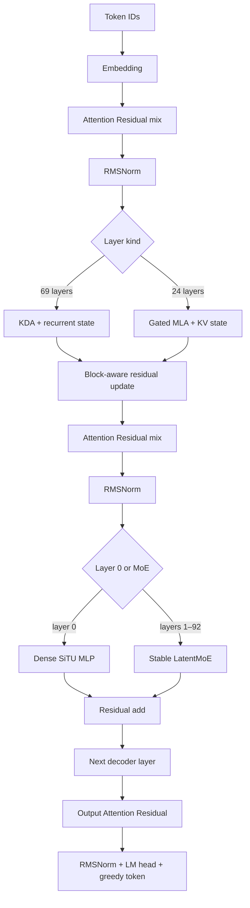
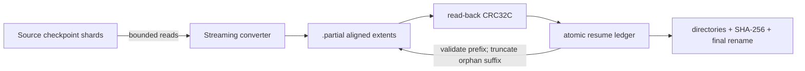

# K3X Architecture

## Scope and evidence

This document separates four kinds of statements.

- **Released graph** describes the text decoder exposed by Moonshot AI's Kimi K3 configuration and official implementations.
- **Milestone 0** describes code that exists and is covered by tests in this repository.
- **Accepted design** describes an approved implementation boundary that has not yet passed its implementation gates.
- **Planned runtime** describes later work and is not presented as implemented performance.

K3X does not download or inspect the full Kimi K3 checkpoint in Milestone 0. MoonViT-V2 is outside the executable milestone; the runtime currently begins at text token embeddings.

## Released Kimi K3 text graph

The released configuration describes a 93-layer, 7,168-wide decoder. Layer 0 is dense. The remaining 92 layers use Stable LatentMoE with 896 routed experts, natural Top-16 selection, and two shared experts. Attention alternates in a 3:1 pattern through layer 91, followed by a final MLA layer: 69 KDA layers and 24 Gated MLA layers in total.

| Component | Released value used by K3X |
|---|---:|
| Decoder layers | 93 |
| Hidden width | 7,168 |
| KDA layers / MLA layers | 69 / 24 |
| Attention heads / head width | 96 / 128 |
| Routed experts / selected experts | 896 / 16 |
| Shared experts | 2 |
| LatentMoE latent width | 3,584 |
| Routed expert intermediate width | 3,072 |
| Dense intermediate width | 33,792 |
| MLA query LoRA rank / KV LoRA rank | 1,536 / 512 |
| MLA main key width / shared extra key width / value width | 128 / 64 / 128 |
| Attention Residual block size | 12 |
| KDA short-convolution width | 4 |
| RMSNorm epsilon | 1e-5 |

The official configuration sets `mla_use_nope=true`. K3X therefore treats both the per-head main key and the shared 64-dimensional extra key as NoPE paths. The extra path is retained because it changes the attention score; its historical `qk_rope_head_dim` name is not taken as evidence that rotary position encoding is active.

### Decoder execution order

For hidden state `x_l`, each decoder layer performs the following ordered operations.

1. Attention Residual selects and mixes the current block's raw depth sources to form the attention input.
2. RMSNorm is applied.
3. The layer executes KDA or Gated MLA and updates its persistent state.
4. The attention output replaces the prefix at a new residual block boundary or is added to the existing prefix otherwise.
5. A second Attention Residual mix forms the feed-forward input.
6. RMSNorm is applied.
7. The dense MLP or Stable LatentMoE executes.
8. The feed-forward output is added to the prefix.

After the last layer, an output Attention Residual mix, final RMSNorm, and LM head produce FP32 logits. Greedy generation selects `argmax(logits)`.

### Kimi Delta Attention

KDA uses causal depthwise short convolutions for Q, K, and V, then maintains a per-head matrix recurrent state. The decay is derived from learned `A_log`, `dt_bias`, and the current query-dependent gate; `beta` controls the delta write. K3X's reference path applies the write before reading the updated state, matching the checked implementation. The persistent state consists of convolution histories and the recurrent matrix and does not grow with context length.

### Gated Multi-Latent Attention

Gated MLA applies query LoRA, normalizes the compressed KV latent, expands per-head main keys and values, and expands one shared extra NoPE key. Scores combine the main and shared subspaces. A learned output gate modulates the attention result before output projection. Incremental decoding persists main keys, values, and shared keys, so this state grows linearly with context.

### Attention Residual

At each block boundary, the raw prefix is added to the block source bank. Learned normalized keys score that bank, while the weighted values are the unnormalized raw sources. K3X preserves this distinction in its executable oracle and C++ runtime.

### Stable LatentMoE and routing

The router computes sigmoid scores for all 896 routed experts. Correction bias participates only in Top-K selection. The selected experts are weighted with normalized, unbiased sigmoid scores. Routed computation projects the hidden state into the 3,584-dimensional latent space, executes native MXFP4 experts, accumulates their scaled outputs, and projects back to hidden width. The shared expert branch remains in hidden space and is added separately.

Native expert matrices use MXFP4 E2M1 values with one E8M0 scale per group of 32 values. K3X preserves the released packed codes and scales instead of dequantizing and requantizing during conversion.

## Milestone 0 executable model

The deterministic synthetic model reduces widths but retains the graph contracts that can silently change tokens.

- Four layers in `KDA, KDA, KDA, MLA` order.
- One dense layer followed by three Stable LatentMoE layers.
- Attention Residual block size two, chosen to exercise multiple depth sources in four layers.
- Full and incremental execution with KDA, convolution, and MLA state.
- Native MXFP4 packed-code and scale paths.
- PyTorch reference and independent dependency-free C++20 runtime.

The seeded fixture generates `[43, 32, 28, 49, 9, 28]` for prompt `[1, 7, 3, 9]` in both runtimes and in full-prefix and incremental modes. Floating-point layer outputs use an explicit `1e-6` relative and absolute tolerance; token IDs and preserved MXFP4 bytes match exactly.

## Milestone 1 accepted design

Milestone 1 preserves the portable CPU graph as the exact reference and introduces a narrow projection/MXFP4 compute-backend boundary plus structured profiling. The optional CUDA backend targets the verified WSL2 Ubuntu 24.04 environment with CUDA Toolkit 13.3.1, nvcc 13.3.73, and native `sm_120` support for the RTX 5080. GPU passthrough, the CUDA resource shell, cuBLASLt dense matvec, the exact native-byte K3 MXFP4 CUDA baseline, explicit runtime selection, synthetic graph integration, and JSON/CSV profiler export are implemented and tested.

The accepted comparison has three explicit execution identities.

| Backend | Dense projection | MXFP4 expert path | Status |
|---|---|---|---|
| `cpu` | Portable FP32 C++ | Portable E2M1/E8M0 decode and FP32 accumulation | Implemented and tested |
| `cuda-dense` | cuBLASLt FP32 and BF16-rounded input/weight with FP32 accumulation/output | Portable CPU E2M1/E8M0 oracle | Implemented, graph-integrated, tested, and measured |
| `cuda-custom` | Same cuBLASLt dense path | Native-byte E2M1/E8M0 CUDA decode and FP32 accumulation | Implemented, graph-integrated, tested, and measured |

KDA, MLA, routing, Attention Residual, recurrent state, and greedy selection stay on the existing CPU graph during this baseline. Per-operation host/device transfers remain visible so a later residency layer has a measured cost to remove. CUDA is optional at build time and cannot break the CPU-only Linux build.

Direct cuBLASLt FP4 is not a K3 MXFP4 backend. NVIDIA's FP4 contract uses UE4M3 scales per 16 values, while the released K3 experts use E8M0 scales per 32 values. K3X rejects implicit repacking for the exact path and uses a custom CUDA implementation against the CPU byte-level oracle.

The detailed numerical, profiling, error, and platform gates are in [`docs/superpowers/specs/2026-08-08-k3x-exact-runtime-profiler-cuda-design.md`](docs/superpowers/specs/2026-08-08-k3x-exact-runtime-profiler-cuda-design.md).

The deterministic profiling primitive and runtime export are implemented and tested. `Profiler` owns explicit `ProfileEvent` records and performs a single linear summary pass. It has no clock, thread, serialization, or CUDA dependency. Successful events contribute wall time, device time, logical bytes, and directional transfer bytes; failed events contribute only to `failed_operations`. `k3x_run` serializes the selected backend, device, dense precision, CUDA-event kernel time, H2D/D2H bytes, peak backend-owned device bytes, logical read counters, layer timings, and optional numerical diagnostics. The benchmark driver preserves these fields in JSON/CSV and compares CUDA diagnostics and token IDs against an FP32 CPU run.

The exact CPU compute boundary is implemented and tested. `ComputeBackend` now owns row-major dense matvec and native packed MXFP4 matvec operations, while KDA, MLA, routing, Attention Residual, recurrent state, activations, and greedy selection remain in the unchanged CPU graph. `CpuBackend` preserves the previous double-accumulation dense arithmetic and delegates native MXFP4 to the existing byte-level oracle. Generation accepts an explicit backend, and the legacy overload constructs `CpuBackend` for compatibility.

The optional CUDA resource shell, dense baseline, and custom MXFP4 baseline are implemented and tested. `K3X_ENABLE_CUDA=OFF` compiles a dependency-free stub that rejects explicit CUDA requests with `backend_unavailable`. The ON build requires CUDA Toolkit 13.3 or newer, links CUDA runtime and cuBLASLt, and emits native `sm_120` cubins. The factory validates compute capability 12.0 or newer before creating one nonblocking stream and one cuBLASLt handle with local RAII ownership. Dense matvec accepts row-major FP32 host tensors, stages either FP32 or BF16-rounded operands, selects a zero-workspace cuBLASLt algorithm, accumulates and returns FP32, records CUDA-event device time and exact directional transfer bytes, and releases per-call device buffers before returning. CUDA 13.3 requires regular BF16 matmul operands A and B to share the BF16 type, so BF16-rounded mode stages both input and weight while preserving the FP32 host API.

The `cuda-custom` MXFP4 operation consumes K3X low-nibble-first E2M1 codes and one E8M0 byte per 32 flattened values without repacking or requantization. One CUDA block owns one output row, 256 threads stride the input columns, decode and scale native bytes, reduce FP32 partial sums in shared memory, and return FP32 output. The custom path rejects non-32 groups, invalid extents, and reserved `0xFF` scales. `cuda-dense` deliberately retains the portable CPU MXFP4 oracle with zero H2D and device time, so the dense-library versus custom-expert comparison changes only the expert operation and never mislabels cuBLASLt FP4 as K3 MXFP4. The custom path records packed, scale, input, output, and kernel timing events explicitly and releases all per-call device buffers before returning.

The CLI accepts only explicit `cpu`, `cuda-dense`, or `cuda-custom` identities and `fp32` or `bf16` dense precision. A CUDA-disabled build returns `BACKEND_UNAVAILABLE` for a requested CUDA backend and never silently substitutes CPU. FP32 and BF16 CUDA paths preserve the seeded six-token sequence. Milestone 1 measurements show that this per-operation correctness baseline is not a performance default: on the tiny graph, CPU reaches 19.49 decode tok/s while `cuda-dense` and `cuda-custom` reach 11.67 and 10.11 tok/s. CUDA-event kernel time is only 11.56--14.52 ms per complete run while per-call allocation, staging, synchronization, and the remaining CPU graph dominate. The next architecture step is persistent device buffers and a layer/block execution boundary that can amortize transfers and launches; asynchronous storage is not yet implemented.

## Milestone 2 implemented CUDA residency layer

Milestone 2 implements three orthogonal CUDA switches while retaining the exact Milestone 1 path as `per-operation + transient + scalar`.

| Axis | Reference | Optimization | Status |
|---|---|---|---|
| Device allocation | Per-operation buffers | Backend-owned grow-only scratch slots | Implemented, tested, and measured |
| Immutable weights | Transient H2D on every use | Tensor-ID-keyed bounded static VRAM residency | Implemented, tested, and measured |
| Projection scheduling | Scalar calls and synchronization | Ordered same-input dense/MXFP4 groups | Implemented, tested, and measured; not a default |

Resident entries preserve FP32, BF16, or native MXFP4 bytes exactly and are keyed by tensor ID plus representation and shape metadata. The configured resident-byte bound is hard. An entry that does not fit uses exact transient staging and records an admission bypass; Milestone 2 has no eviction policy and therefore does not introduce LRU, LFU, or Least-Stale prematurely.

Initial grouping is restricted to dependency-free projections already present in the synthetic graph: KDA Q/K/V, dense/shared gate-up pairs, and routed-expert MXFP4 gate-up pairs. Attention, routing, recurrent state, activation, residual, and greedy selection remain on CPU. Allocation reuse, weight residency, and grouping are independently switchable and ablated before any default changes.

Grouped calls upload one shared activation, use disjoint output arenas, enqueue member kernels and output copies in order on one stream, and synchronize once per group. Dense groups use cuBLASLt; `cuda-custom` expert gate/up groups consume exact native MXFP4 payloads. Expert down projections remain scalar because they depend on the CPU SiTU-GLU result. Successful H2D profiler events are classified as immutable-weight or activation traffic, and their sum remains the total H2D count.

B-0003 measured reusable allocation and static residency as beneficial on the deterministic synthetic graph. Grouping reduced activation traffic and synchronization count but was slightly slower than scalar residency for both CUDA identities, so it remains optional. CPU remains the CLI default because the synthetic GPU results still do not exceed the Milestone 1 CPU result and do not represent full Kimi K3. Static residency has no eviction and is an L0 primitive, not the chartered three-tier expert cache.

The normative design and acceptance matrix are in [`docs/superpowers/specs/2026-08-08-k3x-cuda-residency-batching-design.md`](docs/superpowers/specs/2026-08-08-k3x-cuda-residency-batching-design.md).

## Milestone 3 experimental CUDA FFN block executor

Milestone 3 adds an explicit `operation|ffn-block` execution boundary. `operation` remains the default reference. `ffn-block` is implemented only for `cuda-custom`; unsupported backend combinations fail before model execution and never hide CPU work inside the requested CUDA boundary.

Dense and shared blocks upload one input, execute cuBLASLt gate and up projections, strict FP32 SiTU-GLU, and the down projection on one CUDA stream, then download only the final output and synchronize once. FP32 keeps the activation in FP32. The opt-in BF16 mode rounds dense inputs, dense weights, and the SiTU output to BF16 with RNE while accumulating and returning FP32.

Routed blocks receive the natural Top-K expert triplets in router order. The runtime validates every native MXFP4 gate/up/down view before work, resolves all six or more payloads through the existing exact resident table, uploads the shared latent once, and executes each expert's gate, up, strict SiTU, and down chain in request order. Output mixing remains on CPU with the unchanged router scores. A capacity miss uses exact transient staging; routing and expert bytes are never pruned or approximated.

CUDA routed-block preflight requires native E8M0/32 group size on every gate, up, and down view before allocation, residency lookup, transfer, kernel launch, or profiler mutation. Other group sizes fail with `INVALID_MXFP4`; the fixed-group kernel never interprets arbitrary group metadata.

KDA, MLA, Attention Residual, RMSNorm, routing, score normalization, routed mixing, recurrent state, residual addition, and greedy selection remain on CPU. Diagnostic mode serializes the exact prefill routed-expert trace, and parity tests require it to match the operation reference together with tokens, layer outputs, logits, and state.

B-0004 measures the experimental FP32 block-scalar path at 17.0713 decode tok/s versus 16.3576 for its operation-scalar match. D2H falls by 24.77% and synchronizations by 32.86%, but decode improves only 4.36% and CUDA-event kernel time increases. The block path is therefore an experimental synthetic recommendation, not the CLI default and not a full-model throughput claim. The remaining measured bottleneck is the CPU-driven graph and frequent non-FFN boundaries.

The normative design is in [`docs/superpowers/specs/2026-08-09-k3x-ffn-block-executor-design.md`](docs/superpowers/specs/2026-08-09-k3x-ffn-block-executor-design.md).

## Milestone 4 experimental exact L1-to-L0 prefetch

Milestone 4 adds `synchronous|prefetch` transfer modes while retaining `synchronous` as the default. The first prefetch boundary is intentionally narrow: `cuda-custom + ffn-block + reused + transient` only. Unsupported combinations fail before graph execution. Static residency, eviction, persistent L1 caching, NVMe reads, and prediction are not part of this milestone.

After natural routing has selected experts, the runtime synchronously reads their exact native MXFP4 extents into ordinary host memory. In prefetch mode it validates every gate/up/down extent, copies the six router-ordered payload ranges into one fixed page-locked slab, and enqueues slab-to-device copies on a separate nonblocking CUDA transfer stream. The CPU graph then computes the routed-down projection while the transfer can progress. A readiness event and compute-stream wait establish device lifetime ordering before a single-use prepared token executes the expert FFN block. The token carries a process-global ID and exact use sequence; foreign, stale, repeated, wrong-sequence, wrong-layer, or wrong-phase consumption is rejected before scratch allocation, activation upload, or event submission.

`AsyncMxfp4Pipeline` is single-flight and owns one bounded pinned slab, one matching device slab, a transfer stream, and reusable timing/readiness events. It performs no per-request host registration or pinned allocation. Payload order and bytes remain native E2M1 plus E8M0/32; routing, scores, expert order, CPU mixing, recurrent state, and greedy selection are unchanged. The synchronous path does not allocate pinned memory or report async counters.

Runtime and benchmark records expose configured/current/peak pinned bytes, prefetch calls and bytes, ready/late-at-use classification, transfer-stream waits, pinned staging time, device transfer time, exposed stall time, CUDA async-engine count, and device-overlap capability. H2D totals continue to equal immutable-weight plus activation H2D. These counters describe L1-to-L0 transfer only; logical file reads are not NVMe measurements.

B-0005 preserved exact tokens and routing in all FP32/BF16 scalar/grouped rows. Prefetch did not change total H2D bytes or host synchronization count, and all 27 prepared blocks were ready before use. On the tiny WSL2 fixture, matched decode deltas ranged from -1.03% to +0.90%, while prefetch added a 1 MiB pinned/device slab and 0.198--0.312 ms of measured exposed stall per run. The mechanism therefore remains opt-in. The next data-plane boundary is a bounded persistent L1 expert cache plus asynchronous L2 reads, not a claim that the chartered three-tier cache is complete.

The normative design is in [`docs/superpowers/specs/2026-08-09-k3x-async-l0-l1-transfer-design.md`](docs/superpowers/specs/2026-08-09-k3x-async-l0-l1-transfer-design.md).

## Milestone 5 experimental persistent L1 expert cache

Milestone 5 implements a bounded immutable whole-expert store between `Model` and `Reader`, before both synchronous execution and the Milestone 4 prepared-transfer boundary. A `RuntimeSession` owns the store so admitted experts persist across consecutive generation calls; source-compatible one-shot overloads create one session per call. Entries are keyed by layer and expert and own exact native MXFP4 gate/up/down packed and E8M0/32 scale bytes through stable shared handles. The operation, synchronous FFN-block, and asynchronous prepared-transfer paths consume the same representation.

The runtime exposes `--l1-expert-cache disabled|static` and `--l1-expert-cache-bytes`. Disabled remains the default. Experimental static admission charges the six payload extents, validates complete native group-32 packed/scale sizes, reserved E8M0 values, and triplet shapes, admits only a complete expert when it fits the remaining hard capacity, never evicts, and otherwise returns an exact transient handle. Invalid or failed loads cannot alter successful cache counters or residency.

B-0006 admitted 18 synthetic experts into 29,376 bytes, recorded 36 hits and zero bypasses, and reduced logical Reader calls from 428 to 212 and completed bytes from 665,616 to 606,864. All FP32/BF16 synchronous/prefetch rows preserved exact tokens, routing, H2D, D2H, FFN counts, and synchronization. These logical read counters are not physical NVMe traffic, and the synthetic throughput gain is not a full-model projection.

Milestone 5 itself implements no eviction. Exact runtime-switchable LRU, LFU, and Least-Stale eviction are added later by Milestone 9, and bounded task/session priors by Milestone 10. Prediction, asynchronous cross-layer L2 reads, and cold rescue remain unimplemented. The accepted Milestone 5 design and B-0006 matrix are in [`docs/superpowers/specs/2026-08-09-k3x-persistent-l1-expert-cache-design.md`](docs/superpowers/specs/2026-08-09-k3x-persistent-l1-expert-cache-design.md).

## Milestone 6 experimental independent L2 reader

Milestone 6 implements independent Linux I/O-engine (`pread|io_uring`) and page-cache (`buffered|direct`) axes. Metadata and full-file integrity verification remain on the portable buffered path. The Reader-owned hot data plane keeps one descriptor, preserves exact single-extent wrappers, and exposes an ordered batch operation. A native MXFP4 expert now requests its gate/up/down packed values and scales as one six-extent batch.

`pread + buffered` remains the default. `io_uring` is an optional liburing build capability with bounded queue depth, explicit offsets, stable completion identity, partial-submission handling, and exact success-path completion draining. Submit or completion failure closes the ring while batch buffers remain alive, relying on ring-shutdown cancellation, and permanently fails that Reader's io_uring path closed. Direct mode requires `STATX_DIOALIGN`, opens `O_DIRECT`, uses owned aligned bounce buffers, and fails with `STORAGE_UNAVAILABLE` instead of silently falling back. Each Reader batch still waits internally; Milestone 8 moves that blocking call to one worker to overlap current-layer independent compute. Cross-layer prediction and N+1/N+2 prefetch remain unimplemented.

Runtime and benchmark records distinguish logical requested/completed bytes, aligned storage submitted/completed bytes, Reader storage elapsed time, and Linux process `rchar/read_bytes` deltas. B-0007 preserved exact tokens and the 24-entry routing trace across all four modes on WSL2 ext4. That measurement is a capability smoke, not native P44 Pro evidence and not physical NVMe traffic. The normative design is in [`docs/superpowers/specs/2026-08-09-k3x-l2-reader-design.md`](docs/superpowers/specs/2026-08-09-k3x-l2-reader-design.md).

## Milestone 7 implemented full-dimension bounded expert slice

Milestone 7 materializes one released-dimension routed expert without a full checkpoint. A deterministic source writer emits gate/up/down packed E2M1 values and E8M0/32 scales as six bounded safetensors extents. It publishes a content-addressed shard before atomically replacing the manifest, so an interrupted regeneration leaves the prior manifest and referenced shard consistent. The converter validates the released 3,072 x 3,584 and 3,584 x 3,072 shapes plus manifest-declared shard and tensor SHA-256 values, streams those extents into physical gate/up/down execution order, and records optional K3X feature bit 0.

The bit identifies a non-executable `STORAGE_FIXTURE`. Python and C++ Readers may inspect it, while every model-generation overload rejects it with `NON_EXECUTABLE_ARTIFACT` before graph tensor lookup. This keeps storage evidence separate from the tiny executable graph and prevents a partial checkpoint from being presented as a runnable model.

`k3x_storage_bench` resolves the exact matrix IDs, validates native MXFP4 shapes and lengths, and submits one six-extent ordered batch. It reports expert-load latency, ordered SHA-256, logical/submitted/completed bytes, Reader storage time, alignments, and Linux process-I/O deltas, but no token fields. B-0008 measures all four Reader combinations on WSL2 ext4 with exact 17,547,264-byte and digest parity. This is an implemented and measured storage boundary, not a full-dimension graph runtime or native P44 Pro result. The normative design is in [`docs/superpowers/specs/2026-08-09-k3x-bounded-expert-slice-design.md`](docs/superpowers/specs/2026-08-09-k3x-bounded-expert-slice-design.md).

Resume accepts only a canonical prefix of the planned extent sequence. Every ledger entry must have the expected ID, exact aligned offset and source length, and a CRC32C matching both the current source tensor and the partial artifact. Unknown, duplicated, reordered, truncated, or source-divergent entries fail closed before reuse.

## Milestone 8 experimental exact deadline expert loader

Milestone 8 adds an opt-in `--l2-schedule deadline` path while retaining `blocking` as the default and correctness reference. After the router fixes the current layer's natural Top-K, a bounded single worker orders non-resident loads by absolute latest-start time. Resident L1 hits complete inline. The main thread overlaps those loads only with the same layer's routed-down projection and shared expert computation, then waits before exact expert use. Routing, scores, MXFP4 payloads, recurrent state, and greedy selection are unchanged.

Reader and L1 statistics are mutex-protected value snapshots. A layer captures its storage-latency estimate before submitting any worker request, and both successful and exceptional generation exits wait for the queue and active job to become idle. This prevents telemetry races and ensures raw Reader/store references cannot outlive their generation boundary.

B-0009 crosses `blocking|deadline`, `pread|io_uring`, and `buffered|direct` with a 65,536-byte static L1 cache. All eight WSL2 ext4 rows preserve exact tokens, routing, logical Reader traffic, 36 L1 hits, and 18 misses. Deadline is slower in every measured pair on the tiny warm synthetic graph, so it remains experimental and disabled by default. This milestone does not implement ORBIT, future-layer prediction, multiple storage workers, eviction, or the chartered triple-buffered N/N+1/N+2 pipeline. The normative design is in [`docs/superpowers/specs/2026-08-09-k3x-deadline-expert-loader-design.md`](docs/superpowers/specs/2026-08-09-k3x-deadline-expert-loader-design.md).

## Milestone 9 experimental exact expert cache policies

Milestone 9 extends the session-owned immutable L1 store with runtime-switchable `lru`, `lfu`, and `least-stale` policies while preserving `disabled` as the default and `static` as the no-eviction reference. Every miss still fetches the exact native MXFP4 gate/up/down payload. Residency changes neither natural Top-K routing nor expert contribution weights.

One token forward receives a session-monotonic cycle identity. Before any admission in a MoE layer, the runtime marks the complete natural Top-K set as protected. LRU uses last access, LFU uses lifetime frequency followed by recency, and the SpecMD paper reproduction evicts prior-cycle entries before current entries, processed left layers before upcoming layers, and the farthest future layer first only when an exact capacity fallback is unavoidable. Evictions and same-forward collision misses are exported alongside the existing hit/miss/bypass and residency counters. A collision may occur when a future-layer expert retained from the prior token is evicted by an earlier layer in the current token and requested later in that same token.

The policy context is store-global, so a `RuntimeSession` serializes complete generation calls. Independent sessions remain independent. This closes concurrent active-cycle and selected-set interference without changing the single-generation data path.

B-0010 crosses the four exact cache policies at 2-, 8-, and 16-expert synthetic capacities plus a disabled baseline. At the 8-expert point, Least-Stale records 23 hits, 31 misses, zero collision misses, and 628,080 logical Reader bytes; LRU records 20/34/1 and 632,976 bytes, while LFU records 19/35/7 and 634,608 bytes. At 16 experts LFU has the best traffic, so no dynamic policy becomes a default from this tiny warm WSL2 result. Milestone 10 later adds task/session scoring; transition prediction, ORBIT, and full-model cache evidence remain unimplemented. The normative design is in [`docs/superpowers/specs/2026-08-09-k3x-expert-cache-policies-design.md`](docs/superpowers/specs/2026-08-09-k3x-expert-cache-policies-design.md).

## Milestone 10 experimental task and session profiles

Milestone 10 adds a bounded, versioned `.k3xp` runtime profile that is separate from the model checkpoint. It stores validated runtime-only metadata, per-expert frequency, adjacent-layer transition counts, and a deterministic derived hot bank. Canonical records carry CRC32C and publish through a sibling temporary file plus rename. This is process-interruption-safe publication, not a power-loss durability claim because file and directory fsync are not implemented.

`RuntimeSession` owns prior and live evidence separately. Natural Top-K access sets are observed only when `profiled` is selected or metadata/profile input/output is explicitly requested, so the default and legacy policy paths do not pay profile-map overhead. Runtime metadata never enters the prompt-token vector. Sufficient live observations reduce the prior weight by `prior_strength / (prior_strength + live_observations)`.

The opt-in `profiled` eviction policy removes the lowest normalized prior/live usefulness, followed by recency and stable insertion order. It retains exact expert bytes, selected-set protection, natural routing, and transient exact bypass. Transition counts are persisted for a future predictor but do not affect eviction yet. Prefix/KDA payload reuse, learned prediction, and ORBIT remain unimplemented.

B-0011 compares LFU, Least-Stale, profiled without a prior, a matching prompt prior, and the minimum-overlap alternate prompt prior at an eight-expert synthetic capacity. All rows preserve exact tokens, routing, and numerical parity. The matching prior reaches the same 23 hits, 31 misses, and 628,080 logical Reader bytes as Least-Stale, while its tiny-graph decode timing is lower and the alternate prior is worse. No policy default changes. The normative design is in [`docs/superpowers/specs/2026-08-09-k3x-task-session-profiles-design.md`](docs/superpowers/specs/2026-08-09-k3x-task-session-profiles-design.md).

## Milestone 11 experimental adaptive Top-K and exact rescue

Milestone 11 preserves the checkpoint natural Top-K as immutable reference metadata and computes the full correction-biased stable expert order before selecting an execution prefix. `natural` executes the checkpoint K, `fixed` exposes K4/K6/K8/K12/K16, and `adaptive` chooses from that ladder using cumulative unbiased router mass, entropy effective support, boundary confidence, and an external quality floor. Contribution weights are renormalized over the selected prefix. Natural remains the default; every reduced-K path is explicitly lossy.

Agent failure and critical signals map to K8, K12, and K16 floors for fixed/adaptive execution. Natural mode ignores the floor and always executes the checkpoint K, including on the default Top-2 correctness fixture. This is a low-level tested signal boundary, not an implementation claim for PHOENIX, SHADOW, AUTO, or repeated-agent-failure detection. The caller remains responsible for producing those signals.

Residency never substitutes an expert. When an expert in the selected prefix is absent from an enabled L1 cache, the runtime fetches its exact native MXFP4 gate/up/down payload through the existing L2-to-L1 path and counts one cold rescue. An expert can be omitted only by the selected K policy, not because it is cold. Proxy and permanent pruning remain unimplemented.

B-0012 uses a deterministic 24-expert, natural Top-16 executable fixture. Fixed K16 and critical escalation are exact against natural execution. K4/K8/K12 reduce logical Reader bytes by 40.8%/27.2%/13.6% and increase tiny CPU decode throughput by 3.24x/1.92x/1.34x, but all three change tokens, logits, and recurrent state. The tested adaptive thresholds all conservatively select K16 because the fixture router distribution is nearly uniform. A 6,528-byte LRU rescue case performs 108 exact cold loads, preserves the cache-disabled K4 execution exactly, and records zero hits or traffic savings. No reduced or adaptive mode becomes a default. The normative design is in [`docs/superpowers/specs/2026-08-09-k3x-adaptive-topk-exact-rescue-design.md`](docs/superpowers/specs/2026-08-09-k3x-adaptive-topk-exact-rescue-design.md).

## Milestone 12 experimental routed accumulation fusion

Milestone 12 adds an opt-in `routed-accumulate` CUDA MoE fusion mode for `cuda-custom + ffn-block`. The natural router order and normalized contribution weights remain fixed before backend execution. Gate, up, and SiTU-GLU retain their existing exact native-MXFP4 path; each expert's down projection instead stores the first scaled result and FMA-accumulates later expert results into one device output. Only the final mixed latent crosses D2H. The `none` path remains the reference and default.

The same contract is implemented for synchronous and prepared-prefetch execution. Contribution count and finiteness are validated before allocation, cache, profiling, or prepared-token consumption. The prepared path preserves foreign, stale, repeated, wrong-sequence, wrong-layer, and wrong-phase rejection. FP32/BF16, scalar/grouped, and synchronous/prefetch graph tests preserve token and route identity within the established numerical tolerance.

B-0013 separates end-to-end synthetic evidence from a bounded released-dimension kernel fixture. On the synthetic natural Top-16 graph, fusion increased decode throughput by 11.33% in synchronous mode and 8.91% in prefetch mode while reducing D2H by 51,840 bytes per run. On the 3,584-by-3,072 released expert repeated across 16 immutable slots, it reduced D2H by 93.75% but increased median latency by 630,394 ns, or 8.01%, and aggregate kernel time by 5.88%. That fixture has no routing semantics and is not a full-model TPS measurement. The representative-dimension regression keeps fusion experimental and disabled by default. The normative design is in [`docs/superpowers/specs/2026-08-09-k3x-fused-routed-accumulation-design.md`](docs/superpowers/specs/2026-08-09-k3x-fused-routed-accumulation-design.md).

## Milestone 13 exact token-major speculative verification reference

Milestone 13 now implements the accepted library/runtime boundary. An external `DraftProvider` proposes an accepted anchor plus a bounded candidate prefix, the pure target verifier owns acceptance, and the provider observes the committed result so it can advance or crop private draft state. This mirrors the inspected DeepSpec DSpark lifecycle semantically; it is not DeepSpec checkpoint or tensor-ABI compatibility.

The implemented target path is strict greedy token-major verification. It accepts only the longest candidate prefix equal to successive target argmax tokens and commits one target bonus token. Rejected suffix tokens are never executed, so KDA/MLA state after each block contains all committed tokens except the final bonus token, exactly matching ordinary incremental generation. Empty proposals reduce to one ordinary target step. The speculative entrypoint is separate and incremental-only; default `generate_greedy` behavior remains unchanged.

The runtime validates proposal bounds and anchor identity before target mutation, applies only accepted history to one-token target forwards, and returns final recurrent state plus complete routing/K diagnostics when requested. The CLI's deterministic `scripted-reference` provider rejects malformed, exhausted, and unused records. Perfect and mixed mismatch/empty integration traces match greedy tokens, final state, routing, logical Reader traffic, and L1 counters.

B-0014 compares greedy, 100%-accepted block-2, and mismatch/empty mixed block-2 execution with 3 warmups and 20 samples. All rows generate `[43, 32, 28, 49, 9, 28]`, perform five target decode forwards, read 665,616 logical bytes, and preserve final KDA/MLA state plus complete routing/K traces. Measured decode is 171.4333, 174.0861, and 173.2344 tok/s respectively. Because token-major verification performs identical target work and traffic, the small positive deltas are treated as WSL2 fixture variation, not acceleration evidence.

This boundary deliberately precedes expert-major execution. It provides no parallel target forward, unique-expert union, fetch amortization, learned DSpark drafter, confidence scheduling, EcoSpec, MoE-Spec, or AcceptMoE behavior. The normative design is in [`docs/superpowers/specs/2026-08-10-k3x-exact-speculative-verification-design.md`](docs/superpowers/specs/2026-08-10-k3x-exact-speculative-verification-design.md).

## Milestone 14 experimental exact CPU expert-major verification

Milestone 14 implements a second strict target-verification identity while retaining token-major execution as the default and reference. The expert-major path is deliberately narrow: CPU backend, incremental generation, natural routing, blocking L2, disabled L1, no runtime-profile observation, and the four-layer executable synthetic graph. CLI and library preflight reject unsupported combinations before Reader, provider, output-file, or recurrent-state mutation.

For one proposal `[anchor, candidates...]`, the engine copies the accepted state and executes all block positions layer by layer. KDA state is snapshotted after every position. MLA appends into a temporary causal prefix and snapshots every position's resulting state. At each MoE layer, every position computes the unchanged natural routing decision; a stable token-then-router-slot planner groups assignments by first expert use. Each unique expert payload is loaded once for the layer/block, assignment outputs are stored by `(position, router slot)`, and each token accumulates contributions in its original stable router order. This changes scheduling and physical payload reuse without changing target routing or arithmetic order.

The pure vector verifier receives all `C+1` target argmax values only after the complete block succeeds. It commits the longest matching candidate prefix plus one target bonus token. The session adopts the snapshot belonging to the final committed position and records only committed routing in the canonical trace; evaluated rejected-suffix routing is exported separately. Any block failure discards copied state and leaves the accepted session unchanged.

B-0015 shows the boundary's intended tradeoff. A perfectly accepted block reuses 6 of 30 assignments, loads 24 unique payloads, reduces logical Reader traffic by 1.47%, and measures 25.84% higher decode throughput than token-major on the tiny warm WSL2 CPU fixture. The mixed trace evaluates eight positions but commits five; three discarded positions raise Reader traffic by 2.21% and measure 24.79% lower decode throughput. These measurements keep token-major as the default and make acceptance-aware block sizing the next speculative scheduling bottleneck. The normative design is in [`docs/superpowers/specs/2026-08-10-k3x-expert-major-verification-design.md`](docs/superpowers/specs/2026-08-10-k3x-expert-major-verification-design.md).

## Milestone 15 experimental exact CUDA expert-major verification

Milestone 15 extends the exact block verifier to one deliberately narrow CUDA boundary: `cuda-custom`, native MXFP4, `ffn-block`, reused allocation, transient weights, synchronous transfer, fusion `none`, disabled L1, blocking L2, natural routing, and no runtime-profile observation. All other expert-major CUDA combinations fail before Reader, output-file, provider, or recurrent-state mutation. Token-major remains the default, while the CPU path remains the portable exact reference.

The backend contract accepts one expert and a flat batch of token latents. The CUDA launcher maps `blockIdx.y` to token index and `blockIdx.x` to output row, preserving the existing E2M1 nibble decode, E8M0/32 scale semantics, FP32 accumulation order within each matrix-vector product, SiTU-GLU, and gate/up/down projection order. One call uploads the activation batch once, uploads the expert triplet once, executes gate/up/down for every token, and returns one flat output batch. Runtime telemetry separates batch calls and batch tokens from existing FFN and H2D counters.

During layer-major verification, the stable first-use plan is unchanged. The CUDA path gathers each unique expert group's token inputs in assignment order, invokes one batched expert FFN, verifies the returned row shape, and scatters outputs back to `(position, router slot)` before the pre-existing ordered token accumulation. Routing, expert union order, speculative acceptance, state snapshot selection, and committed-only canonical traces are unchanged.

B-0016 validates exact graph parity and the physical reuse boundary separately. Five CUDA graph rows preserve greedy tokens, final KDA/MLA state, and committed routing. The released 3,584-by-3,072 single-expert fixture shows one payload H2D per batch instead of one per token, with zero numerical error for batch sizes two and four. It has `routing_semantics=false`, so it is kernel/traffic evidence rather than full-model token throughput. Learned drafting, dynamic block size, multi-expert persistent kernels, EcoSpec, MoE-Spec, AcceptMoE, and cross-layer prediction remain unimplemented. The normative design is in [`docs/superpowers/specs/2026-08-10-k3x-cuda-expert-major-design.md`](docs/superpowers/specs/2026-08-10-k3x-cuda-expert-major-design.md).

## Milestone 16 AURORA replay and adaptive scheduling

The implemented standalone replay provider uses a separate CPU Reader, backend, and RuntimeSession to execute the same K3X artifact with fixed reduced Top-K and propose actual candidate tokens from the complete committed prefix. It enforces one outstanding proposal, exact committed-history synchronization, and latched lifecycle failures before further Reader access. `model.cpp` is owned once by `k3x_runtime`, allowing the provider to reuse the public greedy graph without a copied execution path.

The pure scheduler explores proposal lengths 1, 2, and 4 one rung at a time. It uses observed cumulative prefix survival and measured expert-major payload-load-to-assignment ratio, with immediate rejection backoff and a bounded smallest-rung retry after a one-step zero backoff. Token-major target-forward deltas and expert-major evaluated/discarded positions, payload loads, and assignments are delivered before the next proposal. The `aurora-replay` CLI exposes fixed K4/6/8/12 drafting, fixed/adaptive blocks, and token/expert-major natural target verification while serializing draft and target traffic separately.

B-0017 measures seven Top-16 synthetic rows. All preserve natural target tokens, final KDA/MLA state, and committed routing. Every replay row is 46.35% to 62.52% slower than natural greedy because complete-prefix CPU replay adds 1,454,112 to 2,181,168 logical draft Reader bytes. The reference therefore remains an explicit non-default experiment and correctness oracle. Persistent draft state, reduced precision, resident-only drafting, trained DSpark, EcoSpec path selection, MoE-Spec budgets, and AcceptMoE verifier selection remain unimplemented. The normative design is in [`docs/superpowers/specs/2026-08-10-k3x-aurora-replay-adaptive-scheduling-design.md`](docs/superpowers/specs/2026-08-10-k3x-aurora-replay-adaptive-scheduling-design.md).

## Milestone 17 persistent AURORA draft state

The implemented opaque `IncrementalDraftCursor` owns one fixed-reduced-Top-K CPU engine and mutable draft state. Creation prefills `prompt + verified generated prefix` once. Each proposal derives candidates from current logits, forwards all but the last candidate, snapshots fixed-size KDA state after processed candidate positions, and retains only MLA logical length/vector-size marks. Commit validates the accepted prefix before Reader access, restores the matching KDA checkpoint and crops rejected MLA suffix positions when necessary, processes an unconsumed final accepted candidate, and always teacher-forces the target bonus token.

`AuroraPersistentDraftProvider` preserves the replay provider's one-outstanding-proposal lifecycle, exact committed-history check, adaptive scheduler, and fail-closed validation. It creates the cursor lazily, including after an initial zero-length scheduling step. Five counters separate one-time context prefill, incremental draft forwards, rollbacks, cropped MLA positions, and copied KDA checkpoint bytes. The `aurora-persistent` CLI uses a separate draft Reader/backend and leaves the natural target verifier authoritative. Replay remains available as the exact oracle and default speculation remains `none`.

B-0018 proves equal proposal/acceptance counts and exact target token, final-state, and committed-route parity for fixed/adaptive token-major and CPU expert-major pairs. Persistent execution removes all repeated-prefix positions and reduces logical draft Reader bytes by 45.96% to 63.08% relative to replay on the Top-16 synthetic fixture. Reduced precision, resident-only drafting, learned DSpark, serialization/VAULT, multi-branch APOLLO state, and CUDA draft execution remain unimplemented. The normative design is in [`docs/superpowers/specs/2026-08-10-k3x-persistent-aurora-draft-state-design.md`](docs/superpowers/specs/2026-08-10-k3x-persistent-aurora-draft-state-design.md).

This implementation is published on public `main` through PR #23 at integration head `30bbf7a8`. Its branch, pull-request, and post-merge correctness runs all passed; publication does not change the experimental, non-default status above.

## Milestone 18 experimental exact CUDA AURORA drafting

Milestone 18 lets only the persistent AURORA provider own an independent `cuda-custom` draft backend. Replay remains CPU-only and CPU remains the draft default. The accepted CUDA identity is deliberately closed: FP32, reused allocation, transient weights, grouped execution, `ffn-block`, synchronous transfer, fusion `none`, and zero resident/pinned capacity. Runtime and provider validation reject every other identity before draft Reader or output mutation, and backend-unavailable errors propagate without CPU fallback.

The target and draft data paths have separate `Profiler`, `BackendMemoryStats`, and `BackendRuntimeStats` instances. The output schema therefore identifies the draft device and effective CUDA configuration and reports draft kernel time, H2D weight/activation bytes, D2H bytes, peak VRAM, allocations, synchronizations, and cache counters without attributing them to a CPU target. Ordinary greedy and CPU draft execution retain literal zero defaults.

B-0019 keeps the natural target on CPU and changes only draft placement. Fixed/adaptive token-major and expert-major CPU/CUDA pairs preserve proposals, acceptance, generated tokens, final KDA/MLA state, and committed routing. Transient synchronous CUDA drafting regresses paired decode by 96.22% to 97.00%, so the CUDA path remains an exact experimental diagnostic and is rejected as a default. Bounded draft residency, persistent multi-token/multi-expert kernels, reduced precision, and learned drafting remain separate proposed axes.

This implementation is published on public `main` through PR #25 at integration head `7899a7ae`. Its push, pull-request, and post-merge correctness runs all passed; publication does not change the rejected-default status above.

## Milestone 19 bounded exact CUDA AURORA residency

The persistent AURORA provider now accepts exactly two CUDA weight identities behind the existing fixed FP32/reused/grouped/`ffn-block`/synchronous/fusion-none boundary. A zero draft capacity selects the Milestone 18 transient path. A positive `--aurora-draft-resident-bytes` selects the existing backend-owned `ResidentWeightTable`, keyed by tensor ID and bounded by a hard unsigned byte capacity. Admission never evicts and capacity failure executes the same weight through the exact transient path; routing, proposals, target verification, and output state are unchanged.

Ownership remains narrow. Only `aurora-persistent + cuda-custom` accepts the draft-residency option. CPU drafting remains the default, replay remains CPU-only, the target owns a separate Reader/backend/profiler/runtime-stat set, and ordinary execution serializes literal zero draft capacity and occupancy. Draft telemetry adds configured capacity, current/peak resident bytes, hits, misses, and bypasses without contaminating target counters.

B-0020 compares transient/resident pairs for fixed/adaptive token-major and expert-major target verification on the Top-16 synthetic graph. All pairs preserve proposals, acceptance, target tokens, final KDA/MLA state, and committed routing. An 8 MiB cap admits the complete observed draft working set with 644,160–647,424 resident bytes and zero bypasses, reducing draft weight H2D by 88.81%–89.78%. Paired decode changes range from -2.56% to +22.67%, so the path remains experimental and non-default. Dynamic eviction, predictive residency, reduced precision, and new kernels are not part of this milestone. The next isolated boundary is persistent multi-token/multi-expert CUDA execution that reduces synchronous launches and waits after weight transfer has been removed.

This implementation is published on public `main` through PR #27 at integration head `c88456c0`. Its push, pull-request, and post-merge correctness runs all passed; publication does not promote bounded residency to a default.

## Milestone 20 experimental resident expert-grid execution

Milestone 20 implements the accepted rectangular native-MXFP4 CUDA grid over resident experts and token inputs. The low-level kernel maps `blockIdx.z` to expert, `blockIdx.y` to token, and `blockIdx.x` to output row. Gate and up consume one shared token-major input block, SiTU spans every expert-token intermediate, and down consumes expert-token-major activations. Four launches return separate expert/token outputs; the existing CPU router-slot loop retains exact contribution order.

The public backend contract validates token/expert counts, checked products, equal shapes, native group-32 payloads, unique nonzero tensor IDs, and finite SiTU parameters before CUDA mutation. The closed identity requires `cuda-custom + ffn-block + reused + resident + synchronous + fusion-none` with positive capacity. All gate/up/down weights are resolved before launch. If any acquisition bypasses the hard cap, the complete request runs through the existing exact serial FFN path and only the fallback counter changes among grid counters. CUDA errors remain failures.

AURORA integrates the grid at token count one because draft candidates remain causally autoregressive. Direct backend and benchmark coverage exercises 1, 2, and 4 experts and tokens for later expert-major or multi-branch consumers. B-0021 preserves proposals, acceptance, target tokens, KDA/MLA state, committed routes, and Reader evidence in all four grouped/grid pairs. Grid execution reduces derived MoE launches by 75% and improves paired synthetic decode by 10.79% to 38.00%, with zero fallback at 8 MiB. It remains experimental and non-default because the graph is tiny and host-driven. CUDA Graphs, a cooperative persistent kernel, device-resident KDA/MLA/router state, reduced precision, and dynamic eviction remain separate axes.

## Milestone 21 resident MoE-layer implementation

Milestone 21 is implemented, measured by B-0022, and published through PR #31. The public backend contract defines `moe-layer`, immutable dense/vector/expert views, an explicit executed/bypass result, and zero-default CUDA telemetry. The exact CPU oracle and complete resident CUDA backend prevalidate dimensions, finite parameters, native group-32 payloads, and unique nonzero tensor IDs before mutation. Full-fit execution runs thirteen timed operations on one stream, returns one hidden vector after one synchronization, and records exact weight/activation/D2H traffic. One-byte capacity returns launch-free `executed=false`; focused CUDA regression and Compute Sanitizer pass.

The selected CUDA boundary keeps routing and target authority on the CPU while joining routed-down projection, the exact resident expert grid, router-slot ordered weighting, RMSNorm, routed-up projection, the shared SiTU MLP, and routed-plus-shared addition on one CUDA stream. A successful call uploads one hidden input plus contributions/descriptors, returns one hidden-width result, and synchronizes once.

The runtime and AURORA now expose this boundary through independent target `--cuda-boundary moe-layer` and persistent-draft `--aurora-draft-boundary moe-layer` ownership. The boundary is restricted to FP32 `cuda-custom + reused + resident + resident-grid + synchronous + fusion-none` with positive hard capacity. The model reuses the single router decision, selected payload set, and contribution order. All six dense/vector tensors and all native MXFP4 expert matrices are acquired before launch. A hard-cap bypass returns an explicit non-error `executed=false` result and the runtime executes the existing Milestone 20 split CUDA path without rerouting or reloading experts; validation, acquisition, and CUDA errors remain failures. CPU drafting and `ffn-block` remain defaults. Five layer counters are exported independently for target and draft through runtime JSON and benchmark JSON/CSV with literal zero defaults and the existing first-sample deterministic-counter rule.

The design intentionally does not move KDA, MLA, Attention Residual, router selection, logits, argmax, or speculative rollback to the GPU. B-0022 confirms exact target behavior in four matched split/layer AURORA pairs, three fewer synchronizations per successful layer call, lower activation/total H2D, and lower D2H. Because split RMSNorm is on CPU, the layer path's 384-byte positive cold norm-weight H2D equals its resident-weight-byte delta rather than being mislabeled as equal traffic. Paired decode is mixed from -2.75% to +5.62%, so the boundary remains experimental and non-default. CUDA Graph caching remains deferred until ordered routed-set reuse and a bounded graph-cache policy are measured. The normative design is in [`docs/superpowers/specs/2026-08-10-k3x-resident-moe-layer-design.md`](docs/superpowers/specs/2026-08-10-k3x-resident-moe-layer-design.md).

## Milestone 22 released-dimension boundary evidence

Milestone 22 adds a CUDA-only diagnostic binary rather than a new production execution mode. It streams one existing released native-MXFP4 expert from K3X, presents it under 1, 4, or 16 unique logical tensor-ID triplets, and constructs deterministic released-size FP32 routed/shared weights. A separate split CUDA backend supplies the numerical oracle. The selected backend records cold admission once, runs warmups, then measures steady-state latency and traffic under a 1 GiB resident hard cap. Routing semantics are explicitly false and no token metric is emitted.

B-0023 validates maximum error 0, zero bypass/fallback, zero measured warm weight H2D, four-to-one synchronization reduction, lower activation H2D and D2H, thirteen layer launches per call, and an exact 14,336-byte routed-norm cold/resident delta at all expert counts. The split oracle backend now has a strict lifetime ending before selected-backend construction, so the two resident tables never overlap during measurement; peak VRAM is the maximum of the two sequential phases. The complete layer still regresses median boundary latency by 1568.62%, 783.91%, and 329.88% at 1, 4, and 16 experts. It remains experimental and non-default.

The B-0023 implementation scanned every immutable dense weight for finite values on every invocation. At released dimensions those vectors total 469,776,384 bytes before expert payloads. Milestone 23 below preserves that check at admission, eliminates repeated O(weight-bytes) hot-path scans, and measures the attribution. CUDA Graph caching and a larger device-resident token graph remain deferred.

## Milestone 23 immutable-weight admission validation

Milestone 23 implements the D-048 backend-local admission registry as an experimental mode. The public reference remains `per-call`. `admission` is owned only by exact FP32 `cuda-custom + reused + resident + resident-grid + moe-layer + synchronous + fusion-none` execution with positive capacity. Each identity is `(tensor_id, host_pointer, byte_length, rows, cols)` and is scoped to one backend lifetime. The caller must retain and not mutate admitted host allocations for that lifetime.

The preflight is transactional. It classifies all six immutable dense/vector views, rejects any identity conflict, scans every new view for finite values, and commits identities only if the complete scan succeeds. CUDA resident acquisition begins afterward. A failed last-view scan therefore leaves identity and CUDA residency state unchanged. Input, contributions, scalar parameters, dimensions, duplicate IDs, and native MXFP4 structure remain per-call checks. In-place mutation behind an unchanged pointer is outside the admission contract, which is why the general default remains `per-call`.

Runtime telemetry reports immutable validation scans, identity hits, bytes, and host nanoseconds for target and draft backends. B-0024 confirms the released layer performs six cold scans and no warm scan in admission mode while retaining exact output and physical traffic parity. The result removes validation as the dominant host term but does not select CUDA Graphs or a larger token boundary.

## Milestone 24 bounded ordered-set CUDA Graph execution

Milestone 24 implements three explicit resident MoE-layer execution identities. `disabled` preserves the direct thirteen-operation stream and remains the default. `update` captures a fresh graph per call and attempts `cudaGraphExecUpdate` against one executable. `cache` stores a hard-capped LRU set keyed by ordered expert tensor IDs, fixed tensor identities and dimensions, scalar parameters, and scratch pointer/capacity identity. Target and persistent CUDA AURORA draft backends own separate graph mode, capacity, entries, and telemetry.

Each graph entry owns the captured definition, executable, fixed page-locked input/contribution/descriptor/output staging, and timing events. Capture first validates the linear 3-H2D + 13-operation + 1-D2H topology, then inserts explicit timing event nodes around the operations. Entry publication occurs only after instantiation, execution, output copy, and timing succeed. Scratch growth clears update/cache state before reuse. Capacity eviction destroys all graph and staging resources through RAII. Capture, update, launch, allocation, and CUDA errors fail closed without direct fallback.

B-0025 measures stable-one, alternating-two, and rotating-five ordered identities across direct, update-one, and cache capacities one/two/four. All 15 rows preserve exact output, zero warm weight H2D, zero fallback/bypass, one synchronization, and thirteen logical kernels per call. Stable and alternating deltas are mixed from -4.41% to +4.47%; rotating cache rows with 20/20 misses and evictions are 6.09%–11.57% slower. This does not justify a default. CUDA Graph execution remains implemented, experimental, and opt-in; real K3 ordered-set reuse, native-Linux end-to-end timing, dynamic residency interaction, and a whole-token device graph remain unmeasured.

## Milestone 25 converter trust boundary

Milestone 25 hardens the existing K3X v1 streaming converter before it consumes externally supplied real shards. The source manifest is rooted, contained, and canonical: shard paths must remain below the declared source root, shard identities and tensor ownership cannot overlap, constants and lowercase SHA-256 fields are exact, and every tensor belongs to exactly one declared shard. This extends the bounded fixture integrity work from D-028 rather than replacing it.

Safetensors parsing is bounded before allocation by the upstream 100,000,000-byte header ceiling. Duplicate or non-standard JSON, invalid metadata structure, unsupported dtype/shape combinations, byte-count disagreement, gaps, overlaps, and trailing payload bytes fail closed. Valid leading JSON whitespace, scalar tensors, and empty tensors remain supported.

Resume ledgers require the exact versioned schema, canonical hashes and UUID, unique ordered extent identities, bounded numeric fields, and consistency with the current plan, source bytes, partial bytes, and CRC32C. After all committed entries validate, the writer truncates any uncommitted suffix to the exact last `offset + length`, not the following aligned boundary, then regenerates padding and remaining extents. Corrupt committed content remains fatal and the ledger is not rewritten on failure.

B-0026 measures fresh, clean-resume, and 8,192-byte orphan-resume synthetic conversions. All three cap a source read at 257 bytes and finish as Reader-valid 1,421,568-byte artifacts; both resume paths reuse two extents from a 20,736-byte committed prefix. Peak RSS, token throughput, GPU behavior, physical storage traffic, real-checkpoint behavior, and publisher authenticity remain unmeasured.

## Milestone 26 official bounded range discovery

Milestone 26 is implemented and measured by B-0027. `official_transport.py` permits only the fixed public Hugging Face authority and trusted CDN suffix, caps every body, validates every redirect, and requires exact HTTP 206 range metadata. `official_source.py` binds the resolved 40-hex commit, API file identities, full 96-shard index set, index LFS SHA-256, config Git blob SHA-1, released text dimensions, safetensors header, and exact tensor ownership before any tensor payload request. Paths are validated in their original textual form before `PurePosixPath` normalization, so empty, dot, parent, repeated-separator, and backslash segments fail closed.

The accepted live unit is fixed to layer 1, expert 0. Official names under `language_model.model.layers.1.block_sparse_moe.experts.0` map w1 to gate, w2 to down, and w3 to up according to the official implementation. Their packed/scale extents are contiguous and form `[1,268,562,960, 1,286,110,224)`. Dry-run fetches metadata and header only; materialization adds one exact 17,547,264-byte payload request.

Materialization publishes a content-addressed six-tensor safetensors microshard and `k3-storage-slice-v1` manifest atomically, records official provenance outside K3X v1, reuses an existing object only after digest verification, and rejects a finalized K3X whose source fingerprint is not bound to the current manifest. The unchanged writer verifies all local source/tensor hashes and emits `OPTIONAL_STORAGE_FIXTURE`; both Python Reader validation and the C++ `NON_EXECUTABLE_ARTIFACT` guard pass.

The B-0027 strict verifier independently binds every deterministic official snapshot, config, index, selected-expert, traffic, payload, microshard, K3X-root, and per-tensor identity. Canonical record and CSV hashes alone are not treated as authority because a mutually consistent pair can be recomputed after tampering. Observation time and wall time remain measured values rather than fixed identities.

This is implemented storage/conversion compatibility, not real graph execution. Provenance is `transport-pinned-range` because the complete shard LFS digest was not recomputed. Full-shard verification, a real CUDA layer invocation, full-model manufacturing, and SKYFORGE remain future boundaries.

## Milestone 27 official expert CUDA execution

Milestone 27's pinned identity, dedicated benchmark-only official-expert path, and strict two-case B-0028 evidence tool are implemented, measured, publicly integrated through PR #46 at `ec08b827`, and verified by successful post-merge correctness and CodeQL runs. The path binds the B-0027 K3X root, gate/up/down ordered digest, optional features, layer/expert IDs, payload bytes, and shapes before constructing a CPU or CUDA backend. It executes one exact layer-1 expert-0 FFN, compares all 3,584 outputs with the portable CPU backend, and separately exposes transient and exact-capacity resident CUDA traffic and latency. The evidence tool fixes transient-before-resident order, rehashes raw/summary/artifact/runner bytes, and rejects token, quality, or physical-NVMe claims.

B-0028 records a transient median of 2,508,377 ns and resident median of 331,868 ns after three warmups, with identical `3.0267983675e-9` maximum CPU-oracle error. Both modes admit 17,547,264 cold weight bytes. Twenty transient calls transfer 350,945,280 weight bytes, while the resident row transfers zero measured weight bytes and records 60 exact tensor hits. This establishes reuse value at one real expert boundary, not a throughput default or a model-level cache policy.

The executable remains outside `k3x_run`; `OPTIONAL_STORAGE_FIXTURE` generation continues to fail with `NON_EXECUTABLE_ARTIFACT`. M27 does not claim a full MoE layer because routed projections, normalization, shared experts, routing, and the surrounding trunk are not real official weights. That dependency closure remains a separate M28 decision after B-0028.

The accepted M28 boundary is a dependency-closed real MoE FFN sublayer, not another repeated-view microbenchmark. It must bind the real router, compute all 896 scores, preserve natural Top-16 selection, acquire the exact selected routed experts, execute the real shared expert, apply mixing and residual behavior, and compare the complete sublayer output with an independent reference. Attention/KDA/MLA closure and token generation remain later boundaries unless the real sublayer dependencies require them.

## Milestone 28 bounded official MoE manufacturing path

The storage half of the M28 boundary is implemented and tested. Phase 1 materializes the eleven always-active layer-1 BF16/FP32 ranges as individually content-addressed objects, rehashes them, derives deterministic natural routes for cases A and B, and atomically publishes `route-manifest.json`. Phase 2 plans only the first-use union of those exact route IDs, materializes one contiguous native-MXFP4 object per selected expert, and assembles one safetensors-compatible source in execution order. Routed expert matrices are physically repacked as gate, up, then down; remaining routed/shared BF16 tensors follow after the selected expert bank.

Tensor-payload and local-copy operations are capped at 8 MiB. The separately verified model-index metadata response is 59,764,096 bytes; it is not mislabeled as a payload-range cap. A valid completed object is reused only after size and SHA-256 verification; a valid partial resumes from its verified prefix; a damaged partial restarts from byte zero. The route manifest is durable before expert fetching begins, while the final source manifest is not published until every selected object has completed. The final source manifest records pinned repository, revision, snapshot, index, config, shard, deterministic-input, natural-route, object-range, and object-digest identities. Conversion emits both `OPTIONAL_STORAGE_FIXTURE` and `OPTIONAL_OFFICIAL_MOE_FIXTURE`, so general generation remains fail-closed.

The CLI default for `--scope moe-ffn` remains zero-payload dry-run. Actual bounded manufacturing requires the explicit `--materialize` flag and an output directory. Its report separates logical source-object bytes from actual downloaded payload bytes, so a resumed or fully reused run cannot be misreported as new network traffic. The authorized bounded run materialized exactly eleven always-active tensors plus the 32-expert union selected by two natural Top-16 routes. It transferred 941,412,864 tensor-payload bytes without downloading a complete shard or checkpoint. A verified reuse run transferred zero tensor-payload bytes. Each finalized conversion intentionally receives a fresh file UUID, so its K3X root changes across complete rebuilds even when the content-addressed microshard digest remains `d9e4425a11ca71b53abce52b8f120bd257740fc93cbe63df4c1fc3b7465cee35`; the durable manifest and artifact root must always be evaluated as one pair.

The portable CPU execution half is implemented at `8a13cf5`. It owns explicit native-BF16 word views, round-to-nearest-even BF16 boundaries, dimension-driven BF16 matvec/RMSNorm/Attention Residual logic, all-score sigmoid routing with correction-only Top-K selection, exact native-MXFP4 expert decode, FP32 contribution accumulation, routed latent normalization/up-projection, the shared SiTU-GLU expert, routed/shared combination, and final prefix addition. Natural routing and execution are separate pure calls so the later CUDA path consumes the same validated route without changing selection semantics.

The tiny oracle validates every named intermediate boundary against an independently calculated PyTorch graph. Route count, duplicate expert IDs, missing selected experts, non-finite or non-normalized contributions, malformed BF16 dimensions, and invalid MXFP4 views fail before a result is published. The helper owns no filesystem, network, CUDA, global state, or production `ModelSession` dispatch. CPU CTest passes 17/17 and the complete C++ parity file passes 113 tests with 32 capability skips.

The native CUDA half is implemented at `bb634e1` as a dedicated opt-in `official_mxfp4_moe_ffn` boundary. It consumes the already prepared hidden vector, prefix residual, canonical selected IDs/contributions, raw BF16 routed/shared tensors, and native MXFP4 expert views. Transient mode uploads exact source bytes for the call; resident mode admits the same BF16/MXFP4 byte representations under stable tensor identities and reuses them without repeated weight H2D. Routed down, expert gate/up/down, ordered weighted mix, routed RMSNorm/up, shared SiTU-GLU, routed/shared addition, prefix rounding/addition, and one final D2H execute on one CUDA stream. The production `k3x_run` guard and all existing defaults remain unchanged.

The tiny transient/resident CUDA fixture matches the portable oracle within the required `2e-2` maximum absolute tolerance, preserves selected order, rejects malformed aliases/routes/capacity, and verifies zero second-call resident weight H2D. The same byte-native boundary now passes the pinned official 32-expert artifact harness. CPU CTest passes 17/17, CUDA CTest passes 30/30, and Compute Sanitizer reports zero errors for both the focused unit boundary and the actual alternating resident fixture.

The pinned harness is implemented at `bdab0da`. Final materialization atomically augments the already-durable route manifest with the K3X root, source digest, and per-source-tensor digests. The harness rejects duplicate-key or non-finite JSON, verifies fixed repository/snapshot/config/index/shard/input identities, binds the manifest root to a checksum-verified Reader, validates exact physical tensor order and released BF16/MXFP4 metadata, recomputes both natural routes, and requires contribution parity within `1e-6` before CUDA construction. Cases `a`, `b`, and `alternating` share one canonical schema; alternating uses one resident table across A then B. The harness cannot generate artifacts or enter production `k3x_run`.

Synthetic CLI and fail-closed coverage passes 18 tests, and all three actual-fixture smoke cases pass on the ignored bounded artifact. The harness verifies official released dimensions and exact source identities, but the artifact remains deliberately non-executable through `k3x_run` and has no token semantics.

The B-0029 evidence tool is implemented at `ba3a0d2`. Its matrix is fixed to A transient, A resident, and alternating resident. Each subprocess must emit exactly one schema-complete JSON object; the tool validates pinned manifest identity, route/contribution arrays, BF16/MXFP4 traffic formulas, one-D2H-per-call, resident warm-zero H2D, cache/allocation/synchronization formulas, finite output, and `2e-2` parity before writing anything. Raw JSON is compact sorted LF, summary JSON is canonical indented LF, and summary CSV is LF-only. Strict verification fixes 3 warmups and 20 iterations and rehashes artifact, route manifest, runner, every raw row, aggregate, and CSV.

B-0029 is now measured on RTX 5080 under WSL2. Route A transient has a 97,095,781 ns median and transfers 12,955,299,840 logical weight-H2D bytes over twenty calls. Exact residency reduces the A median to 10,153,939 ns and warm weight-H2D to zero while retaining 647,764,992 resident weight bytes. Alternating A+B residency has a 20,201,466 ns sequence median, zero warm weight-H2D, 928,521,216 resident weight bytes, and `0.00048828125` maximum absolute error. These are complete MoE FFN sublayer call/sequence measurements, not transformer-layer latency, token throughput, physical PCIe/NVMe traffic, utilization, or quality.

## Milestone 29 accepted official KDA layer boundary

Milestone 29 is publicly implemented and verified through formal B-0030 at integration head `2a4bfaf`. It closes official layer 1 from the self-attention Attention Residual through KDA, the MLP Attention Residual, the already validated natural Top-16 MoE FFN, and final prefix accumulation. The boundary receives deterministic layer-1 hidden/source-bank vectors and explicit KDA state; it does not import embeddings or layer-0 weights. A KDA-only path remains an implementation gate rather than milestone completion.

Pinned metadata identifies 17 new layer-1 tensors totaling 887,843,840 unaligned bytes, all in `model-00002-of-000096.safetensors`. Combined with the existing always-active MoE tensors and a natural expert union of size `U`, the unaligned payload is `1,267,744,256 + 17,547,264 * U` bytes. The fixed A/B inputs derived two disjoint Top-16 routes, so `U=32`, the unaligned source-object payload is 1,829,256,704 bytes, and the ignored K3X artifact is 1,829,310,720 bytes. No route or input was searched to reduce payload.

The checkpoint stores F32 `A_log[128]`, while the pinned Python constructor initializes `[96]`. The KDA paper defines channel-wise decay at head dimension 128. The M29 planner and all backends therefore require `[128]` and fail closed on `[96]`. Mathematical recurrent state is key-by-value, while the pinned call requests V-first physical state storage; K3X records that layout explicitly even though both dimensions are 128.

The fixture executes tokens A and B both as one two-token call and as two incremental calls from zero state. The initial state is 221,184 BF16 convolution-history bytes plus 6,291,456 FP32 recurrent bytes. Whole-sequence and incremental outputs, final state, natural routes, and contributions must agree before CUDA or B-0030 evidence is accepted. The final artifact retains the storage-fixture guard and remains rejected by `k3x_run`.

The implemented pure planner extends the pinned config authority with exact KDA layer membership and dimensions, binds the source Git blob, validates every one of the 17 header records in execution order, composes the existing M28 MoE plan, and exposes exact storage bounds without network payload access. Malformed list schemas return stable K3X errors rather than host-language exceptions. The actual pinned metadata passes this planner; no tensor object is created.

The native CUDA boundary keeps both Attention Residual reductions, RMS normalization, and natural all-896 routing on the host for this first correctness closure. All large KDA BF16 projections, F32 depthwise convolution and channel decay, V-first FP32 recurrence, gated output projection, routed/shared BF16 work, and exact native-MXFP4 expert work execute on one CUDA backend. Each KDA call publishes output plus all four state extents only after validation and stream completion. Transient and exact-resident modes share the same graph and result contract; malformed tensor identities, shapes, non-finite BF16/F32 state, and insufficient exact-resident capacity fail closed without CPU substitution.

The bounded resident A-to-B capability smoke admitted 1,816,322,048 exact weight bytes and observed 1,824,612,416 peak tracked device bytes. Two KDA calls moved 13,025,280 state bytes in each direction and 57,344 output bytes to the host. The complete-layer output maximum absolute error was `0.00048828125`. These cold single-sequence observations are not B-0030 and do not establish warm latency, token rate, quality, physical PCIe/NVMe traffic, utilization, bandwidth, or a default policy.

The implemented B-0030 publisher is a fixed three-row transaction rather than a tuning loop. The C++ harness emits canonical identities, route contributions, BF16 output digest, V-first state digest, cold and measured latency, KDA launch/state counters, BF16/F32/MXFP4 weight traffic, residency/cache/allocation/synchronization counters, process peak RSS, Reader logical/storage traffic, and tracked device bytes. The Python boundary independently enforces closed schema, traffic formulas, exact 3/20 official identity, full/incremental digest parity, forbidden token/quality/physical-traffic fields, raw/CSV/aggregate hashes, LF line endings, and artifact/manifest/runner hashes. It fsyncs each file and the partial directory, then atomically renames and fsyncs the parent only after every row passes.

Formal B-0030 records 262.801334 ms for A transient, 168.577563 ms for resident A-to-B incremental execution, and 114.804882 ms for resident A+B full execution. Both resident rows retain 1,816,322,048 exact weight bytes and transfer zero warm weight bytes. Full and incremental output plus final V-first state digests are identical. Their aggregate profiled device times per sequence differ by only 0.416216%, while the full-call wall median is 31.897887% lower. The current architecture therefore keeps validation and orchestration outside the CUDA graph as an explicit measured bottleneck candidate rather than claiming the CUDA kernels explain the wall gap.

The implemented scalar oracle is deliberately independent of converter and runtime dispatch. It preserves BF16 projection and short-convolution boundaries, applies Q/K L2 normalization and channel-wise decay, updates an FP32 mathematical key-by-value recurrence one token at a time, and publishes the state in explicit V-first layout. It rejects dtype, shape, device, finite-value, history-width, sequence, and state-layout drift before computation. It now runs on both tiny literals and the bounded official layer fixture.

The portable C++ oracle consumes native BF16 word views plus F32 convolution, decay, bias, norm, and V-first state spans without Reader, filesystem, CUDA, or global state. It checks all dimension products, exact view sizes, input/state finiteness, and derived finiteness before returning an owned result. Its public boundaries mirror the independent PyTorch oracle, and full versus incremental calls agree for every published field. It is registered as a standalone CPU correctness target and is not connected to production model dispatch.

The portable layer composition keeps both Attention Residual operations explicit around `official_kda_cpu` and `official_moe_cpu`. It independently reconstructs the MLP Attention Residual and post-normalization, then requires exact equality with `prepare_official_moe_input` before natural routing or expert execution. Each step owns all upper graph boundaries and the final KDA state remains V-first. The tiny two-token full call and A-then-B incremental calls agree at every step, route, contribution, MoE boundary, and state. This pure composition has no Reader or backend construction.

The dedicated official-layer preflight is a strict trust boundary before native backend construction. It validates the pinned manifest syntax and identity, V-first state chain, input hashes, route union, exact header-derived KDA/MoE trunk ranges, selected-expert range lengths, artifact root, converter source fingerprint, exact physical tensor order, dtype, shape, and individual data/auxiliary SHA-256 values. It reconstructs the deterministic safetensors header and ordered payload hash to validate the separate microshard SHA-256. The microshard SHA-256 and K3X converter source fingerprint remain distinct named identities. The harness then loads all bounded official weights, executes the portable complete-layer oracle, and only then constructs the native CUDA backend. Production `k3x_run` remains separately fail-closed with `NON_EXECUTABLE_ARTIFACT`.

The implemented manufacturing path extends the M28 transaction boundary. It obtains all 17 KDA and 11 MoE trunk tensors as independently resumable, rehashed range objects, then evaluates fixed A/B inputs through full and incremental KDA before route publication. The atomic route-state manifest binds source/config/index/header identities, input hashes, explicit V-first state consumption, KDA output hashes, natural routes, and object ranges before any selected expert is fetched. Only the first-use expert union is then acquired, and the final source order is KDA execution order followed by the validated M28 MoE order. The existing storage/official-MoE optional bits keep the resulting artifact non-executable through `k3x_run`; `official_layer` metadata distinguishes the wider fixture without a premature K3X v2 format change.

The materializer additionally emits `official-layer-oracle-v1.bin`, a 6,541,344-byte crash-safe sidecar containing the two source-byte PyTorch KDA outputs and final Q/K/V convolution plus FP32 V-first recurrent state. Its SHA-256 and length are bound into the route manifest. Exact route IDs and portable full/incremental equality remain strict. Source-byte PyTorch versus portable scalar values use separately recorded absolute gates because oneDNN BF16 GEMM and scalar FP64 accumulation have different reduction order.

## Milestone 30 official KDA admission-validation boundary

Milestone 30 extends the existing backend-wide `CudaWeightValidationMode` rather than introducing a KDA-specific cache. The official KDA boundary continues to validate configuration, derived dimensions, hidden values, three BF16 convolution histories, FP32 V-first recurrent state, unique nonzero tensor IDs, shapes, and byte lengths on every call. Only the eight BF16 and six F32 immutable weight payloads are eligible for admission.

Each admitted view is identified by tensor ID, host pointer, byte length, rows, and columns. A repeated exact tuple is a hit; an absent ID requires a finiteness scan; a known ID with any different identity fails before upload or launch. The call classifies all fourteen views, scans every new payload, and inserts identities only after all scans pass. This makes admission atomic across the complete KDA weight set. Admission plus transient weight execution is rejected; the global and implicit harness default remains `per-call`.

The dedicated official-layer harness emits the validation mode and separate cold/measured scan, hit, byte, and nanosecond deltas only when `--validation` is explicit. Its implicit output preserves the closed B-0030 schema. B-0031 fixes four exact-resident rows: incremental/full crossed with per-call/admission. The publisher reuses B-0030 manifest, traffic, canonical serialization, checksum, fsync, and atomic-directory authorities, then adds closed validation formulas and cross-row output/state/route/residency parity.

Formal B-0031 shows that removing repeated scans lowers the incremental resident median from 175.667985 to 70.584413 ms and the full resident median from 121.067320 to 67.236923 ms. Measured per-call validation consumes 103.874127 and 55.731721 ms per sequence respectively, while paired aggregate kernel totals move by less than 0.4%. The remaining admission incremental/full median gap is 3.347490 ms. This attributes most of B-0030's gap to repeated host validation on the bounded WSL2 fixture; it does not change model semantics, establish token throughput or quality, measure physical traffic, or select a production default.

## Milestone 31 experimental official KDA device-state boundary

The three convolution histories and V-first recurrent state use one dedicated CUDA-backend allocation, separate from sequence-sized operation scratch. An opaque backend-owner/generation token expresses state seed, single-use continuation, and explicit final publication without exposing a device pointer. Host round trip remains the source-compatible default and correctness oracle. The backend rejects undefined modes, stale or cross-backend tokens, wrong layer/configuration, and unexpected host state before transfer or launch.

Only one device state is implemented per backend for this experiment. A token becomes invalid once a state-mutating operation begins. The official-layer wrapper propagates seed/continuation/publication controls and discards an active token after downstream residual, routing, expert-load, or MoE failure. The harness exposes `--state-transfer host|device` only as an explicit closed-schema option and restricts device state to incremental resident admission. Historical implicit B-0030/B-0031 schemas remain unchanged.

Formal B-0032 fixes host-incremental, device-incremental, and full-host rows. Device handoff removes one 6,512,640-byte H2D plus D2H state round trip per sequence, preserves exact routes/output/final state, and lowers the bounded WSL2 incremental median from 73.192169 to 69.835612 ms. The full-host median is 68.224527 ms. The path remains experimental because this is not token throughput, quality, physical traffic, native-Linux, multi-layer, or concurrency evidence. Multi-session residency, eviction, VAULT persistence, and a production default remain unimplemented.

## Milestone 32 experimental official MoE device-routing boundary

D-070 accepts a two-stage route-preparation boundary inside the existing bounded official layer. CUDA executes MLP Attention Residual, post RMSNorm, and the router matvec, returns one raw logit per router row, and retains exact prefix/prepared activations behind a backend-owner/generation token. The canonical host rule owns sigmoid, correction, natural Top-16 ordering, expert-ID tie breaking, and contribution normalization. The official-layer wrapper now resolves exact expert views and consumes that token in the existing exact resident MXFP4 FFN.

The design deliberately preserves the dynamic routing-to-residency scheduling point rather than hiding expert selection inside a monolithic whole-layer call. Host routing remains the default and omitted CLI control emits no new schema fields. Explicit `device` mode requires incremental device KDA state, resident weights, and admission validation. Tiny CUDA tests cover stale/cross-backend/wrong-layer/wrong-width rejection, host invalidation, single consumption, route/missing-expert/FFN failure cleanup, and zero-error Compute Sanitizer. The bounded 896-expert B-0033 preserves exact routes, contributions, output, and final state with zero warm weight H2D. Device preparation reduces host orchestration but adds four CUDA kernels and two logit synchronizations per sequence; the mixed one-layer result keeps it experimental and non-default. The next architecture boundary is bounded multi-layer closure, not another isolated micro-optimization.

## Milestone 33 implemented and measured bounded two-layer closure

D-071 accepts official decoder layers 1 and 2 as the smallest real multi-layer boundary. Both are released KDA plus Stable LatentMoE layers. The implemented bounded fixture evaluates positions A and B in model order, keeps independent recurrent state for each layer, and feeds the exact layer-1 output into layer 2 with the same Attention Residual block source. Replaying layer 1 twice is explicitly insufficient evidence.

The implemented experimental CUDA path adds a capacity-two, layer-keyed KDA state registry and a single-use opaque hidden token backed by bounded ping-pong activation slots. A layer front consumes host input at layer 1 or a valid preceding-layer token and computes self Attention Residual, input RMSNorm, KDA, prefix update, MLP Attention Residual, post RMSNorm, and raw router logits. The host retains the canonical natural Top-16 rule and dynamic expert-resolution point. The layer tail executes the exact resident MXFP4/shared FFN and either retains the output and unchanged block source for the next layer or publishes the final host vector. Tokens expose only owner, generation, producer, width, and bounded slot identity; raw device pointers never cross the backend boundary.

Task 1 implements and tests the bounded metadata planner extension: official MoE and KDA plans accept exact layer IDs 1 and 2, preserve canonical layer-specific names/shard bindings/byte contracts, and reject IDs outside that pair. Task 2 composes those plans only when their pinned source/index and nested MoE identities agree, and implements the A1→A2→B1→B2 scheduler with independent layer states, unchanged block propagation, inter-layer activation digests, and per-layer first-use expert unions. The exact executor decodes BF16/F32 source payloads and native MXFP4 packed/scale payloads, applies the official Attention Residual, KDA, natural routing, selected routed experts, shared expert, and final residual boundaries, and records state, KDA-output, contribution, and final-output digests. Selected MXFP4 experts execute serially so decoded temporary weight lifetime stays bounded.

The implemented two-layer manufacturer has explicit dry-run and materialize modes. It verifies two potentially distinct pinned shard headers, materializes both trunk sets first, derives each route in model order, and fetches an expert only on first use for that layer. It publishes a deterministic two-layer output plus both final KDA states as an external oracle, then assembles one layer-1-before-layer-2 `k3-official-moe-slice-v1` source and converts it to K3X v1. Tensor/source/root hashes, per-layer and expert directories, optional non-executable feature bits, atomic manifests, and interrupted extent resume are verified. Existing layer-1 materialization remains fixed and unchanged.

The portable C++20 runtime now implements the exact interleaved boundary for exactly two inputs and layer IDs `(1, 2)`. It owns independent value-state copies, executes A1→A2→B1→B2 one official layer call at a time, preserves the original block source across each position, and feeds the first layer's exact hidden output into the second. It deliberately contains no duplicate KDA, routing, or MoE math. Invalid ordering, missing expert data, and malformed block inputs fail through the same portable contracts.

The experimental CUDA backend now has exactly two KDA device-state slots keyed to official layers 1 and 2. Each slot owns a separate grow-only state buffer, configuration identity, active bit, and current globally unique generation; the backend owner remains common. Seed, continue, publish, discard, same-layer host invalidation, wrong-layer/config/owner/stale rejection, and transfer counters preserve the existing token contract. A live slot cannot be overwritten, layer 3 is rejected before transfer or launch, and the host-round-trip scratch is separate so touching one layer cannot corrupt the other live state. Two additional grow-only activation slots implement the front/tail bridge. The retained path copies the layer-1 final hidden and original block source device-to-device into the opposite slot, consumes the prior generation exactly once, and feeds layer 2 without a logical hidden D2H/H2D. Front and tail failure cleanup invalidate associated prepared or hidden ownership.

The implemented `official_two_layer_cuda` wrapper owns the bounded A1→A2→B1→B2 transaction. `host_round_trip` composes the existing official-layer device-state/device-route boundary, while `device_closure` composes the new front/tail boundary. Both modes seed two independent KDA states at A, publish both at B, perform one canonical host route decision per layer step, and resolve only exact selected experts. The result exposes four attributed routes, two final host outputs, two final KDA states, and logical traffic deltas. Device closure intentionally omits retained layer-1 host outputs and reports zero logical inter-layer hidden H2D/D2H. Failure cleanup discards every still-live KDA or hidden token; already published state is not rollback-capable.

The dedicated `k3x_cuda_official_two_layer_bench` is a benchmark-only trust boundary. It parses duplicate-key-safe JSON, binds the fixed official revision/source/shards, validates exact layer and step order, route unions, state-chain digests, oracle header/hash, K3X root, record layer identity, execution-order extents, and every dense or MXFP4 packed/scale digest before backend construction. A shared parameterized loader owns the released layer-1/2 dtype and shape contract and is also used by the historical one-layer harness. The harness recomputes the complete portable two-layer graph before executing either CUDA mode. Cross-language validation requires exact expert sets and uses explicit numerical envelopes for ID-keyed contributions, BF16 outputs, convolution state, and recurrent state; manifest digests remain provenance rather than false bit-identity claims. Measured iterations require zero warm weight H2D and emit observed output/state/contribution digests with bounded telemetry and no token/TPS fields. No dynamic map, eviction, session registry, arbitrary-layer, concurrency, or production graph claim is introduced.

The B-0034 evidence boundary is implemented separately from the CUDA harness. It admits only the fixed host-round-trip/device-closure order and revalidates the pinned revision, snapshot, index, config, source blob, two shards, A1→A2→B1→B2 dependency chains, per-layer expert unions, oracle identity, K3X root/source/tensor digests, and all transaction input hashes. The two records must retain exact route-ID parity and independently pass contribution/output/state semantic gates; their measured floating-point digests are preserved even when they differ. Warm weight H2D must be zero, logical transfer decomposition and state/prepared lifetimes must close, and the resident byte formula must match the selected union plus mode-specific route/closure weights. Canonical raw JSON, LF CSV, aggregate hashes, fsync, and atomic publication form one fail-closed evidence transaction. The verifier deliberately performs no ranking or timing interpretation, and the production runtime remains unchanged.

K3X v1 already supports canonical tensor names and per-layer directories, so M33 uses one execution-ordered 3,641,057,536-byte bounded artifact rather than a format revision. Its 119 content-addressed objects cover only required ranges from the pinned layer-1 and layer-2 shards. Sealed B-0034 measures host-round-trip and device-closure modes over the same resident expert union. Device closure removes all 57,344-byte logical inter-layer transfers in each direction per sequence, but adds 86,016 resident bytes and is 13.823803% slower at the median. The accepted architecture therefore keeps host round trip as the default and retains device closure as an experimental exact path. The next architecture boundary is front/tail kernel and synchronization attribution or fusion before any wider closure. No full-checkpoint execution, token throughput, quality result, physical PCIe result, or production-default change exists. The complete design is in [`docs/superpowers/specs/2026-08-12-k3x-official-two-layer-device-closure-design.md`](docs/superpowers/specs/2026-08-12-k3x-official-two-layer-device-closure-design.md).

## Milestone 34 implemented and measured two-layer closure attribution

D-072's attribution-only boundary is implemented. An optional caller-owned accumulator snapshots the existing backend `Profiler` around the unchanged front and tail calls, measures canonical host route/expert-resolution wall time, and reports the checked wrapper remainder. Reusing existing events adds no CUDA synchronization and keeps the exact wrapper as the single ownership and cleanup authority. Results are published only after the complete two-layer transaction succeeds; failure paths leave the caller's accumulator unchanged.

The historical path passes no accumulator and preserves the B-0034 schema. Explicit attribution creates a profiler-backed backend and emits the separate `k3x-official-two-layer-attribution-v1` schema. B-0035 retains the B-0034 artifact, correctness, residency, traffic, and 3/20 measurement contracts. Device-closure averages 69.822990 ms front wall, 0.039036 ms canonical host route wall, 41.060877 ms tail wall, and 0.023582 ms checked remainder per sequence. Front and tail account for 62.934% and 37.010% of attributed wall time; their existing-event CUDA times average 52.571374 and 30.057734 ms. This supports operation-level attribution inside those regions, not an immediate fusion or default change. The design is in [`docs/superpowers/specs/2026-08-13-k3x-two-layer-closure-attribution-design.md`](docs/superpowers/specs/2026-08-13-k3x-two-layer-closure-attribution-design.md).

## Milestone 35 implemented and measured operation-level attribution

D-073's synchronization-free classification is implemented over the profiler events already emitted inside each front and tail snapshot. Front `dense_matvec` device time represents the official KDA call, front `moe_mix` represents device route preparation, and tail `moe_mix` represents the official MoE FFN. Checked unclassified buckets retain unknown or future successful operations and close back to each existing regional device total. Failure does not publish a partial caller accumulator.

The default and M34 schemas remain unchanged. The explicit M35 schema owns B-0036 and reuses the exact B-0035 artifact, correctness, traffic, residency, and 3/20 contracts. B-0036 measures 36.345792 ms KDA, 19.075499 ms device route preparation, and 31.698525 ms MoE FFN existing-event CUDA time per sequence, with zero unclassified time. Their shares are 41.719%, 21.896%, and 36.385%. KDA is the largest single operation but not a majority, so the next boundary is KDA-internal attribution rather than an accepted fusion. No default change exists. The design is in [`docs/superpowers/specs/2026-08-13-k3x-two-layer-operation-attribution-design.md`](docs/superpowers/specs/2026-08-13-k3x-two-layer-operation-attribution-design.md).

## Milestone 37 implemented portable 3-bit correctness boundary

The local Foundry path now has a deterministic group-32 signed 3-bit routed-expert representation for synthetic manufacture. K3X quantization value `2` is negotiated by required feature bit 1. The streaming writer stores twelve packed bytes and one two-byte BF16 scale per group. Python and C++ readers validate record lengths, feature presence, and checksums; the decoders validate scale values and reserved codes before computation.

The PyTorch oracle and portable C++ runtime decode the same packed representation and execute the complete synthetic K3 graph. The focused integration gate converts a synthetic checkpoint, checks every quantized extent, and compares prefill layer outputs, logits, and incremental greedy tokens. Existing native-MXFP4 synthetic execution remains the reference path.

The RTX 5080 CUDA backend now has a scalar direct-packed matvec. It uploads the input, 3-bit payload, and BF16 scales without creating a host FP32 weight matrix, decodes each code inside the CUDA kernel, and returns FP32 row outputs. A literal CUDA test binds H2D/D2H byte accounting to the packed representation, and the complete synthetic CUDA graph matches the quantized Python model's layers, logits, and greedy tokens. Compute Sanitizer reports zero errors.

The pinned official headers now close a bounded manufacturing recipe without downloading tensor payloads. All 82,432 routed experts become group-32 3-bit; embeddings, LM head, one-dimensional tensors, norms, and router gates remain at source precision; remaining non-expert BF16 matrices become group-128 8-bit; and non-text tensors pass through. The exact payload estimate is 1,252,654,054,352 bytes. A deliberately conservative 4 KiB alignment and directory upper bound is 1,254,823,319,114 bytes, leaving 25,176,680,886 bytes below the 1.28 TB cap.

One released layer-1 expert has also been converted to a 14,471,424-byte Reader-valid 3-bit K3X artifact. Least-squares group-scale fitting improves its deterministic random-normal expert-output proxy from 0.929302 to 0.945909 cosine and from 0.369519 to 0.325174 relative L2 error. This is bounded divergence evidence, not an end-to-end model-quality score. At the D-075 measurement point it failed the loss-minimization launch gate. Grouped/resident/fused 3-bit FFN, broader sensitivity sampling, and token/coding-quality evaluation remain unimplemented.

The later D-076 user instruction supersedes that download lock with a different quality recipe rather than accepting the 3-bit candidate. The active Local Foundry preserves native MXFP4 expert packed codes and scales, uses group-128 signed 8-bit codes with BF16 scales only for selected two-dimensional BF16 trunk matrices, and passes sensitive tensors through. Python and C++ readers negotiate required feature bit 2 for this representation. Each official source shard becomes one independently Reader-valid K3X fragment; a final directory assembler will publish the complete checkpoint only after all 96 fragment identities close.

The conductor overlaps the next authenticated Xet download with current conversion across two D-drive slots. A source shard is deleted only after official source SHA-256 verification, output CRC/root/SHA-256 verification, atomic quality-ledger publication, and a second deletion-eligibility check. Conversion work files reside on D so the C-drive final-volume reserve is not consumed by a duplicate temporary shard.

## TITAN component registry

Status meanings are strict. `Implemented` requires code and passing tests. `Experimental` requires code behind a non-default switch. `Proposed` is architecture-only. `Reserved` has no accepted responsibility.

| Component | Responsibility | Status |
|---|---|---|
| TITAN | Umbrella name for Project K3X and its dedicated Kimi K3 runtime, storage, profiling, and manufacturing system | Implemented foundation; production runtime incomplete |
| ATLAS | Responsibility has not been supplied or accepted | Reserved, proposed/undefined |
| CHRONOS | Responsibility has not been supplied or accepted | Reserved, proposed/undefined |
| BLACKSTAR | Responsibility has not been supplied or accepted | Reserved, proposed/undefined |
| PROMETHEUS-X | DSpark-compatible speculative decoding extended with MoE-aware expert-cost scheduling | Proposed |
| AURORA | Self-speculative K3 fast-path drafter using reduced Top-K, reduced precision, and resident experts while retaining target verification | Experimental replay, persistent reduced-Top-K CPU state, exact transient CUDA draft, bounded exact residency, resident expert-grid, resident MoE-layer execution, admission validation, and independent bounded CUDA Graph ownership implemented; CUDA paths remain non-default after B-0019 through B-0025; reduced precision, eviction-capable residency, and learned drafting proposed |
| ORBIT | Multi-layer lookahead expert residency and prefetch prediction | Proposed |
| MERCURY | Dynamic CPU/GPU expert placement using predicted transfer-plus-compute latency | Proposed |
| HELIOS | Automatic hardware/workload tuning for cache, Top-K, speculation, I/O, and placement parameters | Proposed |
| SHADOW | Periodic divergence monitoring between fast execution and a higher-quality reference | Proposed |
| APOLLO | Adaptive test-time reasoning and multi-branch deliberation | Proposed |
| TITAN COUNCIL | Adaptive Architect, Skeptic, Debugger, and Judge reasoning with shared expert-major batching | Proposed |
| PHOENIX | Automatic escalation toward higher quality after uncertainty, divergence, tool failure, or repeated agent failure | Proposed |
| VAULT | Persistent KDA, MLA, prefix, and agent state for resumption without unnecessary re-prefill | Proposed |
| VEILBREAK | Optional behavior-profile adapters for reducing false refusals in legitimate adult roleplay and legitimate security/technical explanation while preserving separate serving-layer controls for disallowed use | Proposed |
| AUTO | Top-level operating mode that combines Balanced and Quality according to confidence, SHADOW divergence, failures, and task importance | Proposed |
| SKYFORGE | Cloud-side bounded, resumable K3X model manufacturing with Conductor, Foundry Workers, and IMMORTAL Ledger | Proposed; no cloud resources provisioned |

APOLLO and TITAN COUNCIL operate above token inference and would consume speculative and expert-major runtime interfaces rather than silently changing K3 routing. AURORA's replay reference is an integrated non-default experiment; PROMETHEUS-X remains proposed. ORBIT predicts future use; MERCURY decides placement; HELIOS tunes exposed policies. SHADOW observes divergence, PHOENIX escalates quality, and AUTO coordinates those signals. These relationships do not imply implementation.

VEILBREAK remains isolated from model correctness modes and from serving-layer policy enforcement. It cannot be described as a safety bypass, and no implementation or quality claim exists.

## K3X data flow

The file format is deliberately execution ordered. The converter reads bounded source chunks, copies or transforms one extent, verifies it after `fsync`, records completion in an atomic ledger, and releases temporary memory. On resume it validates the canonical committed prefix before truncating only the uncommitted suffix to the final extent's exact end. Only after every extent is verified are directories and the superblock finalized and the `.partial` artifact atomically renamed.

The runtime opens only the superblock and bounded directories first. Tensor and expert records map logical execution requests to aligned extents. A strict reader rejects unsupported required features, overflow, overlap, bad alignment, truncation, and checksum failure before execution.

## Three-tier runtime target

The production target is an asynchronous three-tier weight system.

| Tier | Role | Current and planned behavior |
|---|---|---|
| L0: RTX 5080 VRAM | Active trunk tiles and immediately needed experts | Native CUDA compute and pinned asynchronous copies |
| L1: 96 GB system RAM | Quantized trunk working set and warm expert bank | Experimental exact static/LRU/LFU/Least-Stale/profiled residency and persistent task/session frequency priors implemented; learned prediction planned |
| L2: P44 Pro NVMe | Complete cold storage | Large aligned reads and per-expert random access |

The scheduler will assign every requested extent an estimated use deadline and fetch latency. While layer `N` computes, L1-to-L0 transfer for `N+1` and L2-to-L1 transfer for `N+2` can proceed concurrently. `io_uring`, `O_DIRECT`, CUDA Graphs, and persistent kernels are experiments, not assumptions; default paths will be selected by measured end-to-end results.

Full 896-way routing remains available in exact modes. Residency changes where an expert is fetched from, not which expert the model selects. A high-scoring cold expert is rescued through NVMe to RAM to GPU, and repeated use may promote it. Prefetch prediction is permitted to miss without changing model output.

## Correctness boundaries

Every later optimization must retain a runtime switch that reaches a known reference behavior.

- Natural Top-16, exact MXFP4 expert routing, and strict speculative verification define the `QUALITY` baseline.
- Adaptive Top-K, verifier budgets, proxy experts, and pruning are never silently equivalent to that baseline.
- Prefetch and cache policies may change latency and traffic but must not change selected experts in exact-prefetch mode.
- Quantization must be evaluated against layer outputs, logits, greedy tokens, and task-quality measurements.
- A performance result must identify hardware, build mode, model scope, quality mode, warm/cold state, and enabled optimizations.

## Source ledger

The primary references and inspected revisions are listed in [`docs/references.md`](docs/references.md). The exact binary storage contract is in [`K3X_FORMAT.md`](K3X_FORMAT.md).
