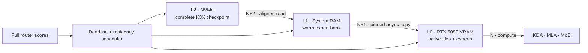

<div align="center">

# K3X

### Kimi K3, engineered for one consumer PC

[](#milestone-29--official-kda-transformer-layer)
[](https://github.com/rsb1813/project-k3x/actions/workflows/ci.yml?query=branch%3Amain)
[](#target-machine)
[](#repository-map)
[](K3X_FORMAT.md)

**A clean-room, out-of-core inference engine and checkpoint format built around Kimi K3's execution graph.**

[Architecture](ARCHITECTURE.md) · [Performance model](PERFORMANCE_MODEL.md) · [File format](K3X_FORMAT.md) · [Research ledger](docs/references.md)

</div>

---

Kimi K3 is a 2.8T-parameter sparse MoE model whose local inference problem is dominated by moving the right expert bytes at the right time. K3X starts from that constraint. It is not a fork of llama.cpp or vLLM, and it does not assume that the checkpoint fits in RAM or VRAM.

The long-term design treats NVMe, system RAM, and GPU memory as one deadline-scheduled hierarchy while preserving full routing and exact cold-expert rescue. Implemented milestones now cover the exact synthetic graph and format, strict converter source/metadata/resume boundaries, explicit RTX 5080 CUDA baselines, bounded L0/L1 primitives, independent L2 Reader modes, a released-size expert storage slice, an opt-in exact current-layer deadline worker, runtime-switchable exact eviction, persistent runtime-only task/session routing profiles, experimental fixed/adaptive Top-K with exact selected-expert rescue, opt-in routed expert accumulation on CUDA, strict token-major plus CPU/CUDA expert-major verification, a transactional persistent AURORA cursor, exact transient and bounded-resident CUDA drafts, an opt-in resident multi-expert CUDA grid, an exact resident MoE-layer boundary, and bounded ordered-set CUDA Graph experiments. Cross-layer prediction and the full three-tier pipeline remain future work.



> [!IMPORTANT]
> The executable token graph still uses a tiny synthetic model, but Milestone 27 now executes one exact 17,547,264-byte native-MXFP4 expert from the pinned official Kimi K3 checkpoint on RTX 5080 and matches the portable CPU oracle within `3.0267983675e-9`. This is one FFN expert, not routing, a full layer, token generation, or a full-model throughput claim. No complete shard, full checkpoint, or paid cloud resource was used.

| Milestone | GitHub status | Evidence |
|---|---|---|
| Milestone 11 | [PR #11 merged](https://github.com/rsb1813/project-k3x/pull/11) at `edc6d605` | B-0012 adaptive Top-K and exact rescue |
| Milestone 12 | [PR #12 merged](https://github.com/rsb1813/project-k3x/pull/12) at `9e59a9db` | B-0013 routed CUDA accumulation |
| Milestone 13 | [PR #13 merged](https://github.com/rsb1813/project-k3x/pull/13) | B-0014 token-major verification |
| Milestone 14 | [PR #15 merged](https://github.com/rsb1813/project-k3x/pull/15) | B-0015 exact CPU expert-major verification |
| Milestone 15 | [PR #17 merged](https://github.com/rsb1813/project-k3x/pull/17) at `c18df33` | B-0016 exact CUDA expert-major execution |
| Milestone 16 | [PR #20 merged](https://github.com/rsb1813/project-k3x/pull/20) at `df5c07d` | B-0017 measured AURORA replay reference; exact and non-default |
| Milestone 17 | [PR #23 merged](https://github.com/rsb1813/project-k3x/pull/23) at `30bbf7a8` | B-0018 persistent AURORA state; exact and non-default |
| Milestone 18 | [PR #25 merged](https://github.com/rsb1813/project-k3x/pull/25) at `7899a7ae` | B-0019 exact transient CUDA AURORA draft; measured regression, non-default |
| Milestone 19 | [PR #27 merged](https://github.com/rsb1813/project-k3x/pull/27) at `c88456c0` | B-0020 bounded exact CUDA AURORA residency; H2D reduction measured, non-default |
| Milestone 20 | [PR #29 merged](https://github.com/rsb1813/project-k3x/pull/29) at `90b20c87` | B-0021 resident CUDA expert grid; four matched pairs preserve exact target behavior and reduce MoE launches 75% |
| Milestone 21 | [PR #31 merged](https://github.com/rsb1813/project-k3x/pull/31) at `97eb3e4e` | B-0022 resident CUDA MoE layer; exact target behavior and lower sync/H2D/D2H, mixed decode result |
| Milestone 22 | [PR #36 merged](https://github.com/rsb1813/project-k3x/pull/36) at `e4820a18` | B-0023 released-dimension MoE boundary; exact traffic gates pass, complete layer latency is 4.30×–16.69× split |
| Milestone 23 | [PR #38 merged](https://github.com/rsb1813/project-k3x/pull/38) at `e24cac2` | B-0024 attributes the regression to repeated 469,776,384-byte validation and measures an exact admission-time fast path |
| Milestone 24 | [PR #40 merged](https://github.com/rsb1813/project-k3x/pull/40) at `13a403f` | B-0025 measures direct, whole-update, and bounded ordered-set CUDA Graph behavior across stable, alternating, and rotating traces |
| Milestone 25 | [PR #42 merged](https://github.com/rsb1813/project-k3x/pull/42) at `ca8c544e` | B-0026 validates bounded fresh/resume/orphan conversion and strict external-input rejection without real weights |
| Milestone 26 | [PR #44 merged](https://github.com/rsb1813/project-k3x/pull/44) at `5b6345db` | B-0027 verifies one pinned official 17,547,264-byte expert range, content-addressed conversion, and the non-executable runtime guard |
| Milestone 27 | [PR #46 merged](https://github.com/rsb1813/project-k3x/pull/46) at `ec08b827` | B-0028 executes the pinned official expert on RTX 5080 and verifies exact transient/resident traffic and CPU-oracle parity |

PR #11 and PR #12 are part of the current public `main` history, not pending feature branches. Their branch, pull-request, and post-merge correctness runs are recorded with the corresponding measurements in [`BENCHMARKS.md`](BENCHMARKS.md). The latest audited public implementation baseline is Milestone 27 integration head `ec08b827`; branch correctness `31455570571`, pull-request correctness `31455597581`, and pull-request CodeQL `31455597565` passed before merge. Post-merge `main` correctness `31455776634` and CodeQL `31455776673` also succeeded.

## Why a dedicated engine

The released text decoder combines 69 Kimi Delta Attention layers, 24 Gated MLA layers, block Attention Residuals, and 92 Stable LatentMoE layers. Each MoE layer selects 16 of 896 native MXFP4 routed experts.

One released routed expert is approximately 16.73 MiB. With no cache reuse, natural Top-16 routing requests approximately **25.83 GB of expert weights per token** across the 92 MoE layers. A P44 Pro's published 7 GB/s sequential maximum would cap that worst case near 0.27 tok/s before all other work. The path to useful speed is therefore traffic avoidance and amortization, not a single faster GEMM.

K3X is designed around four invariants.

- Correctness comes before throughput, and every optimization retains a switchable reference path.
- Residency never silently becomes pruning; a high-scoring cold expert can be fetched exactly.
- Storage order follows execution and prefetch, with direct random access to one expert.
- Every speed claim carries measured bytes/token and a quality mode.

## Milestone 0 — verified foundation

The repository now contains a connected, deterministic K3-compatible miniature graph.

- KDA with causal short-convolution and recurrent state.
- Gated MLA with main and shared-extra NoPE keys plus incremental KV state.
- Block Attention Residual mixing.
- Stable LatentMoE, correction-bias selection, and normalized unbiased routing weights.
- Native MXFP4 E2M1/E8M0 decode and byte-exact storage preservation.
- Full-prefix and incremental greedy generation.
- A bounded-memory, resumable, crash-safe K3X converter.
- Strict Python and independent C++20 readers and runtimes.
- Corruption, truncation, required-feature, state, layer, logit, and token parity tests.

For prompt `[1, 7, 3, 9]`, the seeded fixture generates the same sequence in PyTorch and C++, in both full and incremental modes.

```text
[43, 32, 28, 49, 9, 28]
```

## Milestone 1 — exact CUDA baselines

The same graph can now be executed through three explicit identities with no silent fallback.

| Backend | Dense path | Native MXFP4 expert path |
|---|---|---|
| `cpu` | Portable FP32 C++ | Portable byte-level oracle |
| `cuda-dense` | cuBLASLt FP32 or BF16-rounded | Portable CPU oracle by definition |
| `cuda-custom` | cuBLASLt FP32 or BF16-rounded | Direct E2M1 + E8M0/32 CUDA kernel |

The CUDA build targets native `sm_120`, validates compute capability 12.0 or newer, and records CUDA-event kernel time, directional transfers, and backend-owned peak VRAM. Both CUDA paths preserve the exact six-token sequence. FP32 layer, logit, and state error stays below `1.8e-7` maximum absolute error on the fixture. BF16 remains opt-in and preserves tokens with `0.004025` maximum absolute diagnostic error.

## Milestone 2 — reusable memory and exact residency

CUDA execution now exposes three independent switches while preserving the Milestone 1 reference path.

| Switch | Reference | Optimized path |
|---|---|---|
| Allocation | `per-operation` | `reused` grow-only scratch and cached CUDA resources |
| Weights | `transient` | Tensor-ID-keyed exact `resident` VRAM entries with a hard byte bound |
| Scheduling | `scalar` | Same-input `grouped` dense and native MXFP4 projections |

Static residency stores exact FP32, BF16-rounded, or native E2M1 plus E8M0/32 representations. Entries that do not fit bypass residency and use the exact transient path. This milestone deliberately has no eviction policy and is not yet the L0/L1/L2 expert cache.

## Milestone 3 — exact CUDA FFN blocks

`--cuda-boundary ffn-block` keeps dense/shared gate, up, strict SiTU-GLU, and down intermediates on the GPU. Routed MoE blocks preserve natural Top-K routing, execute exact native MXFP4 expert triplets in router order, upload the shared latent once, and return only final expert outputs for unchanged CPU score mixing.

The block boundary is `cuda-custom` only and remains opt-in. The default `operation` path is the correctness reference. B-0004 measures FP32 block-scalar at 17.0713 decode tok/s versus 16.3576 for its matched operation row, with 24.77% less D2H and 32.86% fewer synchronizations. This is a tiny synthetic WSL2 result, not a full Kimi K3 throughput claim.

## Milestone 4 — exact asynchronous L1-to-L0 transfer

`--cuda-transfer prefetch` stages the naturally routed native MXFP4 expert triplets through one bounded pinned slab and a separate nonblocking CUDA stream. A readiness event lets the routed-down projection overlap the copy, and a single-use prepared token binds the process-global ID, use sequence, layer, and phase. Exact expert bytes, routing scores, order, recurrent state, and output tokens are unchanged.

This first boundary is deliberately limited to `cuda-custom + ffn-block + reused + transient` and requires `--cuda-pinned-bytes`. It does not implement persistent L1 caching or asynchronous NVMe reads. B-0005 found matched decode changes between -1.03% and +0.90% on the tiny WSL2 graph, so synchronous transfer remains the default.

## Milestone 5 — bounded persistent L1 expert cache

`--l1-expert-cache static --l1-expert-cache-bytes N` enables an exact, no-eviction whole-expert store in system RAM. A `RuntimeSession` retains that store across consecutive generation calls. One entry owns the native MXFP4 gate/up/down packed bytes and scales, validates the native group-32 representation before admission, admits atomically under a hard capacity, and returns an exact transient handle when it cannot fit. `disabled` remains the default.

B-0006 validates the same handles across CPU operation execution, synchronous CUDA FFN blocks, and asynchronous prepared CUDA transfers. Milestone 5 itself does not implement eviction; Milestone 9 later adds exact LRU, LFU, and Least-Stale. Task/session profiles, prediction, asynchronous NVMe reads, and physical NVMe counters remain future work.

## Milestone 6 — independent exact L2 reader

The Linux data plane now keeps one descriptor and exposes independent `--l2-io pread|io-uring` and `--l2-cache buffered|direct` switches. Exact native MXFP4 experts submit their six packed/scale extents as one ordered batch. Optional liburing uses bounded explicit-offset reads; direct mode requires `STATX_DIOALIGN`, uses aligned bounce buffers, and fails closed without a supported alignment contract.

The default remains `pread + buffered`. B-0007 preserves exact tokens, routing, and logical bytes across all four modes on WSL2 ext4, but it is a non-authoritative capability benchmark. The batch API still waits for completion; deadline-aware multi-layer prefetch and GPU overlap remain future work.

## Milestone 7 — full-dimension bounded expert slice

A streaming source generator now materializes one actual-size K3 routed expert: 16,515,072 packed E2M1 bytes plus 1,032,192 E8M0 scale bytes. It publishes a content-addressed shard before its manifest, and conversion verifies the declared shard and per-tensor SHA-256 values. K3X optional feature bit 0 marks the artifact as a non-executable storage fixture, so Readers can benchmark it while model generation fails closed. The converter packs gate/up/down in execution order and never holds a full matrix in RAM. Resume reuses only a canonical, source-matched extent prefix.

`k3x_storage_bench` and B-0008 measure one exact six-extent expert load without token fields. All four Reader modes preserve the same 17,547,264-byte payload and ordered SHA-256 on WSL2 ext4. This does not implement a full-dimension graph, establish P44 Pro traffic, or change the `pread + buffered` default.

## Milestone 8 — exact current-layer deadline loading

`--l2-schedule deadline` submits the current layer's already-selected natural Top-K experts to one bounded latest-start-priority worker. Exact L1 hits complete inline while non-resident loads can overlap the routed-down and shared-expert computation. `blocking` remains the default, and generation drains outstanding work on both success and failure.

B-0009 preserves exact tokens, routing, L1 counters, and logical Reader bytes across eight schedule/Reader combinations. Deadline decode was 4.91% to 21.45% slower than blocking on the tiny warm WSL2 graph, so the worker remains experimental. Future-layer prediction, ORBIT, eviction, multiple L2 workers, and N/N+1/N+2 triple buffering are not implemented.

## Milestone 9 — exact expert cache policies

`--l1-expert-cache lru|lfu|least-stale --l1-expert-cache-bytes N` adds exact bounded eviction while retaining `disabled` as the default and `static` as the no-eviction reference. Natural Top-K routing is marked before admission, every miss fetches the exact native MXFP4 expert, and the runtime records evictions plus same-forward collision misses. The SpecMD Least-Stale reproduction prioritizes stale processed layers while protecting upcoming layers.

B-0010 crosses four policies at 2-, 8-, and 16-expert synthetic capacities. At 8 experts, Least-Stale records 23 hits, 31 misses, and zero collisions versus LRU's 20/34/1 and LFU's 19/35/7. At 16 experts LFU has the best traffic, so no policy becomes a default from this tiny warm WSL2 evidence. Milestone 10 adds bounded task/session priors; transition prediction, ORBIT, and full-model cache evidence remain future work.

## Milestone 10 — task and session profiles

`--runtime-metadata TASK=coding,LANG=cpp,PHASE=debug,REPO=k3x` supplies cache-only context without changing prompt IDs. `--runtime-profile-in prior.k3xp --runtime-profile-out observed.k3xp` resumes and persists bounded expert frequency, adjacent-layer transitions, metadata, and a deterministic hot bank. Current metadata can explicitly replace an older saved value such as `PHASE`.

`--l1-expert-cache profiled --profile-prior-strength 4` enables the experimental exact prior/live eviction score. Profile observation is otherwise disabled unless metadata or profile I/O is explicitly requested. B-0011 preserves exact tokens, routing, logits, and recurrent state in every row. A matching prior reaches the same 23 hits and 628,080 logical Reader bytes as Least-Stale, but does not improve tiny-graph timing; the minimum-overlap alternate prior is worse. The mode remains opt-in.

## Milestone 11 — adaptive Top-K and exact cold rescue

`--routing natural|fixed|adaptive` keeps the checkpoint natural Top-K immutable while allowing explicit K4/K6/K8/K12/K16 experiments. Adaptive selection uses cumulative router mass, entropy effective support, boundary confidence, and an external quality floor. Agent-failure and critical signals can only raise fixed/adaptive K; natural routing ignores them and remains the default.

Every selected cold expert is fetched through the exact native MXFP4 path, and residency never substitutes a lower-ranked expert. B-0012 shows 40.8%/27.2%/13.6% logical Reader-byte reductions for K4/K8/K12 against natural K16 on the 24-expert synthetic fixture, but all reduced-K rows change tokens, logits, and recurrent state. Fixed K16 and critical escalation are exact. The measured quality divergence keeps every reduced/adaptive mode explicitly lossy and opt-in.

## Milestone 12 — routed CUDA accumulation fusion

`--cuda-moe-fusion routed-accumulate` is available only with `cuda-custom + ffn-block`. It preserves natural router order and exact native MXFP4 gate/up/SiTU execution, then folds each down projection's contribution scale into ordered device accumulation so only the final mixed latent crosses D2H. Synchronous and prepared-prefetch paths share the same validation and telemetry contract. `none` remains the reference and default.

B-0013 improves tiny synthetic natural Top-16 decode by 11.33% with synchronous transfer and 8.91% with prefetch while reducing D2H by 51,840 bytes per run. The bounded 3,584-by-3,072 released expert fixture instead becomes 8.01% slower in median latency despite a 93.75% D2H reduction. That representative-dimension regression prevents a default change. It is kernel/D2H evidence without routing semantics, not full-model token throughput.

## Milestone 13 — exact speculative verification reference

The runtime implements the first strict greedy, token-major speculative reference behind a separate `generate_speculative` API. An external draft provider supplies the accepted anchor and a bounded candidate prefix. The target accepts only consecutive candidates equal to its own argmax, commits one target bonus token, and reports the exact commit back to the provider. Ordinary `generate_greedy` behavior is unchanged.

Native tests cover perfect, partial, first-token, and empty proposals as well as invalid anchors, token IDs, proposal bounds, callback failures, exhausted providers, unused script records, output-count one, and non-incremental rejection. Runtime integration tests show exact parity with greedy generation for token IDs, final KDA/MLA state, complete routing/K traces, Reader calls and bytes, and L1 hits and misses.

The CLI exposes only `none|scripted-reference` for deterministic drafting. B-0014 measures greedy at 171.4333 tok/s, perfect block-2 at 174.0861 tok/s, and mixed block-2 at 173.2344 tok/s on the tiny WSL2 CPU fixture. All three execute five target decode forwards and read 665,616 bytes, so the 1.55% and 1.05% differences are not evidence of speculative acceleration. Milestone 14 adds the separate expert-major verification switch; a learned DSpark drafter, AURORA, EcoSpec, MoE-Spec, and AcceptMoE remain unfinished.

## Milestone 14 — exact expert-major verification

`--speculative-verification expert-major` executes every position in one scripted proposal block layer by layer on the CPU. Each MoE layer computes natural routing for all positions, forms a stable first-use union, loads each unique native MXFP4 expert payload once, evaluates every assigned token, and accumulates results in the original per-token router-slot order. Position-specific KDA snapshots and temporary MLA prefixes let the verifier commit only the accepted prefix plus target bonus token. `token-major` remains the default.

The first exact boundary is intentionally limited to CPU, incremental generation, natural routing, blocking L2, disabled L1, and no runtime profile observation. Unsupported combinations fail before Reader or output mutation. Greedy, token-major perfect/mixed, and expert-major perfect/mixed tests preserve generated tokens, final KDA/MLA state, and committed routing traces.

B-0015 measures five rows with three warmups and twenty samples on the tiny warm WSL2 CPU fixture. Perfect expert-major verification reuses 6 of 30 expert assignments, reduces Reader bytes from 665,616 to 655,824 and calls from 428 to 392, and measures 201.5550 tok/s versus token-major's 160.1659. Mixed expert-major verification evaluates three rejected positions, raises Reader bytes to 680,304 and calls to 482, and measures 122.6010 tok/s versus 163.0028. This establishes the reuse-versus-rejection-cost boundary, not full-model or RTX 5080 performance, and does not justify changing the default.

## Milestone 15 — exact CUDA expert-major execution

The expert-major verifier now accepts the exact `cuda-custom + ffn-block + reused + transient + synchronous + fusion none` boundary. At each unique expert group it gathers token latents in stable assignment order, uploads one flat activation batch, transfers the expert's native MXFP4 gate/up/down payload once, launches the existing E2M1/E8M0 arithmetic over a two-dimensional `(row, token)` grid, and scatters the results back to their original token/router slots. Token-major remains the default, and CPU expert-major remains the portable exact oracle.

The batch API validates shape, overflow, native-weight metadata, and SiTU parameters before allocation or profiler mutation. CLI capability gates reject unsupported backends, allocation modes, weight modes, transfer modes, fusion, L1, L2 scheduling, routing, and profile observation before output mutation. B-0016 preserves exact generated tokens, final recurrent state, and committed routing in all five CUDA graph rows.

On the released 3,584-by-3,072 single-expert fixture, batching two tokens reduces measured weight H2D from 701,890,560 to 350,945,280 bytes over 20 iterations and median latency from 3.4449 ms to 1.7378 ms. Batching four tokens reduces weight H2D from 1,403,781,120 to 350,945,280 bytes and median latency from 6.7053 ms to 2.6319 ms. Activation H2D and D2H are unchanged, numerical error is zero, and Compute Sanitizer reports zero errors. This is a bounded single-expert kernel/traffic measurement without routing semantics, not full-model Kimi K3 throughput.

Reproduce both evidence boundaries with one command after generating `artifacts/synthetic.k3x` and `artifacts/m12-bounded.k3x`.

```bash
python tools/ablate_cuda_expert_major.py \
  --artifact artifacts/synthetic.k3x \
  --runner build-cuda/k3x_run \
  --released-artifact artifacts/m12-bounded.k3x \
  --released-runner build-cuda/k3x_cuda_expert_batch_bench \
  --warmup 3 \
  --iterations 20 \
  --output-dir build-results/b0016-cuda-expert-major
```

## Milestone 16 — measured AURORA replay reference

The `aurora-replay` provider replays the complete committed prefix through a separate CPU fixed-reduced-Top-K runtime and produces real candidate tokens. Its `{1,2,4}` scheduler gates one-rung exploration with Laplace-smoothed prefix survival and measured expert payload-load-to-assignment cost, then backs off immediately after rejection. Token-major and expert-major target paths feed actual evaluated/discarded work and expert cost before the next proposal. Draft Reader, routing, and time counters remain separate from the natural target.

B-0017 runs natural greedy plus six fixed/adaptive K4 replay rows with three warmups and twenty samples. Every row preserves exact target tokens, final KDA/MLA state, and committed routes. The best replay result is fixed block-2 expert-major at 611.7589 tok/s, still 46.35% below the tiny natural baseline's 1140.3391 tok/s because it reads 1,454,112 extra logical draft bytes. Adaptive token/expert rows accept 0.5 of proposed tokens and are 60.77%/62.52% slower. These are tiny WSL2 synthetic values, not full Kimi K3 or RTX 5080 throughput. Replay remains non-default and serves as the oracle for persistent draft-state work.

Reproduce the seven-row CPU experiment with the already-built runtime.

```bash
python tools/ablate_aurora_replay.py \
  --runner build/k3x_run \
  --output build-results/b0017-aurora-replay \
  --warmups 3 \
  --samples 20
```

## Milestone 17 — persistent AURORA draft state

`--speculative-mode aurora-persistent` replaces complete-prefix draft replay with one transactional cursor. It prefills the prompt plus first verified target token once, snapshots fixed-size KDA convolution/recurrent state, records append-only MLA logical sizes, crops a rejected suffix, and teacher-forces the target bonus token after every verification. Replay remains available as the exact oracle. Reduced precision, resident-only drafting, and learned drafting are not part of this milestone.

B-0018 compares four matched replay/persistent pairs on the same Top-16 synthetic fixture. Proposal counts, acceptance, natural target tokens, final KDA/MLA state, and committed routes match exactly. Persistent fixed block-2 reduces logical draft Reader bytes by 45.96% and measures 14.97% higher token-major decode and 14.55% higher expert-major decode than replay. Persistent adaptive scheduling reduces draft bytes by 63.08% and measures 41.75%/27.08% higher token/expert-major decode. The persistent rows prefill five draft-context tokens once and replay zero prefix positions.

These are tiny CPU measurements under WSL2. Reader bytes are logical runtime bytes, not physical NVMe traffic, and the result does not establish full Kimi K3 throughput, coding quality, or a production default.

```bash
python tools/ablate_persistent_aurora.py \
  --runner build/k3x_run \
  --output build-results/b0018-persistent-aurora \
  --warmups 3 \
  --samples 20
```

## Milestone 18 — exact CUDA AURORA draft experiment

`--aurora-draft-backend cpu|cuda-custom` keeps CPU drafting as the default and enables one deliberately fixed CUDA identity only for `aurora-persistent`: FP32, reused allocations, transient weights, grouped execution, `ffn-block`, synchronous transfer, fusion `none`, and zero resident/pinned capacity. `aurora-replay` remains CPU-only. Backend creation is fail-closed, so a CPU build or unsupported CUDA identity never falls back silently.

Draft and target telemetry are independent. JSON/CSV records carry draft device and CUDA identity plus kernel time, H2D split, D2H, peak VRAM, allocations, synchronizations, and cache counters. With the target kept on CPU, B-0019 confirms its CUDA counters remain zero while only the draft counters increase.

B-0019 measures natural greedy plus four matched CPU/CUDA persistent-draft pairs with three warmups and twenty samples on the RTX 5080 under WSL2. Every pair preserves proposed/accepted/committed counts, strict target tokens, final recurrent state, and committed routing. The transient synchronous CUDA draft is nevertheless 96.22% to 97.00% slower than its CPU pair, adding 5,843,840 to 6,428,224 H2D bytes per measured run and 37.47 to 54.55 ms of aggregate draft kernel time. This is a measured rejection of transient per-step GPU drafting as a default, not a claim that GPU drafting is inherently unsuitable.

The next isolated experiment must remove repeated draft weight transfer through bounded residency or larger persistent multi-token/multi-expert work before considering reduced precision. No default, target verifier, routing rule, full-model claim, or cloud resource changed.

```bash
python tools/ablate_cuda_aurora_draft.py \
  --runner build-cuda/k3x_run \
  --output build-results/b0019-cuda-aurora-draft \
  --warmups 3 \
  --samples 20
```

## Milestone 19 — bounded exact CUDA AURORA residency

`--aurora-draft-resident-bytes N` is owned only by `aurora-persistent + cuda-custom`. Zero preserves the Milestone 18 transient identity byte-for-byte. A positive capacity selects the existing tensor-ID-keyed exact `ResidentWeightTable`; the bound is hard, has no eviction, and falls back to exact transient execution when a weight cannot be admitted. CPU drafting remains the default and `aurora-replay` remains CPU-only.

Draft JSON/CSV now separates configured capacity, current resident bytes, peak resident bytes, cache hits, misses, bypasses, and weight H2D from the CPU target. B-0020 holds FP32, reduced Top-4 drafting, routing, target verification, scheduler, kernels, and synchronous transfer fixed while comparing four transient/resident pairs. Every pair preserves proposals, acceptance, target tokens, final KDA/MLA state, and committed routes.

With an 8 MiB cap, the tiny Top-16 fixture actually occupies only 644,160 or 647,424 bytes, records 75.68% or 77.27% cache hit rate, and has zero bypasses. Resident weight H2D falls by 88.81% or 89.78%. Paired decode changes are mixed: +15.58% fixed token, -2.56% adaptive token, +22.67% fixed expert-major, and +5.57% adaptive expert-major. Residency is therefore retained as an exact opt-in experiment, not promoted to a default. The next isolated CUDA axis is larger persistent multi-token/multi-expert work to reduce 410–451 synchronous waits and fine-grained launches.

```bash
python tools/ablate_cuda_aurora_residency.py \
  --runner build-cuda/k3x_run \
  --output build-results/b0020-cuda-aurora-residency \
  --warmups 3 \
  --samples 20
```

## Milestone 20 — resident CUDA expert grid

`--cuda-batching resident-grid` and `--aurora-draft-batching resident-grid` select a closed experimental identity: `cuda-custom + ffn-block + reused + resident + synchronous + fusion-none` with positive bounded residency. All native MXFP4 gate, up, and down pointers must resolve in the resident table before the grid is launched. Any hard-cap bypass routes the complete request through the exact serial FFN path; CUDA failures never become CPU fallback.

The resident path uploads one bounded descriptor table and one token-major input block, then launches gate, up, grid-wide SiTU, and down exactly once each across `(expert, token, row)`. Outputs remain expert-major and token-major within each expert, so the existing CPU router-slot accumulation order is unchanged. AURORA still drafts causally one token at a time; multi-token coverage in the direct benchmark is a kernel contract for later expert-major consumers, not concurrent autoregressive generation.

B-0021 holds the CPU natural Top-16 target, exact resident Top-4 CUDA draft, scheduler, verification mode, FP32 arithmetic, and 8 MiB capacity fixed. Across fixed/adaptive token-major and expert-major pairs, the grid reduces measured MoE launches by 75% and improves paired synthetic decode by **10.79%**, **24.09%**, **38.00%**, and **21.86%**. Every row preserves proposals, acceptance, target tokens, final KDA/MLA state, committed routing, and Reader evidence with zero grid fallback. This is tiny WSL2 synthetic evidence, so grouped execution and CPU drafting remain defaults.

```bash
python tools/ablate_cuda_aurora_grid.py \
  --runner build-cuda/k3x_run \
  --output-dir build-results/b0021-cuda-aurora-grid \
  --warmup 3 \
  --iterations 20
```

## Milestone 21 — resident CUDA MoE layer

`--cuda-boundary moe-layer` and `--aurora-draft-boundary moe-layer` select a closed FP32 identity built on exact resident weights and `resident-grid`. CPU routing remains authoritative, but routed-down, the expert grid, router-order contribution mixing, RMSNorm, routed-up, the shared SiTU MLP, and final addition execute as thirteen timed operations on one CUDA stream with one final result copy and synchronization.

All dense, norm, and native MXFP4 weights are resolved before launch. If the hard capacity cannot fit any member, the layer returns a launch-free non-error bypass and the runtime reuses the same router decision, expert payloads, and contributions in the exact Milestone 20 split path. CUDA and validation errors remain failures. `ffn-block` and CPU drafting remain defaults.

B-0022 holds target, proposal policy, verification mode, precision, capacity, and expert-grid execution fixed across four split/layer pairs. Every pair preserves target tokens, final KDA/MLA state, committed routes, proposal/acceptance counts, and Reader bytes. The layer removes exactly three synchronizations per successful call, reduces total draft H2D by 14,496 or 15,984 bytes, and reduces D2H by 26,880 or 29,568 bytes. Its extra 384-byte norm admission is recorded identically in weight H2D and resident occupancy.

Paired synthetic decode changes are **+5.62%**, **-2.75%**, **-1.22%**, and **+3.93%**. The mixed timing result keeps the boundary opt-in and non-default despite the verified traffic reduction. These are tiny WSL2 measurements, not full Kimi K3 or coding-quality evidence.

```bash
python tools/ablate_cuda_aurora_moe_layer.py \
  --runner build-cuda/k3x_run \
  --output-dir build-results/b0022-cuda-aurora-moe-layer \
  --warmup 3 \
  --iterations 20
```

## Milestone 22 — released-dimension MoE-layer boundary

`k3x_cuda_moe_layer_bench` loads the existing 17,547,264-byte released expert fixture, creates deterministic FP32 tensors at hidden 7,168, routed latent 3,584, and expert intermediate 3,072, and compares the split resident-grid path with the complete resident `moe-layer` path at 1, 4, and 16 repeated-view experts. The Top-16 layer occupies 750,532,608 resident weight bytes inside an explicit 1 GiB hard cap. This is a direct layer-boundary measurement with `routing_semantics=false`, not token throughput or a full checkpoint.

B-0023 confirms maximum error 0, zero fallback/bypass, zero warm weight H2D, exactly 80→20 synchronizations per 20 iterations, lower activation H2D and D2H, and an exact 14,336-byte routed-norm cold/resident delta in all three pairs. The split oracle is destroyed before the selected backend is measured, and peak VRAM reports the larger sequential phase rather than overlapping two resident tables. Median complete-layer latency nevertheless regresses by **+1568.62%**, **+783.91%**, and **+329.88%** at 1, 4, and 16 experts.

The complete boundary therefore remained diagnostic and non-default after B-0023. Code inspection identified its O(weight-bytes) immutable-weight scan as the next attribution target. Milestone 23 below implements the correctness-preserving admission alternative and confirms that attribution; CUDA Graph caching and a larger device-resident token boundary remain separate decisions.

```bash
python tools/ablate_cuda_released_moe_layer.py \
  --artifact build-fixtures/released-expert.k3x \
  --runner build-cuda/k3x_cuda_moe_layer_bench \
  --output-dir build-results/b0023-cuda-released-moe-layer \
  --warmup 3 \
  --iterations 20
```

## Milestone 23 — admission validation attribution

The exact resident MoE-layer backend now supports `--cuda-weight-validation per-call|admission`. The default remains `per-call`. The opt-in `admission` mode validates all six immutable FP32 tensors before any CUDA acquisition, commits their tensor-ID/pointer/shape identities only after the complete preflight succeeds, and rejects later identity conflicts before CUDA mutation. Dynamic inputs, contributions, dimensions, IDs, native MXFP4 structure, and scalar parameters remain validated on every call.

B-0024 repeats the released-dimension 1/4/16-expert boundary with profiler collection independently off and on. Each per-call row scans exactly **9,395,527,680 bytes** over 20 measured calls. Each admission row records six cold scans totaling **469,776,384 bytes**, then zero warm scan bytes and 120 identity hits. With profiler off, complete-layer median latency changes as follows.

| Experts | Per-call validation | Admission validation | Paired change |
|---:|---:|---:|---:|
| 1 | 19.570 ms | 1.247 ms | -93.63% |
| 4 | 20.729 ms | 1.940 ms | -90.64% |
| 16 | 24.519 ms | 5.221 ms | -78.71% |

All 18 rows preserve maximum absolute error 0, zero warm weight H2D, zero bypass/fallback, exact synchronization/launch/traffic identities, and profiler on/off physical-counter parity. This is a direct released-dimension layer microbenchmark with `routing_semantics=false`; it is not token throughput, a full-checkpoint result, or a coding-quality measurement. CUDA Graph selection remains deferred until ordered routed-set reuse and bounded graph-cache behavior are measured.

Milestone 23 is published through [PR #38](https://github.com/rsb1813/project-k3x/pull/38) at `e24cac2`. Pull-request and post-merge correctness and CodeQL gates all passed.

```bash
python -m tools.ablate_cuda_admission_validation \
  --artifact build-fixtures/released-expert.k3x \
  --runner build-cuda/k3x_cuda_moe_layer_bench \
  --output-dir build-results/b0024-cuda-admission-validation \
  --warmup 3 \
  --iterations 20
```

## Milestone 24 — bounded CUDA Graph cache attribution

The exact resident MoE-layer path now supports `--cuda-graph disabled|update|cache` with a strict entry-capacity contract. `disabled` remains the default. `update` recaptures the thirteen-operation layer and attempts whole-executable update; `cache` stores a hard-capped LRU set keyed by the exact ordered expert identity. Each entry owns its graph executable and fixed pinned input/output staging. Scratch pointer or capacity changes invalidate all entries. Graph errors fail closed and never silently execute the direct path.

B-0025 uses four already-resident expert views in five deterministic orderings, so trace churn changes graph identity without introducing warm weight H2D. Every one of the 15 rows preserves maximum error 0, zero warm weight H2D, zero bypass/fallback, one synchronization and thirteen logical kernels per measured call. Median released-layer latency is shown relative to the direct row for each trace.

| Trace | Direct | Update-1 | Cache-1 | Cache-2 | Cache-4 |
|---|---:|---:|---:|---:|---:|
| Stable A/A | 1.998 ms | 1.968 ms (-1.51%) | 1.964 ms (-1.68%) | 2.011 ms (+0.66%) | 2.035 ms (+1.87%) |
| Alternating A/B | 2.068 ms | 1.976 ms (-4.41%) | 2.160 ms (+4.47%) | 2.035 ms (-1.58%) | 2.005 ms (-3.01%) |
| Rotating A/B/C/D/E | 1.961 ms | 2.094 ms (+6.79%) | 2.099 ms (+7.07%) | 2.080 ms (+6.09%) | 2.188 ms (+11.57%) |

Stable and alternating rows vary within roughly -4.41% to +4.47%, while every rotating capacity churns on all 20 measured calls and regresses 6.09%–11.57%. The mixed small deltas and consistent churn penalty are insufficient to change defaults, especially without real K3 routing traces or native-Linux end-to-end evidence. CUDA Graph modes therefore remain exact, experimental, and opt-in. This is a released-dimension layer microbenchmark with `routing_semantics=false`, not token throughput or coding-quality evidence.

```bash
python -m tools.ablate_cuda_graph_cache \
  --artifact build-fixtures/released-expert.k3x \
  --runner build-cuda/k3x_cuda_moe_layer_bench \
  --output-dir build-results/b0025-cuda-graph-cache \
  --warmup 3 \
  --iterations 20
```

## Milestone 25 — converter trust boundary

The streaming converter now rejects source manifests that escape the declared root, overlap shard ownership, use noncanonical hashes or constants, or bind a tensor to anything other than one contained shard. The safetensors reader enforces the upstream 100,000,000-byte header ceiling before allocation, rejects duplicate or non-standard JSON, validates exact tensor metadata and payload coverage, and retains valid leading-whitespace, scalar, and empty-tensor cases.

Resume ledgers now require the exact canonical schema, lowercase digests and UUIDs, unique ordered extent IDs, and bounded non-boolean integer fields. A resume first validates the complete committed prefix and source bytes, then truncates any uncommitted suffix to the exact final `offset + length`; alignment padding is regenerated. Corrupt committed data remains a hard failure and is never repaired silently.

B-0026 exercises one fresh conversion, one clean two-extent resume, and one resume after appending an 8,192-byte orphan suffix. Every run limits an individual source read to 257 bytes and produces a Reader-valid 1,421,568-byte synthetic K3X artifact. Both resume cases reuse two verified extents from an exact 20,736-byte committed prefix.

| Scenario | Wall time | Max source read | Reused extents | Orphan suffix | Final bytes |
|---|---:|---:|---:|---:|---:|
| Fresh | 804,991,621 ns | 257 B | 0 | 0 B | 1,421,568 |
| Resume clean | 800,116,522 ns | 257 B | 2 | 0 B | 1,421,568 |
| Resume orphan | 887,550,657 ns | 257 B | 2 | 8,192 B | 1,421,568 |

These are synthetic converter-integrity timings, not throughput targets. Peak RSS was not measured, no full Kimi K3 weight was downloaded, no cloud resource was provisioned, and no token, quality, GPU, PCIe, or physical NVMe claim is made.

## Milestone 26 — official bounded range discovery

K3X now resolves the public `moonshotai/Kimi-K3` repository to pinned commit `9f62e4e9fffbd0a83ddd60e1c209d828994b3569`, verifies the 59,764,096-byte model index by its declared LFS SHA-256, recomputes the Git blob identity of `config.json`, and parses the exact safetensors header through HTTP ranges. Redirects, hosts, statuses, byte ceilings, `Content-Range`, object sizes, raw path segments, JSON structure, shard ownership, released dimensions, and w1/w2/w3 role mapping all fail closed.

B-0027 materializes only layer 1, expert 0 from shard 2. The six official U8 tensors form the contiguous shard range `[1,268,562,960, 1,286,110,224)`, exactly 17,547,264 bytes. The payload is repacked into a content-addressed local microshard, hashed per tensor, converted through the unchanged K3X writer, reopened by the strict Reader, and marked `OPTIONAL_STORAGE_FIXTURE`. The C++ runtime rejects generation from the resulting real-weight artifact with exit code 4 and `NON_EXECUTABLE_ARTIFACT` before graph execution.

The evidence verifier binds deterministic repository, snapshot, config, index, shard, expert-layout, traffic, payload, per-tensor, microshard, and K3X-root identities independently of the record's own hashes. Consistently rehashed tampering therefore does not become valid evidence.

| Evidence | Measured value |
|---|---:|
| Official files / repository bytes | 118 / 1,560,998,984,390 |
| Index tensors / shards / tensor bytes | 497,220 / 96 / 1,560,860,324,864 |
| Metadata + header bytes | 59,799,719 + 818,704 |
| Tensor payload bytes | 17,547,264 |
| Payload SHA-256 | `1d925fa7bd91331511783b7423204d20b6337cd672b403fd017b7b42f421c36c` |
| Microshard SHA-256 | `ed3f07d595f37d90b1688de21ba0cdc012ee92c67dd92c460c0c73b2ef374a34` |
| K3X root SHA-256 | `d585d283325e13e1316a0194c2d6274dd89ef75a28b96b02f02733290b7658be` |

The evidence level is explicitly `transport-pinned-range`, not `full-shard-verified`: the complete 16.99 GB shard was not downloaded, so its full LFS digest was not recomputed. Real tensor and K3X bytes remain ignored below `artifacts/`; only canonical JSON/CSV identities and measurements are committed. M27 owns the first actual CUDA expert execution over these real bytes.

## Milestone 27 — official expert CUDA execution

The dedicated `k3x_cuda_official_expert_bench` verifies the fixed B-0027 K3X root, ordered gate/up/down digest, optional features, layer/expert IDs, payload bytes, and shapes before constructing either backend. It runs one real layer-1 expert-0 SiTU FFN on the portable CPU backend and native `sm_120` CUDA path. The general `k3x_run` storage-fixture guard is unchanged.

B-0028 records three warmups and twenty measured calls for transient and exact-capacity resident modes. Both modes preserve all 3,584 outputs within `3.0267983675e-9` maximum absolute error.

| Mode | Cold latency | Warm median | p05–p95 | Measured weight H2D | Activation H2D / D2H | Resident bytes | Peak VRAM |
|---|---:|---:|---:|---:|---:|---:|---:|
| Transient | 7,122,628 ns | 2,508,377 ns | 1,865,439–2,649,090 ns | 350,945,280 B | 286,720 / 286,720 B | 0 B | 5,914,624 B |
| Resident | 7,748,006 ns | 331,868 ns | 319,489–366,599 ns | 0 B | 286,720 / 286,720 B | 17,547,264 B | 23,461,888 B |

Resident execution lowers this bounded warm median by 86.77% and removes all measured repeated weight H2D after the identical 17,547,264-byte cold admission. The comparison is one deterministic expert under WSL2; it does not establish token throughput, natural routing, multi-expert pressure, native-Linux behavior, GPU utilization, memory bandwidth, physical PCIe/NVMe traffic, or coding quality. M28 therefore closes the smallest meaningful real MoE FFN sublayer next: real router scores, natural Top-16 selection, exact selected routed experts, the real shared expert, mixing, and residual behavior.

## Milestone 28 — bounded official MoE manufacturing

The M28 storage path now implements the complete two-phase manufacturing contract without downloading a full shard. Phase 1 materializes and verifies the eleven always-active layer-1 tensors, derives two deterministic natural Top-16 routes from all 896 scores, and atomically persists their first-use union. Phase 2 requests only that selected union, preserves each native MXFP4 expert exactly, repacks expert matrices in gate/up/down execution order, and assembles one BF16/MXFP4 K3X storage fixture.

Tensor-payload responses and local copies are bounded to 8 MiB; the separately verified model-index metadata response is 59,764,096 bytes. Completed objects are rehashed before reuse, verified partials resume, damaged partials restart, and route identity is durable before expert fetching begins. `--scope moe-ffn` remains a zero-payload dry-run by default; payload access additionally requires `--materialize --output-dir`. Reports separate actual downloaded bytes from logical source-object bytes.

Commit `0b0c944` passes 27 focused materializer/CLI tests and 149 official-source/converter recovery regressions. Commit `8a13cf5` adds the pure portable CPU oracle with exact BF16 rounding, natural route validation, native-MXFP4 expert execution, routed/shared mixing, and final prefix addition. Every tiny intermediate boundary matches an independent PyTorch calculation; CPU CTest passes 17/17 and the full C++ parity file passes 113 tests with 32 capability skips.

Commit `bb634e1` adds the opt-in byte-native CUDA counterpart. Routed/shared BF16 tensors and selected native-MXFP4 experts stay in their source representation through transient upload or exact bounded residency; the complete FFN boundary executes on one stream and returns one final vector. Tiny transient and resident fixtures match the portable oracle within `2e-2`, a second resident call performs zero additional weight H2D, CUDA CTest passes 30/30, and Compute Sanitizer reports zero errors.

Commits `a109409` and `bdab0da` bind the final K3X root back into the durable route manifest and add the strict official fixture harness. It verifies pinned source identity, exact tensor metadata/order, both recomputed routes, CPU-oracle parity, and transient/resident traffic formulas before emitting the B-0029 input schema. Synthetic coverage passes 18 tests, and all three official-fixture smoke cases pass on the bounded ignored artifact.

Commit `ba3a0d2` adds the non-ranking B-0029 evidence pipeline for exactly A transient, A resident, and alternating resident. It verifies every schema, traffic, parity, digest, aggregate, and LF-only CSV boundary before publication. The bounded run selected two disjoint natural Top-16 routes, materialized their exact 32-expert union plus eleven always-active tensors, and transferred 941,412,864 tensor-payload bytes without downloading a complete shard or checkpoint. A verified reuse run transferred zero payload bytes.

B-0029 now measures a 97.096 ms transient median and a 10.154 ms exact-resident median for route A. The resident A row transfers zero warm weight bytes and keeps 647.765 MB resident. Alternating A+B residency measures 20.201 ms per sequence, keeps 928.521 MB resident, transfers zero warm weight bytes, and matches the independent oracle within `0.00048828125`. These are complete official MoE FFN sublayer measurements on RTX 5080 under WSL2. They are not token-rate, quality, physical-NVMe/PCIe, complete-layer, or native-Linux results.

The full M28 verification matrix passes CPU CTest 17/17 with Python 507 passed and 97 skipped, liburing CTest 18/18 with Python 509 passed and 95 skipped, ASan/UBSan CTest 18/18, and CUDA CTest 30/30 with Python 592 passed and 12 skipped. Compute Sanitizer reports zero errors on the actual alternating resident path. The next boundary is one complete official transformer layer, adding KDA/MLA/Attention Residual around the now-validated FFN before any end-to-end token claim.

Public PR [#48](https://github.com/rsb1813/project-k3x/pull/48) rebase-merged Milestone 28 at `eb2c208`. Branch correctness, pull-request correctness, C++/Python CodeQL, and post-merge `main` correctness/CodeQL all passed.

## Milestone 29 — official KDA transformer layer

M29 is designed, its metadata-planning gate is implemented, and its independent scalar KDA oracle passes full/incremental state parity. Complete-layer execution, payload materialization, CUDA, and B-0030 are not implemented. It extends the bounded official fixture from the measured MoE FFN boundary to the complete layer-1 graph: self Attention Residual, input RMSNorm, KDA with incremental convolution/recurrent state, MLP Attention Residual, natural Top-16 Stable LatentMoE, and final prefix accumulation.

Header-only inspection found exactly 17 new tensors and 887,843,840 payload bytes. The complete unaligned fixture will be `1,267,744,256 + 17,547,264 * U` bytes for the naturally derived two-token expert union `U`, bounded by 1,829,256,704 bytes. No tensor payload was downloaded during design.

The checkpoint stores channel-wise F32 `A_log[128]`, while its pinned Python constructor creates `[96]`. K3X treats the checkpoint header and KDA paper as authoritative, fails closed on `[96]`, and validates a two-token full call against incremental A-then-B execution including all convolution state, FP32 recurrent state, routes, contributions, and layer outputs. The artifact remains non-executable through `k3x_run` until independent CPU/CUDA whole-layer parity and B-0030 pass. This milestone makes no token-rate or quality claim.

The first Task 1 gate now parses and binds the exact KDA configuration, pinned source blob, 17 tensor dtypes/shapes/ranges, M28 MoE plan, and byte formulas before payload access. The live metadata-only plan returns layer 1, 17 tensors, 887,843,840 KDA bytes, 1,267,744,256 base bytes, and a 1,829,256,704-byte two-route maximum. Official source/MoE/layer/CLI regression coverage passes 64 tests; malformed linear-attention layer sets and `A_log[96]` fail closed.

Task 2 adds an execution-independent PyTorch scalar oracle with explicit BF16 projection/convolution boundaries, F32 channel-wise decay, scalar-per-head beta, FP32 key-by-value recurrence, and V-first published state. A literal two-token fixture matches incremental A-then-B execution exactly at BF16 outputs and convolution histories and within `1e-6` for recurrent state. Focused KDA/model coverage passes 17 tests, including dtype, shape, non-finite, empty-sequence, state-layout, and input-state immutability failures. This is correctness evidence only and contains no official tensor payload or performance result.

## Quick start

### 1. Create an environment

Linux and Python 3.12 are the primary development path. PyTorch is used only by the executable reference and fixture generator; the C++ runtime has no ML framework dependency.

```bash
python3.12 -m venv .venv
source .venv/bin/activate
python -m pip install --upgrade pip
python -m pip install -e '.[dev]'
```

On Windows PowerShell, activate with `.\.venv\Scripts\Activate.ps1`.

### 2. Run the Python correctness suite

```bash
python -m pytest tests/python -q
```

### 3. Build the C++20 runtime

```bash
cmake -S . -B build -G Ninja -DCMAKE_BUILD_TYPE=Release
cmake --build build
ctest --test-dir build --output-on-failure
```

To build the optional Linux io_uring path, install liburing development headers and configure with `-DK3X_ENABLE_IO_URING=ON`. Unsupported runtime requests return `STORAGE_UNAVAILABLE`; they never fall back silently.

For the RTX 5080 CUDA baseline, CUDA Toolkit 13.3 or newer is required.

```bash
cmake -S . -B build-cuda -G Ninja \
  -DCMAKE_BUILD_TYPE=Release \
  -DK3X_ENABLE_CUDA=ON \
  -DCMAKE_CUDA_ARCHITECTURES=120
cmake --build build-cuda
ctest --test-dir build-cuda --output-on-failure
```

### 4. Generate and convert the synthetic checkpoint

```bash
python tools/generate_synthetic.py --output build-fixtures/run-a
python -m k3x_converter.cli convert \
  build-fixtures/run-a/source \
  build-fixtures/synthetic.k3x \
  --chunk-bytes 257
```

The deliberately tiny chunk size makes the bounded streaming path observable. Conversion writes `.partial` data and an atomic ledger until every extent has been read back and CRC-verified.

### 5. Run exact incremental generation

```bash
./build/k3x_run \
  --model build-fixtures/synthetic.k3x \
  --prompt-ids 1,7,3,9 \
  --generate 6 \
  --mode incremental \
  --backend cpu \
  --dense-precision fp32 \
  --json run.json
```

Use `build\k3x_run.exe` on Windows.

Select `--backend cuda-dense` or `--backend cuda-custom` only with a CUDA-enabled build. Use `--dense-precision bf16` for the opt-in BF16-rounded dense path. An unavailable CUDA request fails with `BACKEND_UNAVAILABLE`; it never changes the requested backend.

The CUDA switches are `--cuda-allocation`, `--cuda-weights`, `--cuda-batching`, `--cuda-boundary`, `--cuda-transfer`, `--cuda-resident-bytes`, and `--cuda-pinned-bytes`. Defaults retain the exact synchronous operation reference behavior. `--cuda-boundary ffn-block` requires `--backend cuda-custom`; the initial prefetch mode additionally requires reused allocation, transient weights, and a positive pinned capacity.

### 6. Reproduce the synthetic benchmark

```bash
python tools/benchmark_synthetic.py \
  --artifact build-fixtures/synthetic.k3x \
  --runner build/k3x_run \
  --backend cpu \
  --dense-precision fp32 \
  --warmup 3 \
  --iterations 20 \
  --json build-results/milestone-one.json \
  --csv build-results/milestone-one.csv
```

Run the four-stage CUDA ablation sequentially with the same artifact and sample counts.

```bash
python tools/ablate_cuda_residency.py \
  --artifact build-fixtures/synthetic.k3x \
  --runner build-cuda/k3x_run \
  --backend cuda-custom \
  --dense-precision fp32 \
  --cuda-resident-bytes 8388608 \
  --warmup 3 \
  --iterations 20 \
  --output-dir build-results/m2-cuda-custom
```

Run the exact four-case FFN boundary ablation with one checkpoint, commit, precision, and sample count.

```bash
python tools/ablate_cuda_ffn.py \
  --artifact build-fixtures/synthetic.k3x \
  --runner build-cuda/k3x_run \
  --dense-precision fp32 \
  --cuda-resident-bytes 8388608 \
  --warmup 3 \
  --iterations 20 \
  --output-dir build-results/b0004-ffn-blocks-fp32
```

Run the matched exact transfer ablation with synchronous/prefetch and scalar/grouped cases.

```bash
python tools/ablate_cuda_transfer.py \
  --artifact build-fixtures/synthetic.k3x \
  --runner build-cuda/k3x_run \
  --dense-precision fp32 \
  --cuda-pinned-bytes 1048576 \
  --warmup 3 \
  --iterations 20 \
  --output-dir build-results/b0005-async-transfer-fp32
```

Run the matched persistent-L1 ablation with disabled/static cache and synchronous/prefetch transfers.

```bash
python tools/ablate_l1_expert_cache.py \
  --artifact build-fixtures/synthetic.k3x \
  --runner build-cuda/k3x_run \
  --dense-precision fp32 \
  --l1-expert-cache-bytes 65536 \
  --cuda-pinned-bytes 1048576 \
  --warmup 3 \
  --iterations 20 \
  --output-dir build-results/b0006-l1-cache-fp32
```

## Measured results

The checked Milestone 0 run used Windows 11 AMD64, an MSVC Debug build, three warmups, and 20 measured child processes.

| Metric | Result |
|---|---:|
| Synthetic incremental decode | 558.89 tok/s |
| Synthetic prefill | 405.11 tok/s |
| Process-level TTFT median | 86.20 ms |
| Peak observed child RSS | 6.27 MB |
| Logical K3X reads / generated token | 110,936 bytes |

The benchmark's scope is `synthetic-milestone-zero` and evidence is marked `measured` in both JSON and CSV. TTFT includes complete artifact integrity verification before execution. See [`PERFORMANCE_MODEL.md`](PERFORMANCE_MODEL.md) for definitions, state sizes, layer timings, assumptions, and the full-model byte model.

The Milestone 1 comparison used commit `c92f498`, WSL2 Ubuntu 24.04.4, the Ryzen 7 9800X3D, RTX 5080, CUDA 13.3.1, three warmups, and 20 measured processes per mode.

| Backend | Precision | Decode tok/s | Prefill tok/s | TTFT | H2D/run | Kernel/run | Max abs. error |
|---|---|---:|---:|---:|---:|---:|---:|
| `cpu` | FP32 | 19.49 | 11.35 | 797.40 ms | 0 | 0 | 0 |
| `cuda-dense` | FP32 | 11.67 | 7.18 | 1,244.63 ms | 4,999,104 B | 11.56 ms | 1.640e-7 |
| `cuda-custom` | FP32 | 10.11 | 6.51 | 1,296.82 ms | 5,107,968 B | 14.52 ms | 1.751e-7 |
| `cuda-dense` | BF16 | 11.50 | 7.29 | 1,239.82 ms | 2,499,552 B | 11.84 ms | 0.00402409 |
| `cuda-custom` | BF16 | 10.12 | 6.67 | 1,288.63 ms | 2,608,416 B | 14.31 ms | 0.00402409 |

The CPU wins this deliberately tiny Milestone 1 workload. Milestone 2 then measures each CUDA optimization independently.

| Backend | Reference | Reuse | Residency | Grouped |
|---|---:|---:|---:|---:|
| `cuda-dense` FP32 decode tok/s | 12.13 | 17.46 | **18.00** | 17.90 |
| `cuda-custom` FP32 decode tok/s | 12.26 | 17.14 | **17.27** | 16.83 |

Reusable allocation removes most per-call allocation churn, and residency cuts measured synthetic weight H2D by about 88.5–88.9%. Grouping reduces activation traffic and synchronization but is slightly slower than scalar residency on both backends, so it remains opt-in. Fully enabled BF16 also remains opt-in because it does not beat FP32 scalar residency. These results validate mechanisms on the synthetic graph; they do not predict full Kimi K3 throughput. Raw results live in [`results/`](results/), and the complete measurement contract is in [`BENCHMARKS.md`](BENCHMARKS.md).

Milestone 3 then compares matched `cuda-custom + reused + resident` operation and FFN-block boundaries.

| Precision | Operation scalar | FFN block scalar | Operation grouped | FFN block grouped |
|---|---:|---:|---:|---:|
| FP32 decode tok/s | 16.3576 | **17.0713** | 16.4210 | 17.0270 |
| BF16 decode tok/s | 16.3874 | **16.9847** | 16.1931 | 16.9632 |

All eight B-0004 rows generate `[43, 32, 28, 49, 9, 28]`. FP32 block-scalar is the fastest measured Milestone 3 CUDA row, but `operation` remains the default because the evidence is synthetic, WSL2-only, and still dominated by the CPU-resident graph.

Milestone 4 compares matched exact transient-weight transfers at the FFN-block boundary.

| Precision / scheduling | Synchronous | Prefetch | Decode change |
|---|---:|---:|---:|
| FP32 scalar | **16.9701** | 16.7947 | -1.03% |
| FP32 grouped | 16.7055 | **16.7914** | +0.51% |
| BF16 scalar | **16.6366** | 16.5735 | -0.38% |
| BF16 grouped | 16.5529 | **16.7021** | +0.90% |

All B-0005 rows preserve the same tokens and routing. Prefetch performs 27 exact preparations and waits with no additional host synchronization, but uses 1 MiB each of pinned host and device staging and exposes 0.198--0.312 ms transfer stall per run. It remains opt-in until persistent L1 caching and representative expert sizes make the overlap boundary meaningful.

Milestone 5 crosses disabled/static L1 admission with synchronous/prefetch transfer at the same scalar FFN-block boundary.

| Precision / transfer | Disabled | Static L1 | Decode change |
|---|---:|---:|---:|
| FP32 synchronous | 16.5587 | **47.6845** | +188.0% |
| FP32 prefetch | 16.7636 | **50.6235** | +202.0% |
| BF16 synchronous | 16.4052 | **47.7956** | +191.3% |
| BF16 prefetch | 16.5073 | **47.6198** | +188.5% |

Each static row records 36 hits, 18 misses, zero bypasses, and 29,376 resident bytes. Logical Reader calls fall from 428 to 212 while GPU traffic and execution counts remain unchanged. These are measurements on the tiny synthetic WSL2 graph, not physical NVMe results or projected full-Kimi throughput, so static admission remains opt-in.

Milestone 6 crosses the L2 engine and cache axes with L1 disabled.

| Cache mode | `pread` decode tok/s | `io_uring` decode tok/s | Logical / submitted bytes |
|---|---:|---:|---:|
| Buffered | **5,870.8082** | 5,616.1034 | 665,616 / 665,616 |
| Direct | 163.3491 | 428.8471 | 665,616 / 756,736 |

All four B-0007 rows preserve `[43, 32, 28, 49, 9, 28]` and the same 24-entry routing trace. These CPU figures come from a tiny 3×20 WSL2 ext4 capability benchmark, not the P44 Pro and not a full-model workload. They keep `pread + buffered` as the default but cannot choose the eventual native-Linux storage path.

Milestone 7 replaces tiny expert extents with one physically materialized released-dimension expert.

| Cache mode | `pread` median / Reader ms | `io_uring` median / Reader ms | Bytes per load |
|---|---:|---:|---:|
| Buffered | **50.685 / 4.661** | 51.592 / **4.579** | 17,547,264 |
| Direct | 60.402 / 14.832 | **56.426 / 11.633** | 17,547,264 |

B-0008 uses 3 warmups and 20 loads per row. Wall latency includes payload allocation and ordered SHA-256; Reader time isolates the storage-call boundary. Every row has zero short reads and failures, and actual expert dimensions produce zero 512-byte direct-I/O amplification. These WSL2 ext4 results are expert loads per second, not tokens per second, and do not select a native-Linux default.

## K3X checkpoint format

K3X v1 trades general tensor-container flexibility for K3 execution order.

| Property | Contract |
|---|---|
| Superblock | Fixed 4 KiB, versioned, required/optional feature negotiation |
| Lookup | Tensor, layer, and expert directories |
| Extents | 4 KiB aligned, execution-order packable, independently checksummed |
| Integrity | CRC32C per extent, directory SHA-256, finalized root SHA-256 |
| MXFP4 | Packed values and E8M0 scales preserved byte-for-byte |
| Failure model | `.partial` artifact, atomic idempotent ledger, read-back verification, atomic final rename |
| Access | Per-expert random access and large sequential-read layout |

The normative binary layout lives in [`K3X_FORMAT.md`](K3X_FORMAT.md).

## Quality contract

| Mode | Intended semantics |
|---|---|
| `QUALITY` | High-precision trunk, natural Top-16, exact experts, strict speculative verification, no proxy |
| `BALANCED` | Mixed trunk quantization, adaptive K, full routing, exact cold rescue |
| `HYPERTURBO` | Aggressive mixed precision and experimental expert-aware verification budgets |
| `EXTREME` | Explicitly lossy proxy or pruning experiments |

Only the exact synthetic routing contract is implemented. BF16 dense execution is an explicit experimental precision switch, not an accepted `BALANCED` quality mode. Future modes will not become defaults without an ablation and a simultaneous quality measurement.

## Target machine

| Component | Primary target |
|---|---|
| CPU | AMD Ryzen 7 9800X3D |
| GPU | NVIDIA RTX 5080 16 GB |
| RAM | 96 GB DDR5-4200 |
| Storage | Solidigm P44 Pro 2 TB NVMe |
| OS | Native Linux first |

The first meaningful engineering target is at least 5 warm coding decode tok/s if measurements show it is achievable. It is a target, not a forecast.

## Roadmap

- [x] Exact synthetic reference graph and correctness suite.
- [x] K3X v1 streaming format and crash-safe converter.
- [x] Independent exact C++20 synthetic runtime.
- [x] Synthetic profiler and reproducible JSON/CSV output.
- [x] Strict converter source, safetensors, resume-ledger, and orphan-suffix trust boundaries with B-0026 evidence.
- [x] Pinned official index/config/header discovery and one exact real native-MXFP4 expert conversion with B-0027 evidence.
- [x] Pinned official expert CPU-oracle/RTX 5080 execution with strict transient/resident B-0028 evidence.
- [x] Two-phase bounded official MoE planning, natural-route persistence, exact selected-union materialization, and non-executable K3X assembly.
- [x] Dimension-driven portable BF16/MXFP4 official MoE oracle with independent PyTorch boundary parity.
- [x] Opt-in native BF16/MXFP4 official MoE CUDA boundary with transient/resident parity and sanitizer coverage.
- [x] Strict pinned official MoE fixture harness with root binding, route recomputation, and fail-closed synthetic coverage.
- [x] Strict three-row B-0029 runner/verifier with digest-backed JSON/CSV evidence contracts.
- [x] Bounded 32-expert official MoE fixture, actual parity/sanitizer gates, and formal RTX 5080 B-0029 evidence.
- [x] Explicit RTX 5080 cuBLASLt and native-byte MXFP4 CUDA correctness baselines.
- [x] End-to-end CPU/CUDA synthetic parity and measured comparison.
- [x] Reusable CUDA allocation, bounded exact static residency, grouped projection ablation, and split H2D profiling.
- [x] Bounded exact L1-to-L0 expert prefetch with pinned staging, transfer-stream events, accounting, and matched ablation.
- [ ] Exact full-dimension CPU/GPU runtime over bounded checkpoint slices.
- [x] Opt-in routed down-projection scaling/accumulation fusion with synthetic and released-dimension B-0013 ablation.
- [ ] Wider layer/block GPU execution and additional K3-specific kernels.
- [x] Bounded no-eviction persistent L1 expert cache with exact transient bypass.
- [x] Independent exact `pread|io_uring` and `buffered|direct` L2 reader with ordered expert batches.
- [x] Physically materialized full-dimension expert storage slice and exact four-mode B-0008 ablation.
- [x] Opt-in exact current-layer deadline worker with failure-safe draining and B-0009 ablation.
- [x] Runtime-switchable exact LRU, LFU, and SpecMD Least-Stale expert caches with B-0010 ablation.
- [x] Runtime-only task/session metadata, bounded persistent routing profiles, and opt-in profiled eviction with B-0011 ablation.
- [ ] Cross-layer asynchronous L2 prefetch and N/N+1/N+2 scheduling.
- [ ] Transition-conditioned prediction and multi-layer lookahead.
- [x] Experimental adaptive/fixed Top-K with exact selected cold-expert rescue and B-0012 quality/traffic ablation.
- [x] Exact token-major speculative block verification library/runtime reference with a DSpark-lifecycle-compatible external draft interface.
- [x] Scripted CLI telemetry and B-0014 speculative correctness/overhead measurement.
- [x] Exact CPU/CUDA expert-major speculative verification with stable expert grouping, one-payload-per-group H2D reuse, and B-0015/B-0016 evidence.
- [x] Exact replay-oracle-matched persistent AURORA draft state with bounded KDA checkpoints, MLA crop, and B-0018 evidence.
- [x] Exact opt-in transient CUDA AURORA draft execution with separated target/draft telemetry and B-0019 rejection evidence.
- [x] Exact opt-in bounded CUDA AURORA draft residency with hard-cap transient bypass, separated occupancy telemetry, and B-0020 evidence.
- [x] Exact opt-in resident multi-expert CUDA grid with all-or-nothing serial fallback, direct 1/2/4-token coverage, and B-0021 evidence.
- [x] Exact opt-in resident CUDA MoE-layer boundary with one-result synchronization, exact split fallback, and B-0022 evidence.
- [x] Released-dimension 1/4/16-expert MoE-layer boundary benchmark with cold/warm traffic separation, digest-backed B-0023 evidence, and no token-throughput claim.
- [x] Admission-time immutable validation with B-0024 attribution and bounded ordered-set CUDA Graph update/cache experiments with B-0025 evidence.
- [ ] Learned drafting, acceptance-aware block sizing, and cost-aware verification experiments.
- [ ] Sensitivity-calibrated mixed trunk quantization.
- [ ] SKYFORGE shard compiler for explicitly provisioned cloud jobs.
- [ ] Full ablation and coding-quality suite.

## Repository map

```text
reference/k3x_ref/   PyTorch executable oracle
converter/           Streaming K3X writer, reader, and resume ledger
runtime/             Dependency-free C++20 reader and synthetic runtime
tests/python/        Graph, state, conversion, corruption, and parity tests
tests/cpp/           Portable checksum and primitive tests
tools/               Deterministic fixture and benchmark entrypoints
docs/                Research ledger and milestone design records
```

## Research discipline

The graph and roadmap were checked against the official Kimi K3 release and report, FlashKDA, Attention Residuals, vLLM's implementation work, independent C and MLX runtimes, and the primary SpecMD, DSpark, EcoSpec, MoE-Spec, and AcceptMoE sources. Pinned revisions and the boundary between implemented, designed, and future work are recorded in [`docs/references.md`](docs/references.md).

## Current limitations

- The executable model is synthetic and text-only.
- The production runtime remains synthetic and host-driven outside FFN blocks. A dedicated non-default harness executes one bounded official layer-1 MoE FFN sublayer at released dimensions, but KDA/MLA/attention and the token loop are not connected to that artifact.
- Reusable scratch, bounded static weight residency, and same-input grouping are implemented, but activations and results still cross the host/device boundary and asynchronous overlap is not implemented.
- Static residency has no eviction and is not the future three-tier expert cache.
- The bounded io_uring batch reader, current-layer deadline worker, exact expert eviction policies, persistent task/session frequency profiles, and experimental adaptive/fixed Top-K are implemented, but there is no cross-layer asynchronous storage pipeline or future-layer predictor.
- Exact token-major plus CPU/CUDA expert-major verification, AURORA replay/persistent draft modes, and B-0014 through B-0025 are implemented. Persistent AURORA defaults to CPU fixed-reduced-Top-K; transient, bounded-resident, resident-grid, resident MoE-layer, admission-validation, and CUDA Graph paths are exact opt-in experiments. B-0025 finds mixed stable/alternating deltas and rotating churn 6.09%–11.57% slower, so no graph default changes. There is no learned DSpark drafter, reduced-precision draft path, eviction-capable draft residency, device-resident whole-token graph, or full-model speculative speedup claim.
- Reduced K is explicitly lossy. B-0012 shows synthetic speed and logical-traffic gains together with token/logit/state divergence; natural Top-K remains the default and no full-model quality claim exists.
- The converter and dedicated CUDA harness have processed and executed a bounded official Kimi K3 layer-1 MoE FFN slice with two natural Top-16 routes and a 32-expert union. No complete transformer layer, complete shard, or full checkpoint has been processed. Provenance remains transport-pinned range identity, not recomputed full-object LFS verification or signed publisher provenance.
- RTX 5080 correctness and synthetic performance are measured under WSL2; native-Linux storage and full-model performance remain unmeasured.
- No open-source license has been selected yet; public visibility does not itself grant reuse rights.

---

<div align="center">

**Measure the bytes. Preserve the route. Prove every token.**

</div>
