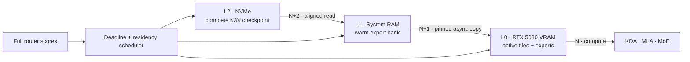

<div align="center">

# K3X

### Kimi K3, engineered for one consumer PC

[](#milestone-1--exact-cuda-baselines)
[](#target-machine)
[](#repository-map)
[](K3X_FORMAT.md)

**A clean-room, out-of-core inference engine and checkpoint format built around Kimi K3's execution graph.**

[Architecture](ARCHITECTURE.md) · [Performance model](PERFORMANCE_MODEL.md) · [File format](K3X_FORMAT.md) · [Research ledger](docs/references.md)

</div>

---

Kimi K3 is a 2.8T-parameter sparse MoE model whose local inference problem is dominated by moving the right expert bytes at the right time. K3X starts from that constraint. It is not a fork of llama.cpp or vLLM, and it does not assume that the checkpoint fits in RAM or VRAM.

The long-term design treats NVMe, system RAM, and GPU memory as one deadline-scheduled hierarchy while preserving full routing and exact cold-expert rescue. Milestone 0 proved the graph, token sequence, persistent state, binary format, and independent runtime. Milestone 1 adds explicit CPU/CUDA backends, native K3 MXFP4 execution, structured device profiling, and an honest end-to-end comparison on the target RTX 5080.



> [!IMPORTANT]
> Milestone 1 still uses a tiny synthetic model. Its measurements validate backend correctness and expose launch, transfer, and residency costs; they are not full Kimi K3 throughput claims. No full checkpoint was downloaded and no paid cloud resource was provisioned.

## Why a dedicated engine

The released text decoder combines 69 Kimi Delta Attention layers, 24 Gated MLA layers, block Attention Residuals, and 92 Stable LatentMoE layers. Each MoE layer selects 16 of 896 native MXFP4 routed experts.

One released routed expert is approximately 16.73 MiB. With no cache reuse, natural Top-16 routing requests approximately **25.83 GB of expert weights per token** across the 92 MoE layers. A P44 Pro's published 7 GB/s sequential maximum would cap that worst case near 0.27 tok/s before all other work. The path to useful speed is therefore traffic avoidance and amortization, not a single faster GEMM.

K3X is designed around four invariants.

- Correctness comes before throughput, and every optimization retains a switchable reference path.
- Residency never silently becomes pruning; a high-scoring cold expert can be fetched exactly.
- Storage order follows execution and prefetch, with direct random access to one expert.
- Every speed claim carries measured bytes/token and a quality mode.

## Milestone 0 — verified foundation

The repository now contains a connected, deterministic K3-compatible miniature graph.

- KDA with causal short-convolution and recurrent state.
- Gated MLA with main and shared-extra NoPE keys plus incremental KV state.
- Block Attention Residual mixing.
- Stable LatentMoE, correction-bias selection, and normalized unbiased routing weights.
- Native MXFP4 E2M1/E8M0 decode and byte-exact storage preservation.
- Full-prefix and incremental greedy generation.
- A bounded-memory, resumable, crash-safe K3X converter.
- Strict Python and independent C++20 readers and runtimes.
- Corruption, truncation, required-feature, state, layer, logit, and token parity tests.

For prompt `[1, 7, 3, 9]`, the seeded fixture generates the same sequence in PyTorch and C++, in both full and incremental modes.

```text
[43, 32, 28, 49, 9, 28]
```

## Milestone 1 — exact CUDA baselines

The same graph can now be executed through three explicit identities with no silent fallback.

| Backend | Dense path | Native MXFP4 expert path |
|---|---|---|
| `cpu` | Portable FP32 C++ | Portable byte-level oracle |
| `cuda-dense` | cuBLASLt FP32 or BF16-rounded | Portable CPU oracle by definition |
| `cuda-custom` | cuBLASLt FP32 or BF16-rounded | Direct E2M1 + E8M0/32 CUDA kernel |

The CUDA build targets native `sm_120`, validates compute capability 12.0 or newer, and records CUDA-event kernel time, directional transfers, and backend-owned peak VRAM. Both CUDA paths preserve the exact six-token sequence. FP32 layer, logit, and state error stays below `1.8e-7` maximum absolute error on the fixture. BF16 remains opt-in and preserves tokens with `0.004025` maximum absolute diagnostic error.

## Milestone 2 — reusable memory and exact residency

CUDA execution now exposes three independent switches while preserving the Milestone 1 reference path.

| Switch | Reference | Optimized path |
|---|---|---|
| Allocation | `per-operation` | `reused` grow-only scratch and cached CUDA resources |
| Weights | `transient` | Tensor-ID-keyed exact `resident` VRAM entries with a hard byte bound |
| Scheduling | `scalar` | Same-input `grouped` dense and native MXFP4 projections |

Static residency stores exact FP32, BF16-rounded, or native E2M1 plus E8M0/32 representations. Entries that do not fit bypass residency and use the exact transient path. This milestone deliberately has no eviction policy and is not yet the L0/L1/L2 expert cache.

## Milestone 3 — exact CUDA FFN blocks

`--cuda-boundary ffn-block` keeps dense/shared gate, up, strict SiTU-GLU, and down intermediates on the GPU. Routed MoE blocks preserve natural Top-K routing, execute exact native MXFP4 expert triplets in router order, upload the shared latent once, and return only final expert outputs for unchanged CPU score mixing.

The block boundary is `cuda-custom` only and remains opt-in. The default `operation` path is the correctness reference. B-0004 measures FP32 block-scalar at 17.0713 decode tok/s versus 16.3576 for its matched operation row, with 24.77% less D2H and 32.86% fewer synchronizations. This is a tiny synthetic WSL2 result, not a full Kimi K3 throughput claim.

## Milestone 4 — exact asynchronous L1-to-L0 transfer

`--cuda-transfer prefetch` stages the naturally routed native MXFP4 expert triplets through one bounded pinned slab and a separate nonblocking CUDA stream. A readiness event lets the routed-down projection overlap the copy, and a single-use prepared token binds the process-global ID, use sequence, layer, and phase. Exact expert bytes, routing scores, order, recurrent state, and output tokens are unchanged.

This first boundary is deliberately limited to `cuda-custom + ffn-block + reused + transient` and requires `--cuda-pinned-bytes`. It does not implement persistent L1 caching or asynchronous NVMe reads. B-0005 found matched decode changes between -1.03% and +0.90% on the tiny WSL2 graph, so synchronous transfer remains the default.

## Milestone 5 — bounded persistent L1 expert cache

`--l1-expert-cache static --l1-expert-cache-bytes N` enables an exact, no-eviction whole-expert store in system RAM. A `RuntimeSession` retains that store across consecutive generation calls. One entry owns the native MXFP4 gate/up/down packed bytes and scales, validates the native group-32 representation before admission, admits atomically under a hard capacity, and returns an exact transient handle when it cannot fit. `disabled` remains the default.

B-0006 validates the same handles across CPU operation execution, synchronous CUDA FFN blocks, and asynchronous prepared CUDA transfers. It does not implement LRU, LFU, Least-Stale, task/session profiles, prediction, asynchronous NVMe reads, or physical NVMe counters.

## Quick start

### 1. Create an environment

Linux and Python 3.12 are the primary development path. PyTorch is used only by the executable reference and fixture generator; the C++ runtime has no ML framework dependency.

```bash
python3.12 -m venv .venv
source .venv/bin/activate
python -m pip install --upgrade pip
python -m pip install -e '.[dev]'
```

On Windows PowerShell, activate with `.\.venv\Scripts\Activate.ps1`.

### 2. Run the Python correctness suite

```bash
python -m pytest tests/python -q
```

### 3. Build the C++20 runtime

```bash
cmake -S . -B build -G Ninja -DCMAKE_BUILD_TYPE=Release
cmake --build build
ctest --test-dir build --output-on-failure
```

For the RTX 5080 CUDA baseline, CUDA Toolkit 13.3 or newer is required.

```bash
cmake -S . -B build-cuda -G Ninja \
  -DCMAKE_BUILD_TYPE=Release \
  -DK3X_ENABLE_CUDA=ON \
  -DCMAKE_CUDA_ARCHITECTURES=120
cmake --build build-cuda
ctest --test-dir build-cuda --output-on-failure
```

### 4. Generate and convert the synthetic checkpoint

```bash
python tools/generate_synthetic.py --output build-fixtures/run-a
python -m k3x_converter.cli convert \
  build-fixtures/run-a/source \
  build-fixtures/synthetic.k3x \
  --chunk-bytes 257
```

The deliberately tiny chunk size makes the bounded streaming path observable. Conversion writes `.partial` data and an atomic ledger until every extent has been read back and CRC-verified.

### 5. Run exact incremental generation

```bash
./build/k3x_run \
  --model build-fixtures/synthetic.k3x \
  --prompt-ids 1,7,3,9 \
  --generate 6 \
  --mode incremental \
  --backend cpu \
  --dense-precision fp32 \
  --json run.json
```

Use `build\k3x_run.exe` on Windows.

Select `--backend cuda-dense` or `--backend cuda-custom` only with a CUDA-enabled build. Use `--dense-precision bf16` for the opt-in BF16-rounded dense path. An unavailable CUDA request fails with `BACKEND_UNAVAILABLE`; it never changes the requested backend.

The CUDA switches are `--cuda-allocation`, `--cuda-weights`, `--cuda-batching`, `--cuda-boundary`, `--cuda-transfer`, `--cuda-resident-bytes`, and `--cuda-pinned-bytes`. Defaults retain the exact synchronous operation reference behavior. `--cuda-boundary ffn-block` requires `--backend cuda-custom`; the initial prefetch mode additionally requires reused allocation, transient weights, and a positive pinned capacity.

### 6. Reproduce the synthetic benchmark

```bash
python tools/benchmark_synthetic.py \
  --artifact build-fixtures/synthetic.k3x \
  --runner build/k3x_run \
  --backend cpu \
  --dense-precision fp32 \
  --warmup 3 \
  --iterations 20 \
  --json build-results/milestone-one.json \
  --csv build-results/milestone-one.csv
```

Run the four-stage CUDA ablation sequentially with the same artifact and sample counts.

```bash
python tools/ablate_cuda_residency.py \
  --artifact build-fixtures/synthetic.k3x \
  --runner build-cuda/k3x_run \
  --backend cuda-custom \
  --dense-precision fp32 \
  --cuda-resident-bytes 8388608 \
  --warmup 3 \
  --iterations 20 \
  --output-dir build-results/m2-cuda-custom
```

Run the exact four-case FFN boundary ablation with one checkpoint, commit, precision, and sample count.

```bash
python tools/ablate_cuda_ffn.py \
  --artifact build-fixtures/synthetic.k3x \
  --runner build-cuda/k3x_run \
  --dense-precision fp32 \
  --cuda-resident-bytes 8388608 \
  --warmup 3 \
  --iterations 20 \
  --output-dir build-results/b0004-ffn-blocks-fp32
```

Run the matched exact transfer ablation with synchronous/prefetch and scalar/grouped cases.

```bash
python tools/ablate_cuda_transfer.py \
  --artifact build-fixtures/synthetic.k3x \
  --runner build-cuda/k3x_run \
  --dense-precision fp32 \
  --cuda-pinned-bytes 1048576 \
  --warmup 3 \
  --iterations 20 \
  --output-dir build-results/b0005-async-transfer-fp32
```

Run the matched persistent-L1 ablation with disabled/static cache and synchronous/prefetch transfers.

```bash
python tools/ablate_l1_expert_cache.py \
  --artifact build-fixtures/synthetic.k3x \
  --runner build-cuda/k3x_run \
  --dense-precision fp32 \
  --l1-expert-cache-bytes 65536 \
  --cuda-pinned-bytes 1048576 \
  --warmup 3 \
  --iterations 20 \
  --output-dir build-results/b0006-l1-cache-fp32
```

## Measured results

The checked Milestone 0 run used Windows 11 AMD64, an MSVC Debug build, three warmups, and 20 measured child processes.

| Metric | Result |
|---|---:|
| Synthetic incremental decode | 558.89 tok/s |
| Synthetic prefill | 405.11 tok/s |
| Process-level TTFT median | 86.20 ms |
| Peak observed child RSS | 6.27 MB |
| Logical K3X reads / generated token | 110,936 bytes |

The benchmark's scope is `synthetic-milestone-zero` and evidence is marked `measured` in both JSON and CSV. TTFT includes complete artifact integrity verification before execution. See [`PERFORMANCE_MODEL.md`](PERFORMANCE_MODEL.md) for definitions, state sizes, layer timings, assumptions, and the full-model byte model.

The Milestone 1 comparison used commit `c92f498`, WSL2 Ubuntu 24.04.4, the Ryzen 7 9800X3D, RTX 5080, CUDA 13.3.1, three warmups, and 20 measured processes per mode.

| Backend | Precision | Decode tok/s | Prefill tok/s | TTFT | H2D/run | Kernel/run | Max abs. error |
|---|---|---:|---:|---:|---:|---:|---:|
| `cpu` | FP32 | 19.49 | 11.35 | 797.40 ms | 0 | 0 | 0 |
| `cuda-dense` | FP32 | 11.67 | 7.18 | 1,244.63 ms | 4,999,104 B | 11.56 ms | 1.640e-7 |
| `cuda-custom` | FP32 | 10.11 | 6.51 | 1,296.82 ms | 5,107,968 B | 14.52 ms | 1.751e-7 |
| `cuda-dense` | BF16 | 11.50 | 7.29 | 1,239.82 ms | 2,499,552 B | 11.84 ms | 0.00402409 |
| `cuda-custom` | BF16 | 10.12 | 6.67 | 1,288.63 ms | 2,608,416 B | 14.31 ms | 0.00402409 |

The CPU wins this deliberately tiny Milestone 1 workload. Milestone 2 then measures each CUDA optimization independently.

| Backend | Reference | Reuse | Residency | Grouped |
|---|---:|---:|---:|---:|
| `cuda-dense` FP32 decode tok/s | 12.13 | 17.46 | **18.00** | 17.90 |
| `cuda-custom` FP32 decode tok/s | 12.26 | 17.14 | **17.27** | 16.83 |

Reusable allocation removes most per-call allocation churn, and residency cuts measured synthetic weight H2D by about 88.5–88.9%. Grouping reduces activation traffic and synchronization but is slightly slower than scalar residency on both backends, so it remains opt-in. Fully enabled BF16 also remains opt-in because it does not beat FP32 scalar residency. These results validate mechanisms on the synthetic graph; they do not predict full Kimi K3 throughput. Raw results live in [`results/`](results/), and the complete measurement contract is in [`BENCHMARKS.md`](BENCHMARKS.md).

Milestone 3 then compares matched `cuda-custom + reused + resident` operation and FFN-block boundaries.

| Precision | Operation scalar | FFN block scalar | Operation grouped | FFN block grouped |
|---|---:|---:|---:|---:|
| FP32 decode tok/s | 16.3576 | **17.0713** | 16.4210 | 17.0270 |
| BF16 decode tok/s | 16.3874 | **16.9847** | 16.1931 | 16.9632 |

All eight B-0004 rows generate `[43, 32, 28, 49, 9, 28]`. FP32 block-scalar is the fastest measured Milestone 3 CUDA row, but `operation` remains the default because the evidence is synthetic, WSL2-only, and still dominated by the CPU-resident graph.

Milestone 4 compares matched exact transient-weight transfers at the FFN-block boundary.

| Precision / scheduling | Synchronous | Prefetch | Decode change |
|---|---:|---:|---:|
| FP32 scalar | **16.9701** | 16.7947 | -1.03% |
| FP32 grouped | 16.7055 | **16.7914** | +0.51% |
| BF16 scalar | **16.6366** | 16.5735 | -0.38% |
| BF16 grouped | 16.5529 | **16.7021** | +0.90% |

All B-0005 rows preserve the same tokens and routing. Prefetch performs 27 exact preparations and waits with no additional host synchronization, but uses 1 MiB each of pinned host and device staging and exposes 0.198--0.312 ms transfer stall per run. It remains opt-in until persistent L1 caching and representative expert sizes make the overlap boundary meaningful.

Milestone 5 crosses disabled/static L1 admission with synchronous/prefetch transfer at the same scalar FFN-block boundary.

| Precision / transfer | Disabled | Static L1 | Decode change |
|---|---:|---:|---:|
| FP32 synchronous | 16.5587 | **47.6845** | +188.0% |
| FP32 prefetch | 16.7636 | **50.6235** | +202.0% |
| BF16 synchronous | 16.4052 | **47.7956** | +191.3% |
| BF16 prefetch | 16.5073 | **47.6198** | +188.5% |

Each static row records 36 hits, 18 misses, zero bypasses, and 29,376 resident bytes. Logical Reader calls fall from 428 to 212 while GPU traffic and execution counts remain unchanged. These are measurements on the tiny synthetic WSL2 graph, not physical NVMe results or projected full-Kimi throughput, so static admission remains opt-in.

## K3X checkpoint format

K3X v1 trades general tensor-container flexibility for K3 execution order.

| Property | Contract |
|---|---|
| Superblock | Fixed 4 KiB, versioned, required/optional feature negotiation |
| Lookup | Tensor, layer, and expert directories |
| Extents | 4 KiB aligned, execution-order packable, independently checksummed |
| Integrity | CRC32C per extent, directory SHA-256, finalized root SHA-256 |
| MXFP4 | Packed values and E8M0 scales preserved byte-for-byte |
| Failure model | `.partial` artifact, atomic idempotent ledger, read-back verification, atomic final rename |
| Access | Per-expert random access and large sequential-read layout |

The normative binary layout lives in [`K3X_FORMAT.md`](K3X_FORMAT.md).

## Quality contract

| Mode | Intended semantics |
|---|---|
| `QUALITY` | High-precision trunk, natural Top-16, exact experts, strict speculative verification, no proxy |
| `BALANCED` | Mixed trunk quantization, adaptive K, full routing, exact cold rescue |
| `HYPERTURBO` | Aggressive mixed precision and experimental expert-aware verification budgets |
| `EXTREME` | Explicitly lossy proxy or pruning experiments |

Only the exact synthetic routing contract is implemented. BF16 dense execution is an explicit experimental precision switch, not an accepted `BALANCED` quality mode. Future modes will not become defaults without an ablation and a simultaneous quality measurement.

## Target machine

| Component | Primary target |
|---|---|
| CPU | AMD Ryzen 7 9800X3D |
| GPU | NVIDIA RTX 5080 16 GB |
| RAM | 96 GB DDR5-4200 |
| Storage | Solidigm P44 Pro 2 TB NVMe |
| OS | Native Linux first |

The first meaningful engineering target is at least 5 warm coding decode tok/s if measurements show it is achievable. It is a target, not a forecast.

## Roadmap

- [x] Exact synthetic reference graph and correctness suite.
- [x] K3X v1 streaming format and crash-safe converter.
- [x] Independent exact C++20 synthetic runtime.
- [x] Synthetic profiler and reproducible JSON/CSV output.
- [x] Explicit RTX 5080 cuBLASLt and native-byte MXFP4 CUDA correctness baselines.
- [x] End-to-end CPU/CUDA synthetic parity and measured comparison.
- [x] Reusable CUDA allocation, bounded exact static residency, grouped projection ablation, and split H2D profiling.
- [x] Bounded exact L1-to-L0 expert prefetch with pinned staging, transfer-stream events, accounting, and matched ablation.
- [ ] Exact full-dimension CPU/GPU runtime over bounded checkpoint slices.
- [ ] Wider layer/block GPU execution and fused K3-specific kernels.
- [x] Bounded no-eviction persistent L1 expert cache with exact transient bypass.
- [ ] Asynchronous L2 NVMe reads and deadline scheduler.
- [ ] Least-Stale, task/session, and transition-aware expert caches.
- [ ] Adaptive Top-K with exact cold-expert rescue.
- [ ] Expert-major speculative verification and cost-aware experiments.
- [ ] Sensitivity-calibrated mixed trunk quantization.
- [ ] SKYFORGE shard compiler for explicitly provisioned cloud jobs.
- [ ] Full ablation and coding-quality suite.

## Repository map

```text
reference/k3x_ref/   PyTorch executable oracle
converter/           Streaming K3X writer, reader, and resume ledger
runtime/             Dependency-free C++20 reader and synthetic runtime
tests/python/        Graph, state, conversion, corruption, and parity tests
tests/cpp/           Portable checksum and primitive tests
tools/               Deterministic fixture and benchmark entrypoints
docs/                Research ledger and milestone design records
```

## Research discipline

The graph and roadmap were checked against the official Kimi K3 release and report, FlashKDA, Attention Residuals, vLLM's implementation work, independent C and MLX runtimes, and the primary SpecMD, EcoSpec, MoE-Spec, and AcceptMoE papers. Pinned revisions and the boundary between implemented and future work are recorded in [`docs/references.md`](docs/references.md).

## Current limitations

- The executable model is synthetic and text-only.
- The runtime implements synthetic dimensions; the CUDA backend accelerates only dense and MXFP4 matrix operations while the graph remains host-driven.
- Reusable scratch, bounded static weight residency, and same-input grouping are implemented, but activations and results still cross the host/device boundary and asynchronous overlap is not implemented.
- Static residency has no eviction and is not the future three-tier expert cache.
- There is no async storage pipeline, cache policy, adaptive Top-K, or speculative decoder yet.
- The converter has not processed the full Kimi K3 checkpoint.
- RTX 5080 correctness and synthetic performance are measured under WSL2; native-Linux storage and full-model performance remain unmeasured.
- No open-source license has been selected yet; public visibility does not itself grant reuse rights.

---

<div align="center">

**Measure the bytes. Preserve the route. Prove every token.**

</div>
