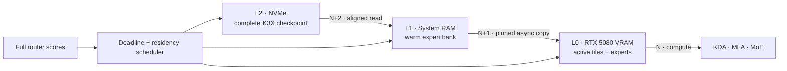

<div align="center">

# K3X

### Kimi K3, engineered for one consumer PC

[](#milestone-0--verified-foundation)
[](#target-machine)
[](#repository-map)
[](K3X_FORMAT.md)

**A clean-room, out-of-core inference engine and checkpoint format built around Kimi K3's execution graph.**

[Architecture](ARCHITECTURE.md) · [Performance model](PERFORMANCE_MODEL.md) · [File format](K3X_FORMAT.md) · [Research ledger](docs/references.md)

</div>

---

Kimi K3 is a 2.8T-parameter sparse MoE model whose local inference problem is dominated by moving the right expert bytes at the right time. K3X starts from that constraint. It is not a fork of llama.cpp or vLLM, and it does not assume that the checkpoint fits in RAM or VRAM.

The long-term design treats NVMe, system RAM, and GPU memory as one deadline-scheduled hierarchy while preserving full routing and exact cold-expert rescue. Milestone 0 deliberately begins smaller: prove the graph, token sequence, persistent state, binary format, and independent runtime before optimizing any of them.



> [!IMPORTANT]
> Milestone 0 uses a tiny synthetic model and a CPU runtime. Its measurements validate the harness; they are not Kimi K3 or RTX 5080 throughput claims. No full checkpoint was downloaded and no paid cloud resource was provisioned.

## Why a dedicated engine

The released text decoder combines 69 Kimi Delta Attention layers, 24 Gated MLA layers, block Attention Residuals, and 92 Stable LatentMoE layers. Each MoE layer selects 16 of 896 native MXFP4 routed experts.

One released routed expert is approximately 16.73 MiB. With no cache reuse, natural Top-16 routing requests approximately **25.83 GB of expert weights per token** across the 92 MoE layers. A P44 Pro's published 7 GB/s sequential maximum would cap that worst case near 0.27 tok/s before all other work. The path to useful speed is therefore traffic avoidance and amortization, not a single faster GEMM.

K3X is designed around four invariants.

- Correctness comes before throughput, and every optimization retains a switchable reference path.
- Residency never silently becomes pruning; a high-scoring cold expert can be fetched exactly.
- Storage order follows execution and prefetch, with direct random access to one expert.
- Every speed claim carries measured bytes/token and a quality mode.

## Milestone 0 — verified foundation

The repository now contains a connected, deterministic K3-compatible miniature graph.

- KDA with causal short-convolution and recurrent state.
- Gated MLA with main and shared-extra NoPE keys plus incremental KV state.
- Block Attention Residual mixing.
- Stable LatentMoE, correction-bias selection, and normalized unbiased routing weights.
- Native MXFP4 E2M1/E8M0 decode and byte-exact storage preservation.
- Full-prefix and incremental greedy generation.
- A bounded-memory, resumable, crash-safe K3X converter.
- Strict Python and independent C++20 readers and runtimes.
- Corruption, truncation, required-feature, state, layer, logit, and token parity tests.

For prompt `[1, 7, 3, 9]`, the seeded fixture generates the same sequence in PyTorch and C++, in both full and incremental modes.

```text
[43, 32, 28, 49, 9, 28]
```

## Quick start

### 1. Create an environment

Linux and Python 3.12 are the primary development path. PyTorch is used only by the executable reference and fixture generator; the C++ runtime has no ML framework dependency.

```bash
python3.12 -m venv .venv
source .venv/bin/activate
python -m pip install --upgrade pip
python -m pip install -e '.[dev]'
```

On Windows PowerShell, activate with `.\.venv\Scripts\Activate.ps1`.

### 2. Run the Python correctness suite

```bash
python -m pytest tests/python -q
```

### 3. Build the C++20 runtime

```bash
cmake -S . -B build -G Ninja -DCMAKE_BUILD_TYPE=Release
cmake --build build
ctest --test-dir build --output-on-failure
```

### 4. Generate and convert the synthetic checkpoint

```bash
python tools/generate_synthetic.py --output build-fixtures/run-a
python -m k3x_converter.cli convert \
  build-fixtures/run-a/source \
  build-fixtures/synthetic.k3x \
  --chunk-bytes 257
```

The deliberately tiny chunk size makes the bounded streaming path observable. Conversion writes `.partial` data and an atomic ledger until every extent has been read back and CRC-verified.

### 5. Run exact incremental generation

```bash
./build/k3x_run \
  --model build-fixtures/synthetic.k3x \
  --prompt-ids 1,7,3,9 \
  --generate 6 \
  --mode incremental
```

Use `build\k3x_run.exe` on Windows.

### 6. Reproduce the synthetic benchmark

```bash
python tools/benchmark_synthetic.py \
  --artifact build-fixtures/synthetic.k3x \
  --runner build/k3x_run \
  --warmup 3 \
  --iterations 20 \
  --json build-results/milestone-zero.json \
  --csv build-results/milestone-zero.csv
```

## Measured result

The checked Milestone 0 run used Windows 11 AMD64, an MSVC Debug build, three warmups, and 20 measured child processes.

| Metric | Result |
|---|---:|
| Synthetic incremental decode | 562.62 tok/s |
| Synthetic prefill | 414.04 tok/s |
| Process-level TTFT median | 19.21 ms |
| Peak observed child RSS | 5.99 MB |
| Logical K3X reads / generated token | 110,936 bytes |

The benchmark's scope is `synthetic-milestone-zero` and evidence is marked `measured` in both JSON and CSV. See [`PERFORMANCE_MODEL.md`](PERFORMANCE_MODEL.md) for definitions, state sizes, layer timings, assumptions, and the full-model byte model.

## K3X checkpoint format

K3X v1 trades general tensor-container flexibility for K3 execution order.

| Property | Contract |
|---|---|
| Superblock | Fixed 4 KiB, versioned, required/optional feature negotiation |
| Lookup | Tensor, layer, and expert directories |
| Extents | 4 KiB aligned, execution-order packable, independently checksummed |
| Integrity | CRC32C per extent, directory SHA-256, finalized root SHA-256 |
| MXFP4 | Packed values and E8M0 scales preserved byte-for-byte |
| Failure model | `.partial` artifact, atomic idempotent ledger, read-back verification, atomic final rename |
| Access | Per-expert random access and large sequential-read layout |

The normative binary layout lives in [`K3X_FORMAT.md`](K3X_FORMAT.md).

## Quality contract

| Mode | Intended semantics |
|---|---|
| `QUALITY` | High-precision trunk, natural Top-16, exact experts, strict speculative verification, no proxy |
| `BALANCED` | Mixed trunk quantization, adaptive K, full routing, exact cold rescue |
| `HYPERTURBO` | Aggressive mixed precision and experimental expert-aware verification budgets |
| `EXTREME` | Explicitly lossy proxy or pruning experiments |

Only exact `QUALITY` semantics are implemented in Milestone 0. Future modes will not become defaults without an ablation and a simultaneous quality measurement.

## Target machine

| Component | Primary target |
|---|---|
| CPU | AMD Ryzen 7 9800X3D |
| GPU | NVIDIA RTX 5080 16 GB |
| RAM | 96 GB DDR5-4200 |
| Storage | Solidigm P44 Pro 2 TB NVMe |
| OS | Native Linux first |

The first meaningful engineering target is at least 5 warm coding decode tok/s if measurements show it is achievable. It is a target, not a forecast.

## Roadmap

- [x] Exact synthetic reference graph and correctness suite.
- [x] K3X v1 streaming format and crash-safe converter.
- [x] Independent exact C++20 synthetic runtime.
- [x] Synthetic profiler and reproducible JSON/CSV output.
- [ ] Exact full-dimension CPU/GPU runtime over bounded checkpoint slices.
- [ ] RTX 5080 backend and fused K3-specific kernels.
- [ ] Three-tier asynchronous storage and deadline scheduler.
- [ ] Least-Stale, task/session, and transition-aware expert caches.
- [ ] Adaptive Top-K with exact cold-expert rescue.
- [ ] Expert-major speculative verification and cost-aware experiments.
- [ ] Sensitivity-calibrated mixed trunk quantization.
- [ ] SKYFORGE shard compiler for explicitly provisioned cloud jobs.
- [ ] Full ablation and coding-quality suite.

## Repository map

```text
reference/k3x_ref/   PyTorch executable oracle
converter/           Streaming K3X writer, reader, and resume ledger
runtime/             Dependency-free C++20 reader and synthetic runtime
tests/python/        Graph, state, conversion, corruption, and parity tests
tests/cpp/           Portable checksum and primitive tests
tools/               Deterministic fixture and benchmark entrypoints
docs/                Research ledger and milestone design records
```

## Research discipline

The graph and roadmap were checked against the official Kimi K3 release and report, FlashKDA, Attention Residuals, vLLM's implementation work, independent C and MLX runtimes, and the primary SpecMD, EcoSpec, MoE-Spec, and AcceptMoE papers. Pinned revisions and the boundary between implemented and future work are recorded in [`docs/references.md`](docs/references.md).

## Current limitations

- The executable model is synthetic and text-only.
- The runtime is CPU-only and implements synthetic dimensions.
- There is no CUDA backend, async storage pipeline, cache policy, adaptive Top-K, or speculative decoder yet.
- The converter has not processed the full Kimi K3 checkpoint.
- Linux target-hardware performance remains unmeasured.
- No open-source license has been selected yet; public visibility does not itself grant reuse rights.

---

<div align="center">

**Measure the bytes. Preserve the route. Prove every token.**

</div>
