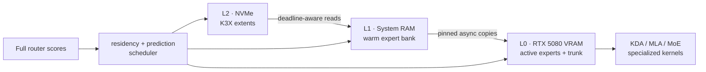
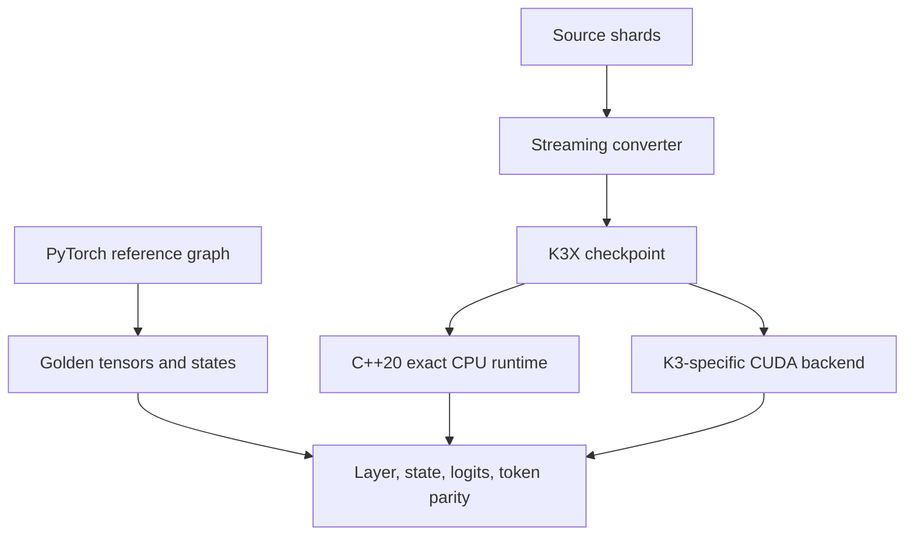

<div align="center">

# K3X

### A Kimi K3 out-of-core inference engine for a single consumer PC

[](#project-status)
[](#target-system)
[](#correctness-contract)

**K3X is a clean-room, Kimi K3-specific runtime and storage format designed to make a 2.8T-parameter sparse MoE model usable on one high-end consumer machine.**

No full checkpoint download is required for the first milestone. No throughput claims are made before measurement.

</div>

---

## Why K3X

Kimi K3 is not a conventional dense Transformer. Its 93-layer text decoder combines Kimi Delta Attention, Gated Multi-Latent Attention, Block Attention Residuals, Stable LatentMoE, and native MXFP4 expert weights. The released model contains 896 routed experts and selects 16 per token.

That structure creates a different local-inference problem. The primary constraint is not only arithmetic throughput; it is moving the right expert bytes through NVMe, system RAM, PCIe, and VRAM before each layer needs them.

K3X therefore starts from K3's execution order and target hardware instead of extending a general-purpose model container with more flags.



The diagram describes the intended runtime. Milestone 0 implements the correctness foundation and synthetic storage round-trip first.

## Design priorities

1. Correctness.
2. Measured end-to-end decode throughput.
3. Minimum NVMe, RAM, and PCIe traffic per token.
4. Preservation of coding and agentic quality.
5. Checkpoint size.
6. General benchmark performance.

## Target system

| Component | Primary target |
|---|---|
| CPU | AMD Ryzen 7 9800X3D |
| GPU | NVIDIA RTX 5080 16 GB |
| RAM | 96 GB DDR5-4200 |
| Storage | Solidigm P44 Pro 2 TB NVMe |
| OS | Native Linux first |

The first meaningful engineering target is at least 5 decode tokens/s on a warm coding workload if the hardware permits it. This is a target, not a prediction. K3X will report the measured bottleneck and theoretical ceiling if the target is not achievable.

## Milestone 0

The first milestone uses a tiny deterministic model with the same essential text-decoder topology as Kimi K3.

```text
tokens
  → embedding
  → KDA layer
  → KDA layer + Stable LatentMoE
  → KDA layer + Stable LatentMoE
  → Gated MLA layer + Stable LatentMoE
  → output Attention Residual
  → RMSNorm
  → LM head
  → greedy token
```

It covers the following behavior without downloading the 1.56 TB checkpoint.

- KDA prefill and incremental recurrent state.
- Gated MLA and incremental KV state.
- Block Attention Residual mixing across depth.
- Sigmoid routing with correction bias and normalized Top-K weights.
- Stable LatentMoE routed and shared branches.
- Native MXFP4 expert decoding and byte-exact payload preservation.
- Full-prefix and incremental greedy generation.
- Streaming conversion into a resumable, checksummed K3X artifact.
- Independent PyTorch and C++20 execution paths.

## Correctness contract

Every optimized feature must retain a switchable reference path. Milestone 0 establishes the comparison ladder.

| Boundary | Required evidence |
|---|---|
| Primitive | PyTorch oracle versus independent implementation |
| Stateful operator | Convolution, recurrent, and KV states match |
| Decoder layer | Hidden states match within an explicit tolerance |
| MXFP4 storage | Packed payload and scales round-trip byte-for-byte |
| Generation | Full and incremental greedy token sequences match exactly |
| Artifact integrity | Truncation, overlap, bad alignment, and checksum corruption are rejected |

Tests are written before production behavior and must be observed failing for the intended reason before the implementation is added.

## K3X checkpoint format

K3X v1 is an execution-ordered, random-access format rather than a general tensor archive.

- Fixed 4 KiB superblock with version and feature negotiation.
- Tensor, layer, and expert directories.
- Aligned extents with CRC32C and a finalized SHA-256 root digest.
- Direct lookup of one expert without scanning unrelated tensors.
- Sequential layout for layer execution and prefetch.
- Native MXFP4 payload preservation.
- Crash-safe `.partial` output and idempotent resume manifest.
- Optional hot/cold expert banks, task-profile metadata, and future PGO layouts.

The detailed binary contract will be added as `K3X_FORMAT.md` with its executable reader and writer. The approved milestone design is available in [`docs/superpowers/specs/2026-08-08-k3x-milestone-one-design.md`](docs/superpowers/specs/2026-08-08-k3x-milestone-one-design.md).

## Planned runtime



The host runtime is C++20. PyTorch is the executable oracle and calibration environment. CUDA kernels will be introduced only after the exact CPU graph, storage format, and profiler are verified.

## Quality modes

K3X will expose explicit quality modes instead of silently changing routing semantics.

| Mode | Intended behavior |
|---|---|
| `QUALITY` | High-precision trunk, natural Top-16, exact routing, strict verification, no proxy |
| `BALANCED` | Mixed quantization, adaptive K, full routing, exact cold rescue |
| `HYPERTURBO` | Aggressive mixed quantization and experimental expert-aware verification |
| `EXTREME` | Explicitly lossy proxy or pruning experiments |

Only `QUALITY` semantics belong to the initial correctness milestone.

## Project status

K3X has an approved Milestone 0 design and an implementation-ready execution plan.

- [x] Workspace and source landscape inspected.
- [x] Runtime language and milestone scope selected.
- [x] Milestone design approved and documented.
- [x] Detailed implementation plan written.
- [ ] Synthetic PyTorch model passing.
- [ ] K3X synthetic round-trip passing.
- [ ] Independent C++ runtime parity passing.
- [ ] Synthetic benchmark recorded.

See [`checklist.md`](checklist.md) for the working checklist and [`context-notes.md`](context-notes.md) for decision history.

## Research baseline

The architecture is checked against primary reports and real implementations rather than assumed benchmark numbers.

- [MoonshotAI/Kimi-K3](https://github.com/MoonshotAI/Kimi-K3) — official release and technical report.
- [moonshotai/Kimi-K3](https://huggingface.co/moonshotai/Kimi-K3) — released configuration and checkpoint metadata.
- [vLLM Kimi K3 implementation](https://github.com/vllm-project/vllm/tree/main/vllm/models/kimi_k3) — production graph and kernels.
- [MoonshotAI/FlashKDA](https://github.com/MoonshotAI/FlashKDA) — KDA kernels.
- [MoonshotAI/Attention-Residuals](https://github.com/MoonshotAI/Attention-Residuals) — original method and implementation.
- [kimi-k3-in-c](https://github.com/FareedKhan-dev/kimi-k3-in-c) and [kimi-k3-mlx](https://github.com/PipeNetwork/kimi-k3-mlx) — independent local-runtime references.
- [SpecMD](https://arxiv.org/abs/2602.03921), [EcoSpec](https://arxiv.org/abs/2607.12696), [MoE-Spec](https://arxiv.org/abs/2602.16052), and [AcceptMoE](https://arxiv.org/abs/2608.02989) — later cache and speculative-decoding experiments.

Source revisions used for the approved design are recorded in the [design specification](docs/superpowers/specs/2026-08-08-k3x-milestone-one-design.md#3-근거가-되는-source-snapshot).

## Development rules

- No performance claim without a reproducible measurement.
- No lossy optimization enabled without a quality comparison.
- No full-model RAM or VRAM residency assumption.
- No full checkpoint download or paid cloud provisioning in Milestone 0.
- Every stage ends with tests, measurements, documentation, and a reviewable commit.

## Documentation

- [Milestone plan](PLAN.md).
- [Milestone design specification](docs/superpowers/specs/2026-08-08-k3x-milestone-one-design.md).
- [Milestone implementation plan](docs/superpowers/plans/2026-08-08-k3x-milestone-zero.md).
- [Implementation checklist](checklist.md).
- [Decision log](context-notes.md).

`ARCHITECTURE.md`, `PERFORMANCE_MODEL.md`, and `K3X_FORMAT.md` are milestone deliverables and will be added with executable evidence.

---

<div align="center">

**Measure the bytes. Preserve the route. Prove every token.**

</div>
