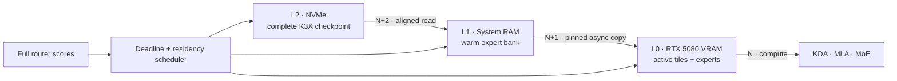

<div align="center">

# K3X

### Kimi K3, engineered for one consumer PC

[](#milestone-17--persistent-aurora-draft-state)
[](https://github.com/rsb1813/project-k3x/actions/workflows/ci.yml?query=branch%3Amain)
[](#target-machine)
[](#repository-map)
[](K3X_FORMAT.md)

**A clean-room, out-of-core inference engine and checkpoint format built around Kimi K3's execution graph.**

[Architecture](ARCHITECTURE.md) · [Performance model](PERFORMANCE_MODEL.md) · [File format](K3X_FORMAT.md) · [Research ledger](docs/references.md)

</div>

---

Kimi K3 is a 2.8T-parameter sparse MoE model whose local inference problem is dominated by moving the right expert bytes at the right time. K3X starts from that constraint. It is not a fork of llama.cpp or vLLM, and it does not assume that the checkpoint fits in RAM or VRAM.

The long-term design treats NVMe, system RAM, and GPU memory as one deadline-scheduled hierarchy while preserving full routing and exact cold-expert rescue. Implemented milestones now cover the exact synthetic graph and format, explicit RTX 5080 CUDA baselines, bounded L0/L1 primitives, independent L2 Reader modes, a released-size expert storage slice, an opt-in exact current-layer deadline worker, runtime-switchable exact eviction, persistent runtime-only task/session routing profiles, experimental fixed/adaptive Top-K with exact selected-expert rescue, opt-in routed expert accumulation on CUDA, strict token-major plus CPU/CUDA expert-major verification, and a transactional persistent AURORA draft cursor. Cross-layer prediction and the full three-tier pipeline remain future work.



> [!IMPORTANT]
> The implemented milestones still use a tiny synthetic model. Their measurements validate correctness and isolate runtime boundaries; they are not full Kimi K3 throughput claims. No full checkpoint was downloaded and no paid cloud resource was provisioned.

| Public milestone | GitHub status | Evidence |
|---|---|---|
| Milestone 11 | [PR #11 merged](https://github.com/rsb1813/project-k3x/pull/11) at `edc6d605` | B-0012 adaptive Top-K and exact rescue |
| Milestone 12 | [PR #12 merged](https://github.com/rsb1813/project-k3x/pull/12) at `9e59a9db` | B-0013 routed CUDA accumulation |
| Milestone 13 | [PR #13 merged](https://github.com/rsb1813/project-k3x/pull/13) | B-0014 token-major verification |
| Milestone 14 | [PR #15 merged](https://github.com/rsb1813/project-k3x/pull/15) | B-0015 exact CPU expert-major verification |
| Milestone 15 | [PR #17 merged](https://github.com/rsb1813/project-k3x/pull/17) at `c18df33` | B-0016 exact CUDA expert-major execution |
| Milestone 16 | [PR #20 merged](https://github.com/rsb1813/project-k3x/pull/20) at `df5c07d` | B-0017 measured AURORA replay reference; exact and non-default |
| Milestone 17 | [PR #23 merged](https://github.com/rsb1813/project-k3x/pull/23) at `30bbf7a8` | B-0018 persistent AURORA state; exact and non-default |

PR #11 and PR #12 are part of the current public `main` history, not pending feature branches. Their branch, pull-request, and post-merge correctness runs are recorded with the corresponding measurements in [`BENCHMARKS.md`](BENCHMARKS.md). The latest audited public implementation baseline is Milestone 17 integration head `30bbf7a8`; its branch and pull-request correctness runs `31340338639` and `31340340063` passed, followed by successful post-merge `main` run `31340476396`.

## Why a dedicated engine

The released text decoder combines 69 Kimi Delta Attention layers, 24 Gated MLA layers, block Attention Residuals, and 92 Stable LatentMoE layers. Each MoE layer selects 16 of 896 native MXFP4 routed experts.

One released routed expert is approximately 16.73 MiB. With no cache reuse, natural Top-16 routing requests approximately **25.83 GB of expert weights per token** across the 92 MoE layers. A P44 Pro's published 7 GB/s sequential maximum would cap that worst case near 0.27 tok/s before all other work. The path to useful speed is therefore traffic avoidance and amortization, not a single faster GEMM.

K3X is designed around four invariants.

- Correctness comes before throughput, and every optimization retains a switchable reference path.
- Residency never silently becomes pruning; a high-scoring cold expert can be fetched exactly.
- Storage order follows execution and prefetch, with direct random access to one expert.
- Every speed claim carries measured bytes/token and a quality mode.

## Milestone 0 — verified foundation

The repository now contains a connected, deterministic K3-compatible miniature graph.

- KDA with causal short-convolution and recurrent state.
- Gated MLA with main and shared-extra NoPE keys plus incremental KV state.
- Block Attention Residual mixing.
- Stable LatentMoE, correction-bias selection, and normalized unbiased routing weights.
- Native MXFP4 E2M1/E8M0 decode and byte-exact storage preservation.
- Full-prefix and incremental greedy generation.
- A bounded-memory, resumable, crash-safe K3X converter.
- Strict Python and independent C++20 readers and runtimes.
- Corruption, truncation, required-feature, state, layer, logit, and token parity tests.

For prompt `[1, 7, 3, 9]`, the seeded fixture generates the same sequence in PyTorch and C++, in both full and incremental modes.

```text
[43, 32, 28, 49, 9, 28]
```

## Milestone 1 — exact CUDA baselines

The same graph can now be executed through three explicit identities with no silent fallback.

| Backend | Dense path | Native MXFP4 expert path |
|---|---|---|
| `cpu` | Portable FP32 C++ | Portable byte-level oracle |
| `cuda-dense` | cuBLASLt FP32 or BF16-rounded | Portable CPU oracle by definition |
| `cuda-custom` | cuBLASLt FP32 or BF16-rounded | Direct E2M1 + E8M0/32 CUDA kernel |

The CUDA build targets native `sm_120`, validates compute capability 12.0 or newer, and records CUDA-event kernel time, directional transfers, and backend-owned peak VRAM. Both CUDA paths preserve the exact six-token sequence. FP32 layer, logit, and state error stays below `1.8e-7` maximum absolute error on the fixture. BF16 remains opt-in and preserves tokens with `0.004025` maximum absolute diagnostic error.

## Milestone 2 — reusable memory and exact residency

CUDA execution now exposes three independent switches while preserving the Milestone 1 reference path.

| Switch | Reference | Optimized path |
|---|---|---|
| Allocation | `per-operation` | `reused` grow-only scratch and cached CUDA resources |
| Weights | `transient` | Tensor-ID-keyed exact `resident` VRAM entries with a hard byte bound |
| Scheduling | `scalar` | Same-input `grouped` dense and native MXFP4 projections |

Static residency stores exact FP32, BF16-rounded, or native E2M1 plus E8M0/32 representations. Entries that do not fit bypass residency and use the exact transient path. This milestone deliberately has no eviction policy and is not yet the L0/L1/L2 expert cache.

## Milestone 3 — exact CUDA FFN blocks

`--cuda-boundary ffn-block` keeps dense/shared gate, up, strict SiTU-GLU, and down intermediates on the GPU. Routed MoE blocks preserve natural Top-K routing, execute exact native MXFP4 expert triplets in router order, upload the shared latent once, and return only final expert outputs for unchanged CPU score mixing.

The block boundary is `cuda-custom` only and remains opt-in. The default `operation` path is the correctness reference. B-0004 measures FP32 block-scalar at 17.0713 decode tok/s versus 16.3576 for its matched operation row, with 24.77% less D2H and 32.86% fewer synchronizations. This is a tiny synthetic WSL2 result, not a full Kimi K3 throughput claim.

## Milestone 4 — exact asynchronous L1-to-L0 transfer

`--cuda-transfer prefetch` stages the naturally routed native MXFP4 expert triplets through one bounded pinned slab and a separate nonblocking CUDA stream. A readiness event lets the routed-down projection overlap the copy, and a single-use prepared token binds the process-global ID, use sequence, layer, and phase. Exact expert bytes, routing scores, order, recurrent state, and output tokens are unchanged.

This first boundary is deliberately limited to `cuda-custom + ffn-block + reused + transient` and requires `--cuda-pinned-bytes`. It does not implement persistent L1 caching or asynchronous NVMe reads. B-0005 found matched decode changes between -1.03% and +0.90% on the tiny WSL2 graph, so synchronous transfer remains the default.

## Milestone 5 — bounded persistent L1 expert cache

`--l1-expert-cache static --l1-expert-cache-bytes N` enables an exact, no-eviction whole-expert store in system RAM. A `RuntimeSession` retains that store across consecutive generation calls. One entry owns the native MXFP4 gate/up/down packed bytes and scales, validates the native group-32 representation before admission, admits atomically under a hard capacity, and returns an exact transient handle when it cannot fit. `disabled` remains the default.

B-0006 validates the same handles across CPU operation execution, synchronous CUDA FFN blocks, and asynchronous prepared CUDA transfers. Milestone 5 itself does not implement eviction; Milestone 9 later adds exact LRU, LFU, and Least-Stale. Task/session profiles, prediction, asynchronous NVMe reads, and physical NVMe counters remain future work.

## Milestone 6 — independent exact L2 reader

The Linux data plane now keeps one descriptor and exposes independent `--l2-io pread|io-uring` and `--l2-cache buffered|direct` switches. Exact native MXFP4 experts submit their six packed/scale extents as one ordered batch. Optional liburing uses bounded explicit-offset reads; direct mode requires `STATX_DIOALIGN`, uses aligned bounce buffers, and fails closed without a supported alignment contract.

The default remains `pread + buffered`. B-0007 preserves exact tokens, routing, and logical bytes across all four modes on WSL2 ext4, but it is a non-authoritative capability benchmark. The batch API still waits for completion; deadline-aware multi-layer prefetch and GPU overlap remain future work.

## Milestone 7 — full-dimension bounded expert slice

A streaming source generator now materializes one actual-size K3 routed expert: 16,515,072 packed E2M1 bytes plus 1,032,192 E8M0 scale bytes. It publishes a content-addressed shard before its manifest, and conversion verifies the declared shard and per-tensor SHA-256 values. K3X optional feature bit 0 marks the artifact as a non-executable storage fixture, so Readers can benchmark it while model generation fails closed. The converter packs gate/up/down in execution order and never holds a full matrix in RAM. Resume reuses only a canonical, source-matched extent prefix.

`k3x_storage_bench` and B-0008 measure one exact six-extent expert load without token fields. All four Reader modes preserve the same 17,547,264-byte payload and ordered SHA-256 on WSL2 ext4. This does not implement a full-dimension graph, establish P44 Pro traffic, or change the `pread + buffered` default.

## Milestone 8 — exact current-layer deadline loading

`--l2-schedule deadline` submits the current layer's already-selected natural Top-K experts to one bounded latest-start-priority worker. Exact L1 hits complete inline while non-resident loads can overlap the routed-down and shared-expert computation. `blocking` remains the default, and generation drains outstanding work on both success and failure.

B-0009 preserves exact tokens, routing, L1 counters, and logical Reader bytes across eight schedule/Reader combinations. Deadline decode was 4.91% to 21.45% slower than blocking on the tiny warm WSL2 graph, so the worker remains experimental. Future-layer prediction, ORBIT, eviction, multiple L2 workers, and N/N+1/N+2 triple buffering are not implemented.

## Milestone 9 — exact expert cache policies

`--l1-expert-cache lru|lfu|least-stale --l1-expert-cache-bytes N` adds exact bounded eviction while retaining `disabled` as the default and `static` as the no-eviction reference. Natural Top-K routing is marked before admission, every miss fetches the exact native MXFP4 expert, and the runtime records evictions plus same-forward collision misses. The SpecMD Least-Stale reproduction prioritizes stale processed layers while protecting upcoming layers.

B-0010 crosses four policies at 2-, 8-, and 16-expert synthetic capacities. At 8 experts, Least-Stale records 23 hits, 31 misses, and zero collisions versus LRU's 20/34/1 and LFU's 19/35/7. At 16 experts LFU has the best traffic, so no policy becomes a default from this tiny warm WSL2 evidence. Milestone 10 adds bounded task/session priors; transition prediction, ORBIT, and full-model cache evidence remain future work.

## Milestone 10 — task and session profiles

`--runtime-metadata TASK=coding,LANG=cpp,PHASE=debug,REPO=k3x` supplies cache-only context without changing prompt IDs. `--runtime-profile-in prior.k3xp --runtime-profile-out observed.k3xp` resumes and persists bounded expert frequency, adjacent-layer transitions, metadata, and a deterministic hot bank. Current metadata can explicitly replace an older saved value such as `PHASE`.

`--l1-expert-cache profiled --profile-prior-strength 4` enables the experimental exact prior/live eviction score. Profile observation is otherwise disabled unless metadata or profile I/O is explicitly requested. B-0011 preserves exact tokens, routing, logits, and recurrent state in every row. A matching prior reaches the same 23 hits and 628,080 logical Reader bytes as Least-Stale, but does not improve tiny-graph timing; the minimum-overlap alternate prior is worse. The mode remains opt-in.

## Milestone 11 — adaptive Top-K and exact cold rescue

`--routing natural|fixed|adaptive` keeps the checkpoint natural Top-K immutable while allowing explicit K4/K6/K8/K12/K16 experiments. Adaptive selection uses cumulative router mass, entropy effective support, boundary confidence, and an external quality floor. Agent-failure and critical signals can only raise fixed/adaptive K; natural routing ignores them and remains the default.

Every selected cold expert is fetched through the exact native MXFP4 path, and residency never substitutes a lower-ranked expert. B-0012 shows 40.8%/27.2%/13.6% logical Reader-byte reductions for K4/K8/K12 against natural K16 on the 24-expert synthetic fixture, but all reduced-K rows change tokens, logits, and recurrent state. Fixed K16 and critical escalation are exact. The measured quality divergence keeps every reduced/adaptive mode explicitly lossy and opt-in.

## Milestone 12 — routed CUDA accumulation fusion

`--cuda-moe-fusion routed-accumulate` is available only with `cuda-custom + ffn-block`. It preserves natural router order and exact native MXFP4 gate/up/SiTU execution, then folds each down projection's contribution scale into ordered device accumulation so only the final mixed latent crosses D2H. Synchronous and prepared-prefetch paths share the same validation and telemetry contract. `none` remains the reference and default.

B-0013 improves tiny synthetic natural Top-16 decode by 11.33% with synchronous transfer and 8.91% with prefetch while reducing D2H by 51,840 bytes per run. The bounded 3,584-by-3,072 released expert fixture instead becomes 8.01% slower in median latency despite a 93.75% D2H reduction. That representative-dimension regression prevents a default change. It is kernel/D2H evidence without routing semantics, not full-model token throughput.

## Milestone 13 — exact speculative verification reference

The runtime implements the first strict greedy, token-major speculative reference behind a separate `generate_speculative` API. An external draft provider supplies the accepted anchor and a bounded candidate prefix. The target accepts only consecutive candidates equal to its own argmax, commits one target bonus token, and reports the exact commit back to the provider. Ordinary `generate_greedy` behavior is unchanged.

Native tests cover perfect, partial, first-token, and empty proposals as well as invalid anchors, token IDs, proposal bounds, callback failures, exhausted providers, unused script records, output-count one, and non-incremental rejection. Runtime integration tests show exact parity with greedy generation for token IDs, final KDA/MLA state, complete routing/K traces, Reader calls and bytes, and L1 hits and misses.

The CLI exposes only `none|scripted-reference` for deterministic drafting. B-0014 measures greedy at 171.4333 tok/s, perfect block-2 at 174.0861 tok/s, and mixed block-2 at 173.2344 tok/s on the tiny WSL2 CPU fixture. All three execute five target decode forwards and read 665,616 bytes, so the 1.55% and 1.05% differences are not evidence of speculative acceleration. Milestone 14 adds the separate expert-major verification switch; a learned DSpark drafter, AURORA, EcoSpec, MoE-Spec, and AcceptMoE remain unfinished.

## Milestone 14 — exact expert-major verification

`--speculative-verification expert-major` executes every position in one scripted proposal block layer by layer on the CPU. Each MoE layer computes natural routing for all positions, forms a stable first-use union, loads each unique native MXFP4 expert payload once, evaluates every assigned token, and accumulates results in the original per-token router-slot order. Position-specific KDA snapshots and temporary MLA prefixes let the verifier commit only the accepted prefix plus target bonus token. `token-major` remains the default.

The first exact boundary is intentionally limited to CPU, incremental generation, natural routing, blocking L2, disabled L1, and no runtime profile observation. Unsupported combinations fail before Reader or output mutation. Greedy, token-major perfect/mixed, and expert-major perfect/mixed tests preserve generated tokens, final KDA/MLA state, and committed routing traces.

B-0015 measures five rows with three warmups and twenty samples on the tiny warm WSL2 CPU fixture. Perfect expert-major verification reuses 6 of 30 expert assignments, reduces Reader bytes from 665,616 to 655,824 and calls from 428 to 392, and measures 201.5550 tok/s versus token-major's 160.1659. Mixed expert-major verification evaluates three rejected positions, raises Reader bytes to 680,304 and calls to 482, and measures 122.6010 tok/s versus 163.0028. This establishes the reuse-versus-rejection-cost boundary, not full-model or RTX 5080 performance, and does not justify changing the default.

## Milestone 15 — exact CUDA expert-major execution

The expert-major verifier now accepts the exact `cuda-custom + ffn-block + reused + transient + synchronous + fusion none` boundary. At each unique expert group it gathers token latents in stable assignment order, uploads one flat activation batch, transfers the expert's native MXFP4 gate/up/down payload once, launches the existing E2M1/E8M0 arithmetic over a two-dimensional `(row, token)` grid, and scatters the results back to their original token/router slots. Token-major remains the default, and CPU expert-major remains the portable exact oracle.

The batch API validates shape, overflow, native-weight metadata, and SiTU parameters before allocation or profiler mutation. CLI capability gates reject unsupported backends, allocation modes, weight modes, transfer modes, fusion, L1, L2 scheduling, routing, and profile observation before output mutation. B-0016 preserves exact generated tokens, final recurrent state, and committed routing in all five CUDA graph rows.

On the released 3,584-by-3,072 single-expert fixture, batching two tokens reduces measured weight H2D from 701,890,560 to 350,945,280 bytes over 20 iterations and median latency from 3.4449 ms to 1.7378 ms. Batching four tokens reduces weight H2D from 1,403,781,120 to 350,945,280 bytes and median latency from 6.7053 ms to 2.6319 ms. Activation H2D and D2H are unchanged, numerical error is zero, and Compute Sanitizer reports zero errors. This is a bounded single-expert kernel/traffic measurement without routing semantics, not full-model Kimi K3 throughput.

Reproduce both evidence boundaries with one command after generating `artifacts/synthetic.k3x` and `artifacts/m12-bounded.k3x`.

```bash
python tools/ablate_cuda_expert_major.py \
  --artifact artifacts/synthetic.k3x \
  --runner build-cuda/k3x_run \
  --released-artifact artifacts/m12-bounded.k3x \
  --released-runner build-cuda/k3x_cuda_expert_batch_bench \
  --warmup 3 \
  --iterations 20 \
  --output-dir build-results/b0016-cuda-expert-major
```

## Milestone 16 — measured AURORA replay reference

The `aurora-replay` provider replays the complete committed prefix through a separate CPU fixed-reduced-Top-K runtime and produces real candidate tokens. Its `{1,2,4}` scheduler gates one-rung exploration with Laplace-smoothed prefix survival and measured expert payload-load-to-assignment cost, then backs off immediately after rejection. Token-major and expert-major target paths feed actual evaluated/discarded work and expert cost before the next proposal. Draft Reader, routing, and time counters remain separate from the natural target.

B-0017 runs natural greedy plus six fixed/adaptive K4 replay rows with three warmups and twenty samples. Every row preserves exact target tokens, final KDA/MLA state, and committed routes. The best replay result is fixed block-2 expert-major at 611.7589 tok/s, still 46.35% below the tiny natural baseline's 1140.3391 tok/s because it reads 1,454,112 extra logical draft bytes. Adaptive token/expert rows accept 0.5 of proposed tokens and are 60.77%/62.52% slower. These are tiny WSL2 synthetic values, not full Kimi K3 or RTX 5080 throughput. Replay remains non-default and serves as the oracle for persistent draft-state work.

Reproduce the seven-row CPU experiment with the already-built runtime.

```bash
python tools/ablate_aurora_replay.py \
  --runner build/k3x_run \
  --output build-results/b0017-aurora-replay \
  --warmups 3 \
  --samples 20
```

## Milestone 17 — persistent AURORA draft state

`--speculative-mode aurora-persistent` replaces complete-prefix draft replay with one transactional cursor. It prefills the prompt plus first verified target token once, snapshots fixed-size KDA convolution/recurrent state, records append-only MLA logical sizes, crops a rejected suffix, and teacher-forces the target bonus token after every verification. Replay remains available as the exact oracle. Reduced precision, resident-only drafting, and learned drafting are not part of this milestone.

B-0018 compares four matched replay/persistent pairs on the same Top-16 synthetic fixture. Proposal counts, acceptance, natural target tokens, final KDA/MLA state, and committed routes match exactly. Persistent fixed block-2 reduces logical draft Reader bytes by 45.96% and measures 14.97% higher token-major decode and 14.55% higher expert-major decode than replay. Persistent adaptive scheduling reduces draft bytes by 63.08% and measures 41.75%/27.08% higher token/expert-major decode. The persistent rows prefill five draft-context tokens once and replay zero prefix positions.

These are tiny CPU measurements under WSL2. Reader bytes are logical runtime bytes, not physical NVMe traffic, and the result does not establish full Kimi K3 throughput, coding quality, or a production default.

```bash
python tools/ablate_persistent_aurora.py \
  --runner build/k3x_run \
  --output build-results/b0018-persistent-aurora \
  --warmups 3 \
  --samples 20
```

## Quick start

### 1. Create an environment

Linux and Python 3.12 are the primary development path. PyTorch is used only by the executable reference and fixture generator; the C++ runtime has no ML framework dependency.

```bash
python3.12 -m venv .venv
source .venv/bin/activate
python -m pip install --upgrade pip
python -m pip install -e '.[dev]'
```

On Windows PowerShell, activate with `.\.venv\Scripts\Activate.ps1`.

### 2. Run the Python correctness suite

```bash
python -m pytest tests/python -q
```

### 3. Build the C++20 runtime

```bash
cmake -S . -B build -G Ninja -DCMAKE_BUILD_TYPE=Release
cmake --build build
ctest --test-dir build --output-on-failure
```

To build the optional Linux io_uring path, install liburing development headers and configure with `-DK3X_ENABLE_IO_URING=ON`. Unsupported runtime requests return `STORAGE_UNAVAILABLE`; they never fall back silently.

For the RTX 5080 CUDA baseline, CUDA Toolkit 13.3 or newer is required.

```bash
cmake -S . -B build-cuda -G Ninja \
  -DCMAKE_BUILD_TYPE=Release \
  -DK3X_ENABLE_CUDA=ON \
  -DCMAKE_CUDA_ARCHITECTURES=120
cmake --build build-cuda
ctest --test-dir build-cuda --output-on-failure
```

### 4. Generate and convert the synthetic checkpoint

```bash
python tools/generate_synthetic.py --output build-fixtures/run-a
python -m k3x_converter.cli convert \
  build-fixtures/run-a/source \
  build-fixtures/synthetic.k3x \
  --chunk-bytes 257
```

The deliberately tiny chunk size makes the bounded streaming path observable. Conversion writes `.partial` data and an atomic ledger until every extent has been read back and CRC-verified.

### 5. Run exact incremental generation

```bash
./build/k3x_run \
  --model build-fixtures/synthetic.k3x \
  --prompt-ids 1,7,3,9 \
  --generate 6 \
  --mode incremental \
  --backend cpu \
  --dense-precision fp32 \
  --json run.json
```

Use `build\k3x_run.exe` on Windows.

Select `--backend cuda-dense` or `--backend cuda-custom` only with a CUDA-enabled build. Use `--dense-precision bf16` for the opt-in BF16-rounded dense path. An unavailable CUDA request fails with `BACKEND_UNAVAILABLE`; it never changes the requested backend.

The CUDA switches are `--cuda-allocation`, `--cuda-weights`, `--cuda-batching`, `--cuda-boundary`, `--cuda-transfer`, `--cuda-resident-bytes`, and `--cuda-pinned-bytes`. Defaults retain the exact synchronous operation reference behavior. `--cuda-boundary ffn-block` requires `--backend cuda-custom`; the initial prefetch mode additionally requires reused allocation, transient weights, and a positive pinned capacity.

### 6. Reproduce the synthetic benchmark

```bash
python tools/benchmark_synthetic.py \
  --artifact build-fixtures/synthetic.k3x \
  --runner build/k3x_run \
  --backend cpu \
  --dense-precision fp32 \
  --warmup 3 \
  --iterations 20 \
  --json build-results/milestone-one.json \
  --csv build-results/milestone-one.csv
```

Run the four-stage CUDA ablation sequentially with the same artifact and sample counts.

```bash
python tools/ablate_cuda_residency.py \
  --artifact build-fixtures/synthetic.k3x \
  --runner build-cuda/k3x_run \
  --backend cuda-custom \
  --dense-precision fp32 \
  --cuda-resident-bytes 8388608 \
  --warmup 3 \
  --iterations 20 \
  --output-dir build-results/m2-cuda-custom
```

Run the exact four-case FFN boundary ablation with one checkpoint, commit, precision, and sample count.

```bash
python tools/ablate_cuda_ffn.py \
  --artifact build-fixtures/synthetic.k3x \
  --runner build-cuda/k3x_run \
  --dense-precision fp32 \
  --cuda-resident-bytes 8388608 \
  --warmup 3 \
  --iterations 20 \
  --output-dir build-results/b0004-ffn-blocks-fp32
```

Run the matched exact transfer ablation with synchronous/prefetch and scalar/grouped cases.

```bash
python tools/ablate_cuda_transfer.py \
  --artifact build-fixtures/synthetic.k3x \
  --runner build-cuda/k3x_run \
  --dense-precision fp32 \
  --cuda-pinned-bytes 1048576 \
  --warmup 3 \
  --iterations 20 \
  --output-dir build-results/b0005-async-transfer-fp32
```

Run the matched persistent-L1 ablation with disabled/static cache and synchronous/prefetch transfers.

```bash
python tools/ablate_l1_expert_cache.py \
  --artifact build-fixtures/synthetic.k3x \
  --runner build-cuda/k3x_run \
  --dense-precision fp32 \
  --l1-expert-cache-bytes 65536 \
  --cuda-pinned-bytes 1048576 \
  --warmup 3 \
  --iterations 20 \
  --output-dir build-results/b0006-l1-cache-fp32
```

## Measured results

The checked Milestone 0 run used Windows 11 AMD64, an MSVC Debug build, three warmups, and 20 measured child processes.

| Metric | Result |
|---|---:|
| Synthetic incremental decode | 558.89 tok/s |
| Synthetic prefill | 405.11 tok/s |
| Process-level TTFT median | 86.20 ms |
| Peak observed child RSS | 6.27 MB |
| Logical K3X reads / generated token | 110,936 bytes |

The benchmark's scope is `synthetic-milestone-zero` and evidence is marked `measured` in both JSON and CSV. TTFT includes complete artifact integrity verification before execution. See [`PERFORMANCE_MODEL.md`](PERFORMANCE_MODEL.md) for definitions, state sizes, layer timings, assumptions, and the full-model byte model.

The Milestone 1 comparison used commit `c92f498`, WSL2 Ubuntu 24.04.4, the Ryzen 7 9800X3D, RTX 5080, CUDA 13.3.1, three warmups, and 20 measured processes per mode.

| Backend | Precision | Decode tok/s | Prefill tok/s | TTFT | H2D/run | Kernel/run | Max abs. error |
|---|---|---:|---:|---:|---:|---:|---:|
| `cpu` | FP32 | 19.49 | 11.35 | 797.40 ms | 0 | 0 | 0 |
| `cuda-dense` | FP32 | 11.67 | 7.18 | 1,244.63 ms | 4,999,104 B | 11.56 ms | 1.640e-7 |
| `cuda-custom` | FP32 | 10.11 | 6.51 | 1,296.82 ms | 5,107,968 B | 14.52 ms | 1.751e-7 |
| `cuda-dense` | BF16 | 11.50 | 7.29 | 1,239.82 ms | 2,499,552 B | 11.84 ms | 0.00402409 |
| `cuda-custom` | BF16 | 10.12 | 6.67 | 1,288.63 ms | 2,608,416 B | 14.31 ms | 0.00402409 |

The CPU wins this deliberately tiny Milestone 1 workload. Milestone 2 then measures each CUDA optimization independently.

| Backend | Reference | Reuse | Residency | Grouped |
|---|---:|---:|---:|---:|
| `cuda-dense` FP32 decode tok/s | 12.13 | 17.46 | **18.00** | 17.90 |
| `cuda-custom` FP32 decode tok/s | 12.26 | 17.14 | **17.27** | 16.83 |

Reusable allocation removes most per-call allocation churn, and residency cuts measured synthetic weight H2D by about 88.5–88.9%. Grouping reduces activation traffic and synchronization but is slightly slower than scalar residency on both backends, so it remains opt-in. Fully enabled BF16 also remains opt-in because it does not beat FP32 scalar residency. These results validate mechanisms on the synthetic graph; they do not predict full Kimi K3 throughput. Raw results live in [`results/`](results/), and the complete measurement contract is in [`BENCHMARKS.md`](BENCHMARKS.md).

Milestone 3 then compares matched `cuda-custom + reused + resident` operation and FFN-block boundaries.

| Precision | Operation scalar | FFN block scalar | Operation grouped | FFN block grouped |
|---|---:|---:|---:|---:|
| FP32 decode tok/s | 16.3576 | **17.0713** | 16.4210 | 17.0270 |
| BF16 decode tok/s | 16.3874 | **16.9847** | 16.1931 | 16.9632 |

All eight B-0004 rows generate `[43, 32, 28, 49, 9, 28]`. FP32 block-scalar is the fastest measured Milestone 3 CUDA row, but `operation` remains the default because the evidence is synthetic, WSL2-only, and still dominated by the CPU-resident graph.

Milestone 4 compares matched exact transient-weight transfers at the FFN-block boundary.

| Precision / scheduling | Synchronous | Prefetch | Decode change |
|---|---:|---:|---:|
| FP32 scalar | **16.9701** | 16.7947 | -1.03% |
| FP32 grouped | 16.7055 | **16.7914** | +0.51% |
| BF16 scalar | **16.6366** | 16.5735 | -0.38% |
| BF16 grouped | 16.5529 | **16.7021** | +0.90% |

All B-0005 rows preserve the same tokens and routing. Prefetch performs 27 exact preparations and waits with no additional host synchronization, but uses 1 MiB each of pinned host and device staging and exposes 0.198--0.312 ms transfer stall per run. It remains opt-in until persistent L1 caching and representative expert sizes make the overlap boundary meaningful.

Milestone 5 crosses disabled/static L1 admission with synchronous/prefetch transfer at the same scalar FFN-block boundary.

| Precision / transfer | Disabled | Static L1 | Decode change |
|---|---:|---:|---:|
| FP32 synchronous | 16.5587 | **47.6845** | +188.0% |
| FP32 prefetch | 16.7636 | **50.6235** | +202.0% |
| BF16 synchronous | 16.4052 | **47.7956** | +191.3% |
| BF16 prefetch | 16.5073 | **47.6198** | +188.5% |

Each static row records 36 hits, 18 misses, zero bypasses, and 29,376 resident bytes. Logical Reader calls fall from 428 to 212 while GPU traffic and execution counts remain unchanged. These are measurements on the tiny synthetic WSL2 graph, not physical NVMe results or projected full-Kimi throughput, so static admission remains opt-in.

Milestone 6 crosses the L2 engine and cache axes with L1 disabled.

| Cache mode | `pread` decode tok/s | `io_uring` decode tok/s | Logical / submitted bytes |
|---|---:|---:|---:|
| Buffered | **5,870.8082** | 5,616.1034 | 665,616 / 665,616 |
| Direct | 163.3491 | 428.8471 | 665,616 / 756,736 |

All four B-0007 rows preserve `[43, 32, 28, 49, 9, 28]` and the same 24-entry routing trace. These CPU figures come from a tiny 3×20 WSL2 ext4 capability benchmark, not the P44 Pro and not a full-model workload. They keep `pread + buffered` as the default but cannot choose the eventual native-Linux storage path.

Milestone 7 replaces tiny expert extents with one physically materialized released-dimension expert.

| Cache mode | `pread` median / Reader ms | `io_uring` median / Reader ms | Bytes per load |
|---|---:|---:|---:|
| Buffered | **50.685 / 4.661** | 51.592 / **4.579** | 17,547,264 |
| Direct | 60.402 / 14.832 | **56.426 / 11.633** | 17,547,264 |

B-0008 uses 3 warmups and 20 loads per row. Wall latency includes payload allocation and ordered SHA-256; Reader time isolates the storage-call boundary. Every row has zero short reads and failures, and actual expert dimensions produce zero 512-byte direct-I/O amplification. These WSL2 ext4 results are expert loads per second, not tokens per second, and do not select a native-Linux default.

## K3X checkpoint format

K3X v1 trades general tensor-container flexibility for K3 execution order.

| Property | Contract |
|---|---|
| Superblock | Fixed 4 KiB, versioned, required/optional feature negotiation |
| Lookup | Tensor, layer, and expert directories |
| Extents | 4 KiB aligned, execution-order packable, independently checksummed |
| Integrity | CRC32C per extent, directory SHA-256, finalized root SHA-256 |
| MXFP4 | Packed values and E8M0 scales preserved byte-for-byte |
| Failure model | `.partial` artifact, atomic idempotent ledger, read-back verification, atomic final rename |
| Access | Per-expert random access and large sequential-read layout |

The normative binary layout lives in [`K3X_FORMAT.md`](K3X_FORMAT.md).

## Quality contract

| Mode | Intended semantics |
|---|---|
| `QUALITY` | High-precision trunk, natural Top-16, exact experts, strict speculative verification, no proxy |
| `BALANCED` | Mixed trunk quantization, adaptive K, full routing, exact cold rescue |
| `HYPERTURBO` | Aggressive mixed precision and experimental expert-aware verification budgets |
| `EXTREME` | Explicitly lossy proxy or pruning experiments |

Only the exact synthetic routing contract is implemented. BF16 dense execution is an explicit experimental precision switch, not an accepted `BALANCED` quality mode. Future modes will not become defaults without an ablation and a simultaneous quality measurement.

## Target machine

| Component | Primary target |
|---|---|
| CPU | AMD Ryzen 7 9800X3D |
| GPU | NVIDIA RTX 5080 16 GB |
| RAM | 96 GB DDR5-4200 |
| Storage | Solidigm P44 Pro 2 TB NVMe |
| OS | Native Linux first |

The first meaningful engineering target is at least 5 warm coding decode tok/s if measurements show it is achievable. It is a target, not a forecast.

## Roadmap

- [x] Exact synthetic reference graph and correctness suite.
- [x] K3X v1 streaming format and crash-safe converter.
- [x] Independent exact C++20 synthetic runtime.
- [x] Synthetic profiler and reproducible JSON/CSV output.
- [x] Explicit RTX 5080 cuBLASLt and native-byte MXFP4 CUDA correctness baselines.
- [x] End-to-end CPU/CUDA synthetic parity and measured comparison.
- [x] Reusable CUDA allocation, bounded exact static residency, grouped projection ablation, and split H2D profiling.
- [x] Bounded exact L1-to-L0 expert prefetch with pinned staging, transfer-stream events, accounting, and matched ablation.
- [ ] Exact full-dimension CPU/GPU runtime over bounded checkpoint slices.
- [x] Opt-in routed down-projection scaling/accumulation fusion with synthetic and released-dimension B-0013 ablation.
- [ ] Wider layer/block GPU execution and additional K3-specific kernels.
- [x] Bounded no-eviction persistent L1 expert cache with exact transient bypass.
- [x] Independent exact `pread|io_uring` and `buffered|direct` L2 reader with ordered expert batches.
- [x] Physically materialized full-dimension expert storage slice and exact four-mode B-0008 ablation.
- [x] Opt-in exact current-layer deadline worker with failure-safe draining and B-0009 ablation.
- [x] Runtime-switchable exact LRU, LFU, and SpecMD Least-Stale expert caches with B-0010 ablation.
- [x] Runtime-only task/session metadata, bounded persistent routing profiles, and opt-in profiled eviction with B-0011 ablation.
- [ ] Cross-layer asynchronous L2 prefetch and N/N+1/N+2 scheduling.
- [ ] Transition-conditioned prediction and multi-layer lookahead.
- [x] Experimental adaptive/fixed Top-K with exact selected cold-expert rescue and B-0012 quality/traffic ablation.
- [x] Exact token-major speculative block verification library/runtime reference with a DSpark-lifecycle-compatible external draft interface.
- [x] Scripted CLI telemetry and B-0014 speculative correctness/overhead measurement.
- [x] Exact CPU/CUDA expert-major speculative verification with stable expert grouping, one-payload-per-group H2D reuse, and B-0015/B-0016 evidence.
- [x] Exact replay-oracle-matched persistent AURORA draft state with bounded KDA checkpoints, MLA crop, and B-0018 evidence.
- [ ] Learned drafting, acceptance-aware block sizing, and cost-aware verification experiments.
- [ ] Sensitivity-calibrated mixed trunk quantization.
- [ ] SKYFORGE shard compiler for explicitly provisioned cloud jobs.
- [ ] Full ablation and coding-quality suite.

## Repository map

```text
reference/k3x_ref/   PyTorch executable oracle
converter/           Streaming K3X writer, reader, and resume ledger
runtime/             Dependency-free C++20 reader and synthetic runtime
tests/python/        Graph, state, conversion, corruption, and parity tests
tests/cpp/           Portable checksum and primitive tests
tools/               Deterministic fixture and benchmark entrypoints
docs/                Research ledger and milestone design records
```

## Research discipline

The graph and roadmap were checked against the official Kimi K3 release and report, FlashKDA, Attention Residuals, vLLM's implementation work, independent C and MLX runtimes, and the primary SpecMD, DSpark, EcoSpec, MoE-Spec, and AcceptMoE sources. Pinned revisions and the boundary between implemented, designed, and future work are recorded in [`docs/references.md`](docs/references.md).

## Current limitations

- The executable model is synthetic and text-only.
- The runtime implements synthetic dimensions; the CUDA backend accelerates only dense and MXFP4 matrix operations while the graph remains host-driven.
- Reusable scratch, bounded static weight residency, and same-input grouping are implemented, but activations and results still cross the host/device boundary and asynchronous overlap is not implemented.
- Static residency has no eviction and is not the future three-tier expert cache.
- The bounded io_uring batch reader, current-layer deadline worker, exact expert eviction policies, persistent task/session frequency profiles, and experimental adaptive/fixed Top-K are implemented, but there is no cross-layer asynchronous storage pipeline or future-layer predictor.
- Exact token-major plus CPU/CUDA expert-major verification, AURORA replay/persistent draft modes, and B-0014 through B-0018 are implemented. Persistent AURORA is CPU fixed-reduced-Top-K and non-default; there is no learned DSpark drafter, reduced-precision or resident-only draft path, multi-expert persistent CUDA kernel, or full-model speculative speedup claim.
- Reduced K is explicitly lossy. B-0012 shows synthetic speed and logical-traffic gains together with token/logit/state divergence; natural Top-K remains the default and no full-model quality claim exists.
- The converter has not processed the full Kimi K3 checkpoint.
- RTX 5080 correctness and synthetic performance are measured under WSL2; native-Linux storage and full-model performance remain unmeasured.
- No open-source license has been selected yet; public visibility does not itself grant reuse rights.

---

<div align="center">

**Measure the bytes. Preserve the route. Prove every token.**

</div>
