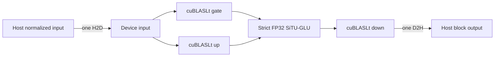

# K3X CUDA FFN Block Executor Design

## Status and scope

This document defines Milestone 3, the first dependency-closed CUDA execution boundary in K3X. It follows B-0003, which showed that reusable allocation and exact static residency remove most allocation and immutable-weight transfer overhead, while operation-level grouping reduces transfers and synchronization without improving end-to-end decode.

Milestone 3 keeps KDA, MLA, Attention Residual, RMSNorm, routing, routed-output mixing, recurrent state, residual addition, and token selection on CPU. It moves only complete feed-forward projection chains across one CUDA boundary. The checkpoint remains the deterministic synthetic K3-compatible artifact. No full Kimi K3 weights, asynchronous storage, eviction policy, cloud resources, pruning, proxy, adaptive Top-K, or speculation enter this milestone.

## Decision

K3X will add a dependency-closed FFN block executor rather than a generic device-tensor framework or a complete decoder-layer CUDA executor.

The public option is `--cuda-boundary operation|ffn-block`.

- `operation` is the default and preserves the complete Milestone 2 execution path.
- `ffn-block` is supported only by `cuda-custom` and is rejected before inference for `cpu`, `cuda-dense`, or a CUDA-disabled build.
- Allocation, weight residency, precision, and independent-projection batching remain separate switches.
- A block failure returns a typed backend error and never invokes CPU computation as a fallback.

The restriction to `cuda-custom` is deliberate. A `cuda-dense` FFN block would still require the routed native MXFP4 experts to execute on CPU, which would make the advertised boundary incomplete and obscure the measured transfer contract.

## Alternatives considered

### Generic device-tensor handles

A device handle and staged graph API would support arbitrary future KDA, MLA, residual, and FFN composition. It is rejected for this milestone because it introduces public lifetime, aliasing, ownership, synchronization, and error contracts before one dependency-closed block has established their measured value.

### Complete decoder-layer CUDA execution

A whole-layer boundary has the largest theoretical transfer reduction. It is deferred because it would move KDA, MLA, recurrent state, routing, normalization, residual logic, and MoE execution simultaneously. A parity failure or performance regression would not be attributable to one independently testable boundary.

### Dependency-closed FFN blocks

This is selected because the gate and up projections, SiTU-GLU activation, and down projection form a small closed chain with one host input and one host output. It removes observable intermediate transfers and synchronization while preserving the current CPU graph around the block.

## Public contracts

### Execution option

```cpp
enum class CudaBoundaryMode { operation, ffn_block };

struct BackendOptions {
    // Existing fields remain unchanged.
    CudaBoundaryMode cuda_boundary{CudaBoundaryMode::operation};
};
```

CPU configuration accepts only `operation`. CUDA configuration accepts `ffn_block` only when `BackendKind::cuda_custom` is selected. Unsupported combinations fail during option validation, before model construction or checkpoint execution.

### Dense block view

```cpp
struct DenseMlpView {
    DenseWeightView gate;
    DenseWeightView up;
    DenseWeightView down;
};

Result<std::vector<float>> dense_situ_mlp(
    std::span<const float> input,
    DenseMlpView weights,
    float situ_beta,
    std::optional<float> situ_linear,
    std::uint32_t layer,
    ProfilePhase phase);
```

The gate and up matrices have shape `intermediate × input_width`. The down matrix has shape `output_width × intermediate`. All three views retain their existing stable tensor identities and representation metadata.

### Native MXFP4 expert block view

```cpp
struct Mxfp4MlpView {
    Mxfp4WeightView gate;
    Mxfp4WeightView up;
    Mxfp4WeightView down;
};

Result<std::vector<std::vector<float>>> mxfp4_situ_mlp_group(
    std::span<const float> input,
    std::span<const Mxfp4MlpView> experts,
    float situ_beta,
    std::optional<float> situ_linear,
    std::uint32_t layer,
    ProfilePhase phase);
```

The returned expert outputs preserve request order. The method validates every expert triplet before any activation upload or kernel launch. Native low-nibble-first E2M1 codes and E8M0/32 scales pass through the existing exact resident table without repacking or requantization.

The CPU backend implements both block methods as deterministic compositions of the current scalar oracles for literal test comparison. Runtime option validation still prevents selecting `ffn-block` with the CPU backend.

## CUDA data flow

### Dense and shared FFN



Gate and up outputs occupy disjoint regions of one backend-owned arena. The SiTU-GLU kernel writes a separate activated region. Down consumes that device region directly. The stream synchronizes once after the final D2H copy.

### Routed expert group

After CPU routing selects the natural synthetic Top-K experts, the model loads owned gate, up, and down payloads for every selected expert. One backend call then performs the following sequence.

1. Validate every triplet and resolve all three exact resident entries per expert.
2. Upload the shared routed latent input once.
3. For each expert in routing order, launch native gate and up MXFP4 kernels into disjoint device regions.
4. Launch strict FP32 SiTU-GLU for that expert.
5. Launch the native down MXFP4 kernel from the device activation.
6. Copy each final expert output to its ordered host destination.
7. Synchronize the stream once for the complete selected-expert group.

CPU code retains unbiased router weights, mixes the ordered outputs, applies routed normalization, and performs the routed-up projection exactly as before. Routing and expert selection do not change.

## Numerical contract

The GPU activation computes the current portable formula without fast-math.

```text
sigmoid = 1 / (1 + exp(-gate))
bounded_gate = beta * tanh(gate / beta) * sigmoid
bounded_up = linear_beta * tanh(up / linear_beta) when present, otherwise up
output = bounded_gate * bounded_up
```

CUDA compilation for the activation translation unit must not enable `--use_fast_math`. The literal CUDA block tests establish the accepted FP32 and BF16 tolerances before graph integration. If the activation cannot meet the existing graph tolerance and exact-token contract, `ffn-block` remains unconnected and the milestone reports the numerical blocker.

## Residency and memory

- Every gate, up, and down view uses the existing tensor-ID, representation, rows, columns, and group-size cache key.
- The configured resident-byte capacity remains a hard upper bound.
- A non-fitting weight records one admission bypass and uses exact transient staging for that invocation.
- Block output and intermediate activation arenas are scratch memory, not resident-weight memory.
- Scratch growth retains the existing allocate-before-swap failure behavior and live/peak accounting.
- Host pointers and temporary payload ownership never participate in cache identity.

Milestone 3 does not add eviction, promotion, L1 RAM storage, L2 NVMe storage, or prefetch.

## Synchronization and profiling

New runtime counters record successful block work.

```cpp
std::uint64_t ffn_block_calls{};
std::uint64_t ffn_block_experts{};
```

The profiler adds a `situ_glu` operation for CUDA-event device time. Existing weight H2D, activation H2D, D2H, allocation, scratch, residency, cache, and synchronization counters remain authoritative.

All member CUDA events are read only after the block's one final stream synchronization. The block must not synchronize to obtain intermediate timings. Transfer accounting records only actual successful copies and preserves these identities.

```text
weight_h2d_bytes + activation_h2d_bytes == host_to_device_bytes
current_device_bytes == resident_weight_bytes + scratch_bytes
resident_weight_bytes <= cuda_resident_bytes
```

An FFN block call increments `ffn_block_calls` only after successful completion. A routed group adds its number of expert triplets to `ffn_block_experts`; dense and shared blocks add zero.

## Error handling

- Invalid gate, up, or down shapes return `invalid_extent` before CUDA work.
- Invalid MXFP4 extents, non-32 group sizes, or reserved `0xFF` scales return `invalid_mxfp4` before activation upload.
- Unsupported backend and boundary combinations return the existing typed option or backend-unavailable error before model execution.
- Allocation, copy, event, kernel, cuBLASLt, and synchronization failures return `backend_unavailable` with an operation-specific message.
- No failed block increments successful block, transfer, or synchronization counters.
- No CUDA failure triggers CPU evaluation or returns partial expert outputs.

## Model integration

`Engine::activated_mlp()` calls `dense_situ_mlp()` only in `ffn-block` mode. The operation path remains byte-for-byte structurally unchanged.

`Engine::moe()` loads all selected routed expert triplets into owned payloads and calls `mxfp4_situ_mlp_group()` once per layer in `ffn-block` mode. It then mixes returned outputs using the existing natural router weights. The shared expert branch calls `dense_situ_mlp()`. The operation path retains the existing per-expert gate/up group, CPU SiTU-GLU, and scalar down sequence.

## Test gates

1. CPU literal dense and MXFP4 block compositions establish the independent oracle.
2. CUDA FP32 dense/shared block output matches the CPU oracle within the existing FP32 tolerance.
3. CUDA BF16 dense/shared block output matches an explicitly BF16-rounded CPU composition within the accepted BF16 tolerance.
4. CUDA native MXFP4 expert-group output preserves request order and matches the CPU byte-level oracle.
5. Invalid shape, group size, reserved scale, capacity bypass, and unsupported backend combinations return the expected typed errors.
6. Operation and FFN-block modes preserve full-prefix and incremental layer outputs, logits, KDA/MLA state, selected routing order, and exact tokens `[43, 32, 28, 49, 9, 28]`.
7. Compute Sanitizer reports zero errors for dense block, native MXFP4 block, memory, and residency tests.
8. CPU-only builds retain no CUDA or cuBLAS dependency and reject requested FFN-block CUDA execution without fallback.

## Measurement plan

B-0004 uses the regenerated deterministic synthetic artifact, three warmups, and twenty measured processes. It records `cuda-custom` FP32 configurations sequentially.

1. `operation + reused + resident + scalar`.
2. `operation + reused + resident + grouped`.
3. `ffn-block + reused + resident + scalar`.
4. `ffn-block + reused + resident + grouped`.

Fully enabled BF16 is measured separately. The comparison records decode and prefill tok/s, TTFT, peak RSS, backend VRAM, weight and activation H2D, D2H, allocations, synchronizations, cache statistics, block calls, expert members, kernel time, and numerical diagnostics. NVMe, GPU utilization, memory bandwidth, and I/O stall remain explicitly not measured.

Acceptance requires correctness, reduced intermediate activation transfer, reduced D2H, and fewer synchronizations against the same operation-level switches. It does not require a speedup. Defaults change only if end-to-end throughput improves without violating the numerical contract. No synthetic result is presented as full Kimi K3 performance.

## Deferred work

- Generic device tensor ownership and cross-layer activation handles.
- KDA, MLA, recurrent state, RMSNorm, residual, and routing CUDA kernels.
- CUDA Graphs and persistent kernels.
- Pinned asynchronous L0/L1 transfer and storage scheduling.
- Expert eviction and prediction policies.
- Full-dimension slices and full checkpoint execution.
