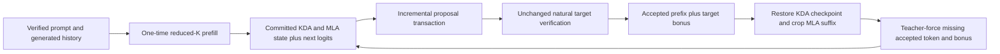

# K3X Milestone 17 Persistent AURORA Draft-State Design

## Status and objective

Milestone 17 replaces complete-prefix AURORA replay with a persistent reduced-Top-K draft cursor while retaining `aurora-replay` as the exact candidate oracle. The persistent cursor prefills the verified context once, advances KDA and MLA state incrementally, rolls speculative suffix state back after rejection, and teacher-forces the target-committed bonus token before the next proposal.

This milestone changes draft execution only. Natural target routing, strict greedy verification, token-major and expert-major target implementations, the `{1,2,4}` scheduler, and all default modes remain unchanged. Reduced precision, resident-only drafting, learned DSpark checkpoints, EcoSpec, MoE-Spec, AcceptMoE, VAULT persistence, and long-context compression remain out of scope.

## Evidence and constraints

K3X B-0017 measures every replay row 46.35% to 62.52% below natural greedy. The best replay row still reads 1,454,112 additional logical draft bytes and reprocesses 13 context positions. The measured problem is repeated prefix execution, not an insufficiently aggressive scheduler.

DeepSpec commit `005e03b81cec38b7da6399833d609ee89a2587f2` provides the inspected lifecycle analogue. Its `deepspec/eval/dspark/draft_ops.py` executes a speculative block and immediately calls `DynamicCache.crop(start)`. Its evaluator then retains only target-verified hidden states through `accepted_draft_tokens + 1`. K3X cannot copy that tensor ABI because K3 combines fixed-size KDA convolution/recurrent state with append-only MLA state, but it preserves the same rule: speculative suffix state is private and only target-confirmed history becomes the next draft context.

Pinned implementation sources:

- <https://github.com/deepseek-ai/DeepSpec/blob/005e03b81cec38b7da6399833d609ee89a2587f2/deepspec/eval/dspark/draft_ops.py>
- <https://github.com/deepseek-ai/DeepSpec/blob/005e03b81cec38b7da6399833d609ee89a2587f2/deepspec/eval/dspark/evaluator.py>
- <https://arxiv.org/abs/2607.05147>

## Alternatives

### Accepted: transactional incremental cursor with KDA snapshots and MLA crop

Keep one mutable draft `ModelState`. Before a proposal, capture the current KDA state, MLA logical sizes, and next-token logits. While producing candidates, capture a KDA checkpoint and MLA length mark after each processed candidate. Verification selects the accepted checkpoint, discarded MLA suffix storage is cropped by logical size, and the target bonus token is processed to synchronize the cursor.

KDA state is fixed-size with respect to context, so bounded snapshot copies are acceptable. MLA keys, values, and shared keys grow with context, so only their sizes and logical position count are checkpointed. Vector capacity may remain reserved after crop; logical state and future attention must exclude the cropped suffix.

### Rejected: deep-copy the complete `ModelState` per candidate

This is simple and exact on the synthetic graph, but MLA copy traffic grows with context length and would replace compute replay with host-memory replay. It conflicts with the project priority to minimize RAM traffic and provides a misleading small-context speed result.

### Rejected: periodic context checkpoints plus partial replay

Checkpointing every fixed number of tokens bounds replay distance, but it retains repeated weight execution and introduces a tuning parameter before the exact persistent boundary exists. It is useful only as a fallback for future compressed state, not as the Milestone 17 implementation.

### Deferred: shared or copy-on-write MLA pages

Paged copy-on-write state may reduce reallocations and enable branch deliberation, but a single mutable cursor with logical crop is sufficient for one outstanding AURORA proposal. Page ownership belongs with later APOLLO, TITAN COUNCIL, or VAULT work.

## Incremental cursor contract

Add `IncrementalDraftCursor` as an opaque runtime component declared in `runtime/include/k3x/incremental_cursor.hpp` and implemented inside the model translation unit where `Engine` and `ModelState` are available.

```cpp
struct IncrementalDraftCursorStats {
    std::uint64_t context_prefill_tokens{};
    std::uint64_t incremental_forward_calls{};
    std::uint64_t rollback_events{};
    std::uint64_t mla_positions_cropped{};
    std::uint64_t kda_checkpoint_bytes{};
};

struct IncrementalDraftCursorDiagnostics {
    std::vector<float> flattened_state;
    std::size_t mla_length{};
    std::size_t mla_key_elements{};
    std::size_t mla_value_elements{};
    std::size_t mla_shared_key_elements{};
};

class IncrementalDraftCursor {
public:
    static Result<std::unique_ptr<IncrementalDraftCursor>> create(
        Reader& reader, ComputeBackend& backend,
        std::span<const std::uint32_t> context,
        RuntimeSession& session);

    Result<std::vector<std::uint32_t>> propose(std::size_t count);
    Result<bool> commit(
        std::size_t accepted_prefix,
        std::span<const std::uint32_t> committed_tokens);
    IncrementalDraftCursorStats stats() const noexcept;
    IncrementalDraftCursorDiagnostics diagnostics() const;
};
```

`create` requires a nonempty context and an incremental session. It runs that context once with prefill phase, retains the resulting state and logits, and records the exact context length. It owns an internal `Engine`, state, next logits, pending proposal, and checkpoints while borrowing the Reader, backend, and RuntimeSession lifetimes. Creation and every proposal or commit acquire the draft RuntimeSession generation guard, so one cursor cannot interleave policy context with another generation on the same draft session.

`propose` permits one outstanding transaction. It returns `count` greedy tokens from the current logits. It processes only the first `count - 1` candidates because the last token does not need to be consumed to predict itself. Count zero creates an empty transaction without a forward. Any token, shape, Reader, or backend failure latches the cursor unusable.

`commit` requires exactly `accepted_prefix + 1` committed tokens. The first `accepted_prefix` values must equal the pending candidate prefix; the final value is the target bonus token. It restores the state after the accepted prefix, processes the last accepted candidate when the proposal did not already process it, then processes the target bonus. The resulting state includes every committed token and `next_logits` predicts the next draft candidate. A malformed commit latches failure before additional Reader access.

`diagnostics` returns a copied flattened KDA/MLA state plus MLA logical and scalar vector sizes. It exists to prove state equality and crop behavior directly; the generation hot path never calls it.

## State checkpoint and rollback semantics

Each checkpoint contains the following.

- A copy of all three KDA convolution histories and recurrent matrices.
- MLA logical `length`.
- Scalar sizes of MLA `keys`, `values`, and `shared_keys`.
- The logits produced after the checkpoint token.

The base checkpoint represents zero accepted candidates. A checkpoint after candidate `k` represents exactly `k` accepted candidates. Restoring a checkpoint copies KDA state, resizes each MLA vector to its recorded size, restores MLA length, and restores logits. Capacity is not treated as live state and may remain larger than size.

If all proposed candidates are accepted, the final candidate has not yet been processed. `commit` processes it once before the bonus. If a shorter prefix is accepted, the cursor restores that prefix checkpoint and processes only the target bonus. If zero candidates were proposed or accepted, it restores the base and processes the bonus. No target state is ever borrowed or mutated.

The cursor does not promise failure atomicity for its private draft state after a backend exception. Instead it latches failure and refuses further proposals. Target generation remains failure-atomic because target state is independent and provider failure stops generation before another target commit.

## Persistent AURORA provider

Add `AuroraPersistentDraftProvider` alongside `AuroraReplayDraftProvider`. It retains the same scheduler, supported fixed K values, request-history validation, one-outstanding-proposal rule, and no-fail `DraftProvider::update` boundary.

The cursor is created lazily on the first positive or zero proposal from `prompt + request.generated_tokens`. This ensures the reduced-K draft state is teacher-forced through the target-selected initial anchor even when reduced-K prefill would predict a different first token. Later requests must exactly match the provider's target-derived committed history.

`propose` asks the scheduler for a length and delegates to the cursor. `update` validates the existing `DraftVerification`, commits the accepted prefix plus bonus into the cursor, then updates the scheduler and expected history. Any cursor or lifecycle failure latches the provider and the next `propose` fails before Reader access.

The supported runtime identity remains CPU, incremental, fixed K4/6/8/12 below natural K, disabled L1, blocking L2, no profile observation, and exact native MXFP4 expert decode. Replay and persistent providers use separate Readers in matched tests so their counters remain independently attributable.

## Telemetry and CLI

Extend `DraftProviderStats`, `GenerationResult`, JSON, and CSV with the following default-zero fields.

- `draft_context_prefill_tokens`
- `draft_incremental_forward_calls`
- `draft_rollback_events`
- `draft_mla_positions_cropped`
- `draft_kda_checkpoint_bytes`

Existing replay rows keep these fields zero. Persistent rows keep `draft_replayed_context_tokens` zero. Draft Reader calls, logical bytes, routing decisions, and generation time retain their existing cumulative meanings and include the one-time context prefill plus incremental forwards.

Add `--speculative-mode aurora-persistent`. It uses the existing `--aurora-draft-k`, `--aurora-block-policy`, and `--speculative-block-size` options and the same target preflight gates as `aurora-replay`. Replay remains callable and documented as the oracle. Neither mode becomes default.

## Data flow



## Correctness tests

- Cursor candidates match independent fixed-K greedy generation for the initial context.
- Successive cursor proposals match complete-prefix replay after full acceptance, first-token rejection, middle rejection, and zero-candidate scheduling.
- KDA and MLA flattened state after each commit matches a fresh fixed-K teacher-forced context run.
- MLA crop removes rejected logical positions even when vector capacity remains allocated.
- All-accepted commit processes the final candidate exactly once before the bonus.
- Malformed accepted counts, token prefixes, bonus shape, outstanding proposals, and post-failure reuse reject before additional Reader access.
- Persistent provider candidates equal replay provider candidates under identical fixed and adaptive verification traces.
- Natural target tokens, final KDA/MLA state, committed target routing, and acceptance remain identical between replay and persistent modes for token-major and expert-major verification.
- Existing greedy, scripted, replay, B-0014 through B-0017, and default-schema tests remain unchanged and passing.

## B-0018 measurement gate

B-0018 uses the same deterministic natural Top-16 artifact, prompt, six-token generation, three warmups, and twenty samples as B-0017. It measures natural greedy plus matched replay and persistent K4 rows for fixed block-2 token-major, adaptive token-major, fixed block-2 expert-major, and adaptive expert-major verification.

Every matched pair must preserve candidate proposals, acceptance, target tokens, final target state, and committed target routes. The report records existing target/draft traffic plus the five cursor fields. Persistent mode must report zero replayed-context tokens and one context prefill per generation. A Reader-byte or throughput improvement is measured rather than assumed; no favorable result is required for correctness acceptance.

The primary decision gate is whether persistent mode removes repeated context forwards without introducing state divergence. Scheduler thresholds, draft K, precision, residency, and target verification mode do not change based on this small WSL2 trace. Native-Linux, long-context, coding-quality, and full-model measurements remain required before any default decision.

## Follow-up boundary

After B-0018, the next AURORA experiment may place exact persistent draft experts in a resident bank or reduce trunk precision, one axis at a time. VAULT may later serialize the committed cursor state, but Milestone 17 keeps it process-local. Branching, shared MLA pages, and long-context compression require separate designs and quality or memory-traffic evidence.
